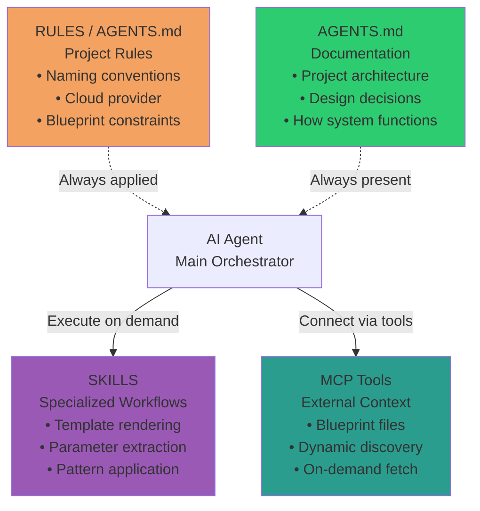

# Terraform Infrastructure Blueprints - AI Assistant Guide

Opinionated, standalone Infrastructure-as-Code blueprints for AWS, Azure, and GCP. Each blueprint is a complete, self-contained package you can copy and own - no dependencies, no vendor lock-in.

**Key principle**: Copy one blueprint folder and you have everything needed.

**Consultancy model**: ustwo builds for clients. When engagements end, clients own the code. Generated Terraform must be completely standalone with zero ustwo dependencies.

For detailed documentation, see:

- [Blueprint Catalog](docs/blueprints/catalog.md) - Complete blueprint reference, decision trees, cross-cloud equivalents
- [Workflows](docs/blueprints/workflows.md) - Usage scenarios and step-by-step workflows
- [Patterns](docs/blueprints/patterns.md) - Key patterns (secrets, naming, VPC, extractable patterns)
- [Customization](docs/blueprints/customization.md) - Common customizations, commands, constraints

**For AI Assistants**:

- [Developer Workflow](docs/developer-workflow.md) - How developers work with blueprints
- [AI Assistant Guidelines](docs/ai-assistant-guidelines.md) - Guidelines for AI assistants
- [MCP Tools Reference](docs/mcp-tools-reference.md) - Technical reference for MCP tools
- [Manifests and Templates](docs/manifests-and-templates.md) - How the system works
- [Patterns with Examples](docs/blueprints/patterns.md) - Key patterns including wrong vs right code comparisons

## Decision Framework: AGENTS.md vs Skills vs MCP

### Use AGENTS.md for

- **Project rules and conventions** — Architecture patterns, project-specific context
- **Correct examples:**
  - "Always use TypeScript strict mode"
  - "Follow ustwo naming: {project}-{env}-{resource}"
  - "Never use 'env' type — Errors must be logged to Sentry"

**DON'T put in AGENTS.md:**

- "How to deploy" (use Skill)
- Step-by-step procedures (use Skill)
- "Code style rules" (use Skill)

### Use Skills for

- **Workflows and procedures** — When/how to do something in specific situations
- **Correct examples:**
  - "Deploy → Create deploy config → Build → Deploy to prod"
  - "Adding API endpoint → Create route component → Prep → Tests → Export"
  - "Create-component → Create static components → Boilerplate → Props → Tests → Export"

**DON'T put in Skills:**

- "Always use X" (use AGENTS.md)
- "API conventions" (use AGENTS.md)
- "Code style rules" (use AGENTS.md)

### Use MCP for

- **External tools and services** — Connecting to APIs, databases, services
- **Correct examples:**
  - "Blueprint MCP — Fetch/write blueprint files, search, recommend"
  - "PostgreSQL MCP — Query database, run migrations"
  - "Slack MCP — Post messages, read channels"

**DON'T use MCP for:**

- Project rules (use AGENTS.md)
- Internal workflows (use Skill)
- Context that fits in AGENTS.md or a Skill (use those first)

## Context Architecture

- **AGENTS.md**: Always present context (architecture, consultancy model, skill table)
- **Skills**: Execute procedural workflows when needed
- **MCP**: Connect to external blueprint repository for dynamic discovery

## Architecture Evolution

### Before (Fragmented Custom Agents)

- Each skill had isolated context
- Difficult to combine workflows
- No shared conventions
- LLMs repeated context across skills

### After (Generic Agent + Composable Skills)

- Single generic agent (Claude/Cursor)
- Progressive disclosure via skills
- Composable workflows (MCP + Skills + AGENTS.md)
- Cross-platform compatibility

*"Building a skill for an agent is like putting together an onboarding guide for a new hire."* — Anthropic

---

**Skills** (when to use which):

| Skill | Use when |
|-------|----------|
| `style-guide` | Selecting blueprints, naming/tagging, writing/reviewing Terraform, architectural decisions; decision tree, catalog, and priority rules (CRITICAL/HIGH/MEDIUM/LOW). Includes HCL formatting rules (indentation, block ordering, naming conventions). |
| `code-generation` | Adding a capability to an existing project; generate Terraform from parameterized templates. |
| `mcp-discovery` | Finding blueprints, fetching files, workflow guidance; when to use each MCP tool. |
| `security` | Secrets (RDS/Aurora passwords, Secrets Manager, IAM DB auth; never in state) and security groups (Lambda, RDS, API Gateway, ECS; least-privilege, no 0.0.0.0/0). |
| `terraform-practices` | Testing (native/Terratest, decision matrix), CI/CD (validate→test→plan→apply), code structure (block ordering, count/for_each); use with blueprint-generated or blueprint-style Terraform. |
| `terraform-testing` | Writing Terraform test files (.tftest.hcl), creating test scenarios with run blocks, validating infrastructure with assertions, mocking providers, testing module outputs; comprehensive guide for Terraform's native testing framework. |
