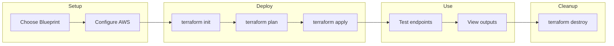
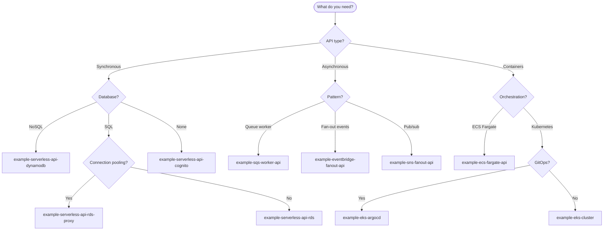

# Table of Contents

- [What is this?](#what-is-this)
- [What it is not](#what-it-is-not)
- [Repository layout](#repository-layout)
- [Key principles](#key-principles)
- [Quick Start](#quick-start)
- [How to use](#how-to-use)
- [Ways to Use](#ways-to-use)
- [AI accessibility](#ai-accessibility)
- [CI/CD Pipeline](#cicd-pipeline)
- [Available Blueprints](#available-blueprints)
- [Maintainer](#maintainer)

## Terraform Infrastructure Blueprints

Opinionated, repeatable Infrastructure-as-Code blueprints for bootstrapping cloud foundations across GCP, AWS, and Azure.
Each example is a fully self-contained IaC package that includes everything needed to deploy that pattern: modules, configurations, and conventions all in one place.

Consultants copy the example they need, adapt it, and hand over clean, client-owned infrastructure code.
No dependencies. No shared modules. No vendor lock-in.

## What is this?

A library of complete, standalone IaC examples, organized by cloud provider:

- GCP → multiple end-to-end examples (e.g., opinionated project setups, service deployments, network patterns)
- AWS → multiple complete examples (e.g., ECS services, Lambda stacks, account foundations)
- Azure → multiple complete examples (e.g., subscription scaffolding, app patterns, resource setups)

Every example folder contains:

- Its own Terraform modules
- Its own naming/tagging logic
- Its own IAM setup
- Its own logging patterns
- Its own main Terraform configuration
- Clear documentation for how to use it

Copy any example and you have a working blueprint.

## What it is not

- Not a reusable Terraform module source
- Not tied to any ustwo system, pipeline, or secret
- Not referencing other examples or shared folders
- Not intended as a turnkey production platform
- Not something clients must keep connected to ustwo after handover

Everything is local, isolated, and modifiable.

## Repository layout

```text
/gcp/
  example-ecs-node/
    main.tf
    modules/
      iam/
      logging/
      tagging/
      naming/
  example-networking/
    main.tf
    modules/
      iam/
      logging/
      ...
  example-custom/
    ...
/aws/
  example-ecs-python/
    main.tf
    modules/
  example-account-foundation/
    main.tf
    modules/
  example-custom/
    ...
/azure/
  example-subscription-scaffold/
    main.tf
    modules/
  example-app-pattern/
    main.tf
    modules/
  example-custom/
    ...
```

### Key principles

- Each example is a complete blueprint.
- Examples do not depend on each other.
- There is no shared folder.
- Each example includes its own modules and utilities.

Users copy one example folder and get everything they need.

## Quick Start

Deploy any blueprint in 5 steps:

```bash
# 1. Navigate to the blueprint's dev environment
cd aws/example-sqs-worker-api/environments/dev

# 2. Configure AWS credentials
export AWS_PROFILE=your-profile  # or set AWS_ACCESS_KEY_ID/AWS_SECRET_ACCESS_KEY

# 3. Initialize Terraform
terraform init

# 4. Review and apply
terraform plan
terraform apply

# 5. Test (most blueprints output a quick_start guide)
terraform output quick_start
```

### Deployment Flow



### Step-by-Step Guide

#### 1. Choose a Blueprint

```bash
# List available blueprints
ls aws/

# Example output:
# example-sqs-worker-api/
# example-serverless-api-dynamodb/
# example-ecs-fargate-api/
# example-eks-cluster/
# ...
```

#### 2. Choose Your AWS Region

Edit `terraform.tfvars` to set your target region:

```hcl
aws_region = "eu-west-2"  # London - change to your preferred region
```

**How to choose a region:**

| Consider | Recommendation |
|----------|----------------|
| **User location** | Choose region closest to your users for lowest latency |
| **Compliance** | GDPR → EU regions, Data residency → specific country |
| **Cost** | Prices vary by region ([AWS pricing](https://aws.amazon.com/pricing/)) |
| **Service availability** | Some services aren't in all regions |

**Common regions:**

| Region | Location | Code |
|--------|----------|------|
| US East (N. Virginia) | USA | `us-east-1` |
| US West (Oregon) | USA | `us-west-2` |
| Europe (Ireland) | EU | `eu-west-1` |
| Europe (Frankfurt) | EU | `eu-central-1` |
| Europe (London) | UK | `eu-west-2` |
| Asia Pacific (Tokyo) | Japan | `ap-northeast-1` |
| Asia Pacific (Sydney) | Australia | `ap-southeast-2` |

#### 3. Configure AWS Credentials

```bash
# Option A: AWS SSO (recommended)
aws sso login --profile your-profile
export AWS_PROFILE=your-profile

# Option B: Environment variables
export AWS_ACCESS_KEY_ID="your-key"
export AWS_SECRET_ACCESS_KEY="your-secret"
export AWS_REGION="eu-west-2"  # Match your terraform.tfvars

# Verify credentials
aws sts get-caller-identity
```

#### 4. (Optional) Configure Remote State

For team collaboration, set up S3 backend:

```bash
cd aws/example-sqs-worker-api/environments/dev
cp backend.tf.example backend.tf
# Edit backend.tf with your S3 bucket details
```

#### 5. Review Configuration

```bash
# Check default values
cat terraform.tfvars

# Common settings to customize:
# - project     = "your-project-name"
# - environment = "dev"
# - aws_region  = "us-east-1"
```

#### 6. Deploy

```bash
# Initialize providers and modules
terraform init

# Preview what will be created
terraform plan

# Create resources (type 'yes' to confirm)
terraform apply
```

#### 7. Use the Outputs

```bash
# View all outputs
terraform output

# Get specific endpoint
terraform output -raw api_endpoint

# Most blueprints include helpful test commands
terraform output quick_start
```

#### 8. Cleanup

```bash
# Destroy all resources when done
terraform destroy
```

### Blueprint Structure

Every blueprint follows this pattern:

```
aws/example-{name}/
├── environments/
│   └── dev/
│       ├── main.tf           # Module composition
│       ├── variables.tf      # Input variables  
│       ├── outputs.tf        # Outputs
│       ├── versions.tf       # Provider versions
│       ├── terraform.tfvars  # Default values
│       └── backend.tf.example
├── modules/                  # Self-contained modules
├── src/                      # Application code (if any)
├── tests/
│   ├── unit/                 # Validation tests
│   └── integration/          # Full deployment tests
└── README.md                 # Blueprint-specific docs
```

## How to use

## Ways to Use

### 1. Direct Copy

- Browse the examples under `/gcp`, `/aws`, or `/azure` and choose the one that matches your needs.
- Copy the example folder into your project—this can be a dedicated infrastructure folder (like `infra/` or `infrastructure/`) inside your main application repo, or a separate infrastructure repo alongside your app code.
- For example:
  - Monorepo: `my-app/infra/` (application code in `src/`, infrastructure code in `infra/`)
  - Multi-repo: `my-app` (application repo), `my-app-infra` (infrastructure repo)
- Customize IAM, naming/tagging, networking, environment structure, and module internals as needed to fit your application's requirements.

### 2. Use tiged (Recommended)

Use [tiged](https://github.com/tiged/tiged) to download a specific blueprint (each child folder under `blueprints/` is a complete blueprint) without cloning the whole repo:

```bash
# Download an AWS ECS Node.js blueprint
npx tiged ustwo/terraform-infra-blueprints/blueprints/ecs-node my-ecs-node

# Download a GCP blueprint
npx tiged ustwo/terraform-infra-blueprints/gcp/example-1 my-gcp-example

# Download an Azure blueprint
npx tiged ustwo/terraform-infra-blueprints/azure/example-1 my-azure-example
```

### 3. Use AI Tools

You can use AI agents (GitHub Copilot, Cursor, ChatGPT, Claude, etc.) to help you set up a complete infrastructure folder for your client project using these examples:

#### Example Workflow

1. **Share the example folder with your AI tool**

- Paste the folder structure or link to the example in your AI chat.

1. **Describe your requirements**

- E.g., "Adapt this ECS Node.js example for a client with two environments (dev, prod), custom tags, and private networking."

1. **Request code generation and refactoring**

- Ask the AI to update variables, add modules, or restructure files as needed.

1. **Generate documentation and CI/CD workflows**

- Request README updates, pipeline configs, or cost/security reviews.

1. **Copy the AI-generated code into your client repo**

This approach works with:

- GitHub Copilot (inline code completion)
- Cursor (AI pair programming)
- ChatGPT/Claude (chat-based code generation)
- Amazon Q (AWS-specific guidance)

AI tools can:

- Scaffold full client environments
- Refactor and adapt modules
- Duplicate patterns across clouds
- Generate custom variants
- Review for security, cost, and best practices

### 4. Deliver Clean, Client-Owned IaC

Before handover, ensure:

- No references to ustwo repos
- No external dependencies outside OSS
- All modules and code are contained in the client repo
- Documentation matches the client’s environment

## AI accessibility

This structure is AI-optimized:

- Each example is a complete “unit” an AI can analyze without external context
- Modules sit inside the example, so AI never has to resolve imports across folders
- Clear, predictable structure across clouds
- Easy for AI to copy an example and generate a new client repo
- No shared modules → no dependency ambiguity
- Works perfectly with tools like Cursor, ChatGPT agents, MCP, and IDE assistants

AI can reliably:

- scaffold full client environments
- refactor modules
- adapt naming/tagging
- duplicate patterns across clouds
- generate custom variants

All without risking vendor lock-in.

## CI/CD Pipeline

For best practices, you can combine all checks (validation, linting, security scan) into a single workflow, and keep the release workflow separate:

```yaml
# .github/workflows/ci.yml
name: CI
on:
  pull_request:
    paths:
      - "**/*.tf"
      - "**/main.tf"
      - "**/modules/**"
      - "**/*.md"
jobs:
  validate:
    # Terraform Validate job
  lint:
    # Markdown Lint job
  security:
    # Terraform Security Scan job
```

And a separate workflow for releases:

```yaml
# .github/workflows/release.yml
name: Release
on:
  push:
    tags:
      - "v*"
jobs:
  release:
    # Release job
```

When an example in this repository is updated, changes do not automatically apply to copies in client projects. To keep your infrastructure up to date:

1. **Watch for updates:** Monitor this repository for new releases, improvements, or security fixes.
2. **Compare changes:** When an update is published, compare your local example folder with the updated version in this repo.
3. **Merge manually:** Manually merge relevant changes into your local copy, taking care to preserve any customizations.
4. **Test before applying:** Always test updates in a non-production environment before rolling out to production.
5. **Document customizations:** Keep notes on any changes you make to the example so you can reapply them after future updates.

This manual update flow ensures you stay secure and benefit from improvements, while maintaining full control over your infrastructure code.

- Self-contained examples
  Each example includes everything it needs: its own modules, logic, patterns, and configs.
- Client-first ownership
  Delivered IaC should be entirely controlled by the client.
- Zero vendor lock-in
  No ustwo references, remote sources, or implicit dependencies.
- Opinionated but flexible
  Patterns enforce strong defaults but allow easy modification.
- AI-friendly structure
  Example-driven, isolated, predictable folder layouts ideal for automated code generation.

## Available Blueprints

### AWS Blueprints

| Blueprint | Description | Key Services |
|-----------|-------------|--------------|
| `example-sqs-worker-api` | Async API with SQS worker pattern | API Gateway, SQS, Lambda, DynamoDB |
| `example-serverless-api-dynamodb` | Serverless REST API | API Gateway, Lambda, DynamoDB |
| `example-serverless-api-rds` | Serverless API with RDS | API Gateway, Lambda, RDS PostgreSQL |
| `example-serverless-api-aurora` | Serverless API with Aurora | API Gateway, Lambda, Aurora Serverless |
| `example-serverless-api-cognito` | API with authentication | API Gateway, Lambda, Cognito |
| `example-serverless-api-rds-proxy` | API with RDS Proxy | API Gateway, Lambda, RDS Proxy |
| `example-ecs-fargate-api` | Container API on Fargate | ECS Fargate, ALB, ECR |
| `example-ecs-fargate-rds` | Container API with RDS | ECS Fargate, ALB, RDS |
| `example-eks-cluster` | Kubernetes cluster | EKS, VPC, IAM |
| `example-eks-argocd` | EKS with GitOps | EKS, ArgoCD, Helm |
| `example-eventbridge-fanout-api` | Event-driven fanout | API Gateway, EventBridge, Lambda |
| `example-sns-fanout-api` | SNS fanout pattern | API Gateway, SNS, Lambda |
| `example-bedrock-rag-api` | RAG API with Bedrock | API Gateway, Bedrock, OpenSearch |
| `example-amplify-hosting-auth` | Static hosting with auth | Amplify, Cognito |

### Choosing the Right Blueprint



## Maintainer

Bernardo Trindade de Abreu (<bernardo.trindade-de-abreu@ustwo.com>)
