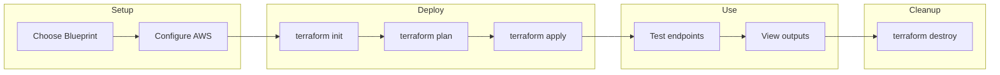
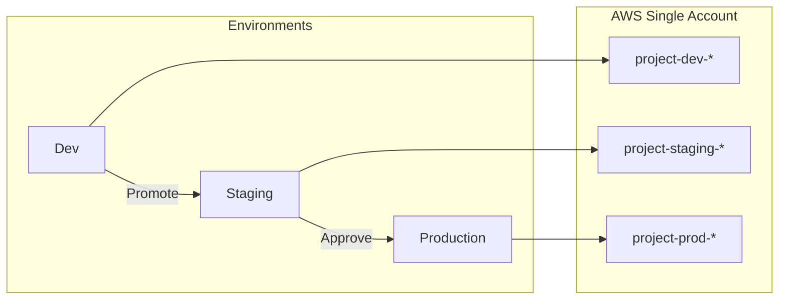
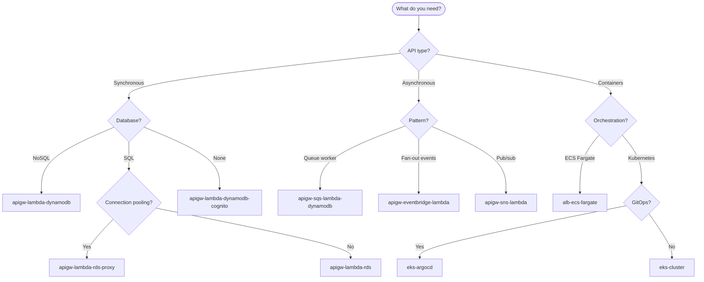
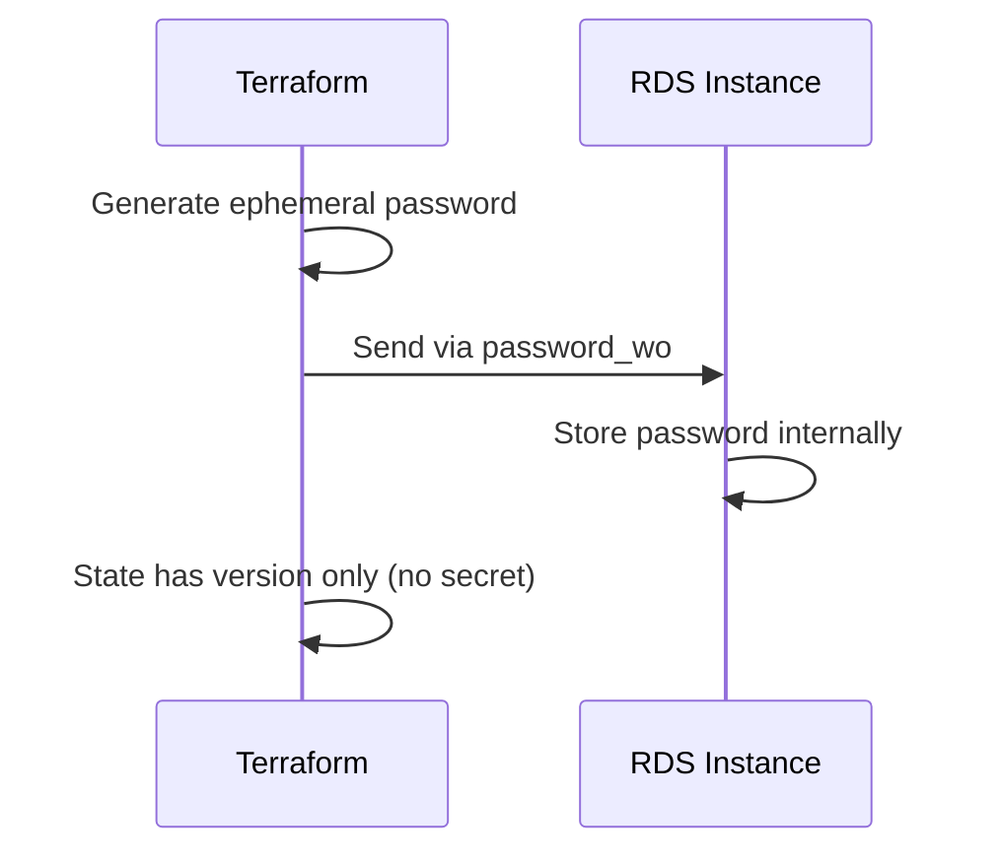
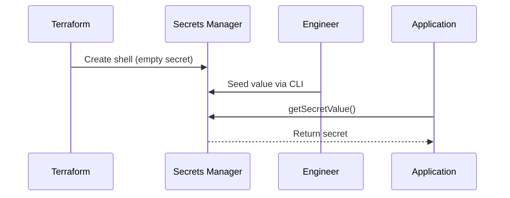

# Table of Contents

- [What is this?](#what-is-this)
- [What it is not](#what-it-is-not)
- [Repository layout](#repository-layout)
- [Key principles](#key-principles)
- [Quick Start](#quick-start)
- [Creating Additional Environments](#creating-additional-environments)
- [Development Setup](#development-setup)
- [Testing](#testing)
- [How to use](#how-to-use)
- [Ways to Use](#ways-to-use)
- [AI accessibility](#ai-accessibility)
- [CI/CD Pipeline](#cicd-pipeline)
- [Available Blueprints](#available-blueprints)
- [Secrets Management](#secrets-management)
- [Official Modules](#official-modules)
- [Architecture Decision Records](#architecture-decision-records)
- [Maintainer](#maintainer)

## Terraform Infrastructure Blueprints

Opinionated, repeatable Infrastructure-as-Code blueprints for bootstrapping cloud foundations across GCP, AWS, and Azure.
Each blueprint is a fully self-contained IaC package that includes everything needed to deploy that pattern: modules, configurations, and conventions all in one place.

Consultants copy the example they need or extract patterns to add to existing projects, adapt it, and hand over clean, client-owned infrastructure code.
No dependencies. No shared modules. No vendor lock-in.

## What is this?

A library of complete, standalone IaC blueprints, organized by cloud provider:

- **AWS** → Serverless, container, event-driven, AI/ML, and full-stack patterns
- **GCP** → Coming soon
- **Azure** → Coming soon

Every blueprint folder contains:

- Its own Terraform modules
- Its own naming/tagging logic
- Its own IAM setup
- Its own logging patterns
- Its own main Terraform configuration
- Clear documentation for how to use it

Copy any example and you have a working blueprint. Or extract specific patterns to add capabilities to existing projects.

### Two Ways to Use

1. **Copy whole blueprint** → Start new projects from scratch
2. **Extract patterns** → Add modules/patterns to existing Terraform projects

See [ADR-0002](docs/adr/0002-expand-scope-pattern-extraction.md) for the rationale behind supporting both workflows.

## What it is not

- Not a shared module registry (blueprints remain self-contained, but patterns can be extracted)
- Not tied to any ustwo system, pipeline, or secret
- Not referencing other examples or shared folders
- Not intended as a turnkey production platform
- Not something clients must keep connected to ustwo after handover

Everything is local, isolated, and modifiable.

## Repository layout

```text
/aws/
  alb-ecs-fargate/
    environments/
      dev/
    modules/
    src/
    tests/
    README.md
  apigw-lambda-dynamodb/
    ...
  apigw-lambda-rds/
    ...
  eks-cluster/
    ...
  # ... more blueprints
/gcp/
  # Coming soon
/azure/
  # Coming soon
```

### Key principles

- Each example is a complete blueprint.
- Examples do not depend on each other.
- There is no shared folder.
- Each example includes its own modules and utilities.

Users copy one example folder and get everything they need.

## Quick Start

Deploy any blueprint in 5 steps:

```bash
# 1. Navigate to the blueprint's dev environment
cd aws/apigw-lambda-dynamodb/environments/dev

# 2. Configure AWS credentials
export AWS_PROFILE=your-profile  # or set AWS_ACCESS_KEY_ID/AWS_SECRET_ACCESS_KEY

# 3. Initialize Terraform
terraform init

# 4. Review and apply
terraform plan
terraform apply

# 5. Test (most blueprints output a quick_start guide)
terraform output quick_start
```

### Deployment Flow



### Step-by-Step Guide

#### 1. Choose a Blueprint

```bash
# List available blueprints
ls aws/

# Example output:
# alb-ecs-fargate/
# apigw-lambda-dynamodb/
# apigw-lambda-rds/
# eks-cluster/
# ...
```

#### 2. Choose Your AWS Region

Edit `terraform.tfvars` to set your target region:

```hcl
aws_region = "eu-west-2"  # London - change to your preferred region
```

**How to choose a region:**

| Consider | Recommendation |
|----------|----------------|
| **User location** | Choose region closest to your users for lowest latency |
| **Compliance** | GDPR → EU regions, Data residency → specific country |
| **Cost** | Prices vary by region ([AWS pricing](https://aws.amazon.com/pricing/)) |
| **Service availability** | Some services aren't in all regions |

**Common regions:**

| Region | Location | Code |
|--------|----------|------|
| US East (N. Virginia) | USA | `us-east-1` |
| US West (Oregon) | USA | `us-west-2` |
| Europe (Ireland) | EU | `eu-west-1` |
| Europe (Frankfurt) | EU | `eu-central-1` |
| Europe (London) | UK | `eu-west-2` |
| Asia Pacific (Tokyo) | Japan | `ap-northeast-1` |
| Asia Pacific (Sydney) | Australia | `ap-southeast-2` |

#### 3. Configure AWS Credentials

```bash
# Option A: AWS SSO (recommended)
aws sso login --profile your-profile
export AWS_PROFILE=your-profile

# Option B: Environment variables
export AWS_ACCESS_KEY_ID="your-key"
export AWS_SECRET_ACCESS_KEY="your-secret"
export AWS_REGION="eu-west-2"  # Match your terraform.tfvars

# Verify credentials
aws sts get-caller-identity
```

#### 4. (Optional) Configure Remote State

For team collaboration, set up S3 backend:

```bash
cd aws/apigw-lambda-dynamodb/environments/dev
cp backend.tf.example backend.tf
# Edit backend.tf with your S3 bucket details
```

#### 5. Review Configuration

```bash
# Check default values
cat terraform.tfvars

# Common settings to customize:
# - project     = "your-project-name"
# - environment = "dev"
# - aws_region  = "us-east-1"
```

#### 6. Deploy

```bash
# Initialize providers and modules
terraform init

# Preview what will be created
terraform plan

# Create resources (type 'yes' to confirm)
terraform apply
```

#### 7. Use the Outputs

```bash
# View all outputs
terraform output

# Get specific endpoint
terraform output -raw api_endpoint

# Most blueprints include helpful test commands
terraform output quick_start
```

#### 8. Cleanup

```bash
# Destroy all resources when done
terraform destroy
```

### Blueprint Structure

Every blueprint follows this pattern:

```
aws/{blueprint-name}/
├── environments/
│   └── dev/
│       ├── main.tf           # Module composition
│       ├── variables.tf      # Input variables  
│       ├── outputs.tf        # Outputs
│       ├── versions.tf       # Provider versions
│       ├── terraform.tfvars  # Default values
│       └── backend.tf.example
├── modules/                  # Self-contained modules
├── src/                      # Application code (if any)
├── tests/
│   ├── unit/                 # Validation tests
│   └── integration/          # Full deployment tests
└── README.md                 # Blueprint-specific docs
```

## Creating Additional Environments

Blueprints include only a `dev/` environment by default. Use the helper script to create staging or production environments when needed.

### Quick Create

```bash
# Create staging environment
./scripts/create-environment.sh aws/apigw-sqs-lambda-dynamodb staging

# Create production environment
./scripts/create-environment.sh aws/apigw-sqs-lambda-dynamodb prod
```

### What the Script Does

1. **Copies** the `dev/` directory to the new environment
2. **Updates** `terraform.tfvars` with environment-specific scaling
3. **Updates** `backend.tf.example` with new state key path
4. **Removes** any cached `.terraform` directories

### Environment Scaling Recommendations

| Setting | Dev | Staging | Prod |
|---------|-----|---------|------|
| **Memory (Lambda/Container)** | 256 MB | 512 MB | 1024 MB |
| **Log retention** | 7 days | 30 days | 90 days |
| **Message retention (SQS)** | 1 day | 7 days | 14 days |
| **Replicas/Concurrency** | 1-2 | 2-5 | 5-10 |
| **Database** | Single/Small | Multi-AZ/Medium | Multi-AZ/Large |

### Manual Environment Creation

If you prefer to create environments manually:

```bash
# 1. Copy dev environment
cp -r aws/apigw-sqs-lambda-dynamodb/environments/dev \
      aws/apigw-sqs-lambda-dynamodb/environments/staging

# 2. Update environment name in terraform.tfvars
sed -i '' 's/environment = "dev"/environment = "staging"/' \
    aws/apigw-sqs-lambda-dynamodb/environments/staging/terraform.tfvars

# 3. Adjust resource sizing as needed
# Edit terraform.tfvars with staging-appropriate values

# 4. Update backend state key (if using remote state)
# Edit backend.tf.example or backend.tf
```

### Multi-Environment Deployment Flow



### GitHub Environments for Approvals

Configure approval gates in GitHub:

1. Go to **Settings → Environments**
2. Create environments: `dev`, `staging`, `production`
3. Add protection rules:

| Environment | Required Reviewers | Wait Timer |
|-------------|-------------------|------------|
| dev | None | None |
| staging | 1 | None |
| production | 1-2 | 10 minutes |

Then use the deploy workflow to promote between environments with manual approval.

## How to use

## Ways to Use

### 1. Direct Copy

- Browse the blueprints under `/aws`, `/gcp`, or `/azure` and choose the one that matches your needs.
- Copy the blueprint folder into your project—this can be a dedicated infrastructure folder (like `infra/` or `infrastructure/`) inside your main application repo, or a separate infrastructure repo alongside your app code.
- For example:
  - Monorepo: `my-app/infra/` (application code in `src/`, infrastructure code in `infra/`)
  - Multi-repo: `my-app` (application repo), `my-app-infra` (infrastructure repo)
- Customize IAM, naming/tagging, networking, environment structure, and module internals as needed to fit your application's requirements.

### 2. Use tiged (Recommended)

Use [tiged](https://github.com/tiged/tiged) to download a specific blueprint without cloning the whole repo:

```bash
# Download an AWS serverless API blueprint
npx tiged ustwo/terraform-infrastructure-blueprints/aws/apigw-lambda-dynamodb my-api

# Download an AWS ECS Fargate blueprint
npx tiged ustwo/terraform-infrastructure-blueprints/aws/alb-ecs-fargate my-ecs-app

# Download an AWS EKS cluster blueprint
npx tiged ustwo/terraform-infrastructure-blueprints/aws/eks-cluster my-eks-cluster

# GCP and Azure blueprints coming soon
# npx tiged ustwo/terraform-infrastructure-blueprints/gcp/{blueprint} my-gcp-project
# npx tiged ustwo/terraform-infrastructure-blueprints/azure/{blueprint} my-azure-project
```

### 3. Use AI Tools

You can use AI agents (GitHub Copilot, Cursor, ChatGPT, Claude, etc.) to help you set up a complete infrastructure folder for your client project using these examples:

#### Example Workflow

1. **Share the example folder with your AI tool**

- Paste the folder structure or link to the example in your AI chat.

1. **Describe your requirements**

- E.g., "Adapt this ECS Node.js example for a client with two environments (dev, prod), custom tags, and private networking."

1. **Request code generation and refactoring**

- Ask the AI to update variables, add modules, or restructure files as needed.

1. **Generate documentation and CI/CD workflows**

- Request README updates, pipeline configs, or cost/security reviews.

1. **Copy the AI-generated code into your client repo**

This approach works with:

- GitHub Copilot (inline code completion)
- Cursor (AI pair programming)
- ChatGPT/Claude (chat-based code generation)
- Amazon Q (AWS-specific guidance)

AI tools can:

- Scaffold full client environments
- Refactor and adapt modules
- Duplicate patterns across clouds
- Generate custom variants
- Review for security, cost, and best practices

### 4. Deliver Clean, Client-Owned IaC

Before handover, ensure:

- No references to ustwo repos
- No external dependencies outside OSS
- All modules and code are contained in the client repo
- Documentation matches the client’s environment

## AI accessibility

This structure is AI-optimized:

- Each blueprint is a complete "unit" an AI can analyze without external context
- Modules sit inside the blueprint, so AI never has to resolve imports across folders
- Clear, predictable structure across clouds
- Easy for AI to copy a blueprint and generate a new client repo
- No shared modules → no dependency ambiguity
- Works perfectly with tools like Cursor, ChatGPT agents, MCP, and IDE assistants

AI can reliably:

- scaffold full client environments
- refactor modules
- adapt naming/tagging
- duplicate patterns across clouds
- generate custom variants

All without risking vendor lock-in.

### MCP Server (Recommended for ustwo developers)

The MCP server makes your AI assistant automatically aware of these blueprints. Once configured, you can simply ask "I need a serverless API with PostgreSQL" and the AI knows about our blueprints.

Distributed via GitHub Container Registry (same as youandustwo).

#### Setup

1. **Authenticate to GitHub Container Registry** (one-time, same as youandustwo):

   ```bash
   docker login ghcr.io
   ```

2. **Add to your AI tool config:**

   **Cursor** (`~/.cursor/mcp.json`):
   ```json
   {
     "mcpServers": {
       "ustwo-infra": {
         "command": "docker",
         "args": ["run", "--rm", "-i", "ghcr.io/ustwo/infra-mcp:latest"]
       }
     }
   }
   ```

   **Claude Desktop** (`~/Library/Application Support/Claude/claude_desktop_config.json`):
   ```json
   {
     "mcpServers": {
       "ustwo-infra": {
         "command": "docker",
         "args": ["run", "--rm", "-i", "ghcr.io/ustwo/infra-mcp:latest"]
       }
     }
   }
   ```

3. **Restart your AI tool**

4. **Start asking:**
   - "I need a serverless API with PostgreSQL"
   - "Add RDS to my existing project"
   - "What blueprints do we have for async processing?"

See [mcp-server/README.md](mcp-server/README.md) for full documentation.

## CI/CD Pipeline

For best practices, you can combine all checks (validation, linting, security scan) into a single workflow, and keep the release workflow separate:

```yaml
# .github/workflows/ci.yml
name: CI
on:
  pull_request:
    paths:
      - "**/*.tf"
      - "**/main.tf"
      - "**/modules/**"
      - "**/*.md"
jobs:
  validate:
    # Terraform Validate job
  lint:
    # Markdown Lint job
  security:
    # Terraform Security Scan job
```

And a separate workflow for releases:

```yaml
# .github/workflows/release.yml
name: Release
on:
  push:
    tags:
      - "v*"
jobs:
  release:
    # Release job
```

When an example in this repository is updated, changes do not automatically apply to copies in client projects. To keep your infrastructure up to date:

1. **Watch for updates:** Monitor this repository for new releases, improvements, or security fixes.
2. **Compare changes:** When an update is published, compare your local example folder with the updated version in this repo.
3. **Merge manually:** Manually merge relevant changes into your local copy, taking care to preserve any customizations.
4. **Test before applying:** Always test updates in a non-production environment before rolling out to production.
5. **Document customizations:** Keep notes on any changes you make to the example so you can reapply them after future updates.

This manual update flow ensures you stay secure and benefit from improvements, while maintaining full control over your infrastructure code.

- Self-contained examples
  Each example includes everything it needs: its own modules, logic, patterns, and configs.
- Client-first ownership
  Delivered IaC should be entirely controlled by the client.
- Zero vendor lock-in
  No ustwo references, remote sources, or implicit dependencies.
- Opinionated but flexible
  Patterns enforce strong defaults but allow easy modification.
- AI-friendly structure
  Example-driven, isolated, predictable folder layouts ideal for automated code generation.

## Available Blueprints

### AWS Blueprints

| Blueprint | Description | Key Services |
|-----------|-------------|--------------|
| `apigw-sqs-lambda-dynamodb` | Async API with SQS worker pattern | API Gateway, SQS, Lambda, DynamoDB |
| `apigw-lambda-dynamodb` | Serverless REST API | API Gateway, Lambda, DynamoDB |
| `apigw-lambda-rds` | Serverless API with RDS | API Gateway, Lambda, RDS PostgreSQL |
| `apigw-lambda-aurora` | Serverless API with Aurora | API Gateway, Lambda, Aurora Serverless |
| `apigw-lambda-dynamodb-cognito` | API with authentication | API Gateway, Lambda, DynamoDB, Cognito |
| `apigw-lambda-rds-proxy` | API with RDS Proxy | API Gateway, Lambda, RDS Proxy |
| `alb-ecs-fargate` | Container API on Fargate | ECS Fargate, ALB, ECR |
| `alb-ecs-fargate-rds` | Container API with RDS | ECS Fargate, ALB, RDS |
| `eks-cluster` | Kubernetes cluster | EKS, VPC, IAM |
| `eks-argocd` | EKS with GitOps | EKS, ArgoCD, Helm |
| `apigw-eventbridge-lambda` | Event-driven fanout | API Gateway, EventBridge, Lambda |
| `apigw-sns-lambda` | SNS fanout pattern | API Gateway, SNS, Lambda |
| `apigw-lambda-bedrock-rag` | RAG API with Bedrock | API Gateway, Bedrock, OpenSearch |
| `amplify-cognito-apigw-lambda` | Full-stack with auth | Amplify, Cognito, API Gateway, Lambda |

### Choosing the Right Blueprint



## Development Setup

### Pre-commit Hooks

This repository uses [pre-commit](https://pre-commit.com/) with [pre-commit-terraform](https://github.com/antonbabenko/pre-commit-terraform) to enforce code quality standards before commits.

#### Installation

```bash
# Install pre-commit (macOS)
brew install pre-commit tflint terraform-docs

# Install pre-commit (pip)
pip install pre-commit

# Install the git hooks
pre-commit install
```

#### What it checks

| Hook | Description |
|------|-------------|
| `terraform_fmt` | Formats Terraform files |
| `terraform_validate` | Validates Terraform configuration |
| `terraform_tflint` | Lints for common errors and best practices |
| `terraform_docs` | Auto-generates documentation |

#### Manual run

```bash
# Run on all files
pre-commit run --all-files

# Run on staged files only
pre-commit run
```

## Testing

Blueprints include native Terraform tests (`.tftest.hcl`) for validation.

### Running Tests

```bash
# Navigate to the blueprint's environment
cd aws/apigw-lambda-dynamodb/environments/dev

# Initialize Terraform
terraform init

# Run all tests
terraform test

# Run tests with verbose output
terraform test -verbose
```

### What Tests Validate

| Category | Examples |
|----------|----------|
| **Input validation** | Project name format, environment constraints |
| **Configuration** | API routes, memory limits, timeouts |
| **Resource creation** | VPC, Lambda, DynamoDB modules planned |
| **Defaults** | Billing mode, log retention, scaling |

### Test Structure

```
aws/{blueprint-name}/
├── environments/
│   └── dev/
│       └── *.tf
└── tests/
    └── blueprint.tftest.hcl   # Native Terraform tests
```

### Example Test

```hcl
# tests/blueprint.tftest.hcl
run "validate_project_name" {
  command = plan

  variables {
    project     = "my-api"
    environment = "dev"
  }

  assert {
    condition     = true
    error_message = "Project name validation failed"
  }
}
```

## Secrets Management

All blueprints follow the [terraform-secrets-poc](../terraform-secrets-poc) engineering standard for secure secret handling. This ensures passwords and credentials are never stored in Terraform state.

### Secret Flows

| Flow | Use Case | How It Works |
|------|----------|--------------|
| **Flow A** | Database passwords | Ephemeral password → `password_wo` → RDS/Aurora. Password never in state. |
| **Flow B** | Third-party APIs | Terraform creates shell → Engineer seeds value → App reads at runtime. |

### Flow A: TF-Generated Secrets (Database Passwords)



- Uses `ephemeral "random_password"` (Terraform 1.11+)
- Password sent via `password_wo` (write-only attribute)
- Password **never** stored in `terraform.tfstate`
- Applications use IAM Database Authentication

**Blueprints using Flow A:**
- `alb-ecs-fargate-rds`
- `apigw-lambda-aurora`
- `apigw-lambda-rds`
- `apigw-lambda-rds-proxy` (uses RDS-managed password)

### Flow B: Third-Party Secrets (API Keys)



- Terraform creates empty secret "shell"
- Engineers seed values after `terraform apply`
- Applications read at runtime via AWS SDK

**Seeding secrets:**
```bash
aws secretsmanager put-secret-value \
  --secret-id /dev/myapp/stripe-api-key \
  --secret-string '{"api_key": "sk_live_xxx"}'
```

### Naming Convention

All secrets follow the `/{env}/{app}/{purpose}` naming pattern:

| Example | Description |
|---------|-------------|
| `/dev/myapp/db-credentials` | Database connection metadata |
| `/dev/myapp/stripe-api-key` | Stripe API key |
| `/dev/myapp/oauth-credentials` | OAuth client credentials |

### Secret Tags

All secrets include governance tags:

```hcl
tags = {
  SecretFlow = "A-tf-generated" | "B-third-party"
  SecretType = "database" | "api-key" | "oauth-credentials"
  DataClass  = "secret"
}
```

### Requirements

- **Terraform**: >= 1.11 (for ephemeral values and write-only arguments)
- **AWS Provider**: >= 5.0

## Official Modules

This repository uses official [terraform-aws-modules](https://registry.terraform.io/namespaces/terraform-aws-modules) for battle-tested, community-maintained infrastructure:

| Component | Module | Version |
|-----------|--------|---------|
| **VPC** | `terraform-aws-modules/vpc/aws` | ~> 5.0 |
| **ECS** | `terraform-aws-modules/ecs/aws` | ~> 5.0 |
| **ALB** | `terraform-aws-modules/alb/aws` | ~> 9.0 |
| **EKS** | `terraform-aws-modules/eks/aws` | ~> 20.0 |
| **Lambda** | `terraform-aws-modules/lambda/aws` | ~> 7.0 |
| **API Gateway** | `terraform-aws-modules/apigateway-v2/aws` | ~> 5.0 |
| **DynamoDB** | `terraform-aws-modules/dynamodb-table/aws` | ~> 4.0 |
| **SQS** | `terraform-aws-modules/sqs/aws` | ~> 4.0 |
| **Security Groups** | `terraform-aws-modules/security-group/aws` | ~> 5.0 |

### Why Official Modules?

- **Community maintained** - Regular updates and security patches
- **Well documented** - Comprehensive examples and inputs/outputs
- **Battle tested** - Used in production by thousands of organizations
- **Best practices** - Follow AWS and Terraform guidelines
- **Consistent patterns** - Similar interface across modules

### References

- [terraform-aws-modules GitHub](https://github.com/terraform-aws-modules)
- [Terraform Registry](https://registry.terraform.io/namespaces/terraform-aws-modules)
- [AWS Prescriptive Guidance](https://docs.aws.amazon.com/prescriptive-guidance/)

## Architecture Decision Records

We use [ADRs](docs/adr/README.md) to document significant architectural decisions. Key decisions include:

| ADR | Title | Status |
|-----|-------|--------|
| [0001](docs/adr/0001-standalone-blueprints.md) | Standalone Self-Contained Blueprints | Approved |
| [0002](docs/adr/0002-expand-scope-pattern-extraction.md) | Expand Scope to Support Pattern Extraction | Approved |
| [0003](docs/adr/0003-mcp-server-ai-discovery.md) | MCP Server for AI-Assisted Blueprint Discovery | Approved |

## Maintainer

Bernardo Trindade de Abreu (<bernardo.trindade-de-abreu@ustwo.com>)
