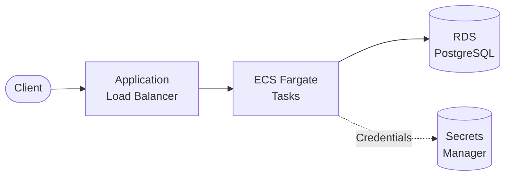

# ALB + ECS Fargate + RDS PostgreSQL

Containerized REST API on Amazon ECS Fargate with RDS PostgreSQL database.

## Architecture



## Requirements

- AWS Account with appropriate permissions
- AWS CLI installed and configured
- Terraform >= 1.9
- Docker installed

## Deployment

### 1. Deploy Infrastructure

```bash
cd environments/dev
terraform init
terraform apply
```

> RDS takes ~5-10 minutes to create.

### 2. Build and Push Image

```bash
ECR_URL=$(terraform output -raw ecr_repository_url)

aws ecr get-login-password --region us-east-1 | docker login --username AWS --password-stdin $ECR_URL

cd ../../src/api
docker build -t $ECR_URL:latest .
docker push $ECR_URL:latest
```

### 3. Force New Deployment

```bash
CLUSTER=$(terraform output -raw ecs_cluster_name)
SERVICE=$(terraform output -raw ecs_service_name)

aws ecs update-service --cluster $CLUSTER --service $SERVICE --force-new-deployment
```

## How it works

ECS Fargate runs containerized applications that connect to RDS PostgreSQL. The container retrieves database credentials from Secrets Manager at startup. Both the database and containers run in private subnets with no public access.

Key benefits:
- **Serverless containers**: No EC2 management
- **Managed database**: RDS handles backups, patching
- **Secure credentials**: Secrets Manager with rotation support
- **Private networking**: Database isolated in private subnets

## Testing

```bash
ALB_URL=$(terraform output -raw alb_url)

curl $ALB_URL/health
curl $ALB_URL/items
curl -X POST $ALB_URL/items -H "Content-Type: application/json" -d '{"name": "Test"}'
```

## Configuration

| Variable | Default | Description |
|----------|---------|-------------|
| `project` | - | Project name (lowercase, alphanumeric) |
| `environment` | - | Environment: dev, staging, prod |
| `task_cpu` | 256 | CPU units (256 = 0.25 vCPU) |
| `task_memory` | 512 | Memory in MB |
| `db_instance_class` | db.t3.micro | RDS instance size |
| `db_multi_az` | false | Multi-AZ deployment |

## Estimated Costs

| Resource | Cost (monthly) |
|----------|----------------|
| ALB | ~$16 + data |
| NAT Gateway | ~$32 + data |
| Fargate (256 CPU, 512MB, 24/7) | ~$9 |
| RDS (db.t3.micro) | ~$15 |
| Secrets Manager | ~$0.40 |

**Dev estimate: ~$75/month**

## Cleanup

```bash
# Delete images first
aws ecr batch-delete-image --repository-name $(terraform output -raw ecr_repository_name) --image-ids imageTag=latest

terraform destroy
```

## Related Blueprints

| Blueprint | Relationship | Use Case |
|-----------|--------------|----------|
| `alb-ecs-fargate` | Simpler | No database needed |
| `apigw-lambda-rds` | Serverless | Prefer Lambda over containers |
| `eks-cluster` | Kubernetes | Need full Kubernetes ecosystem |
