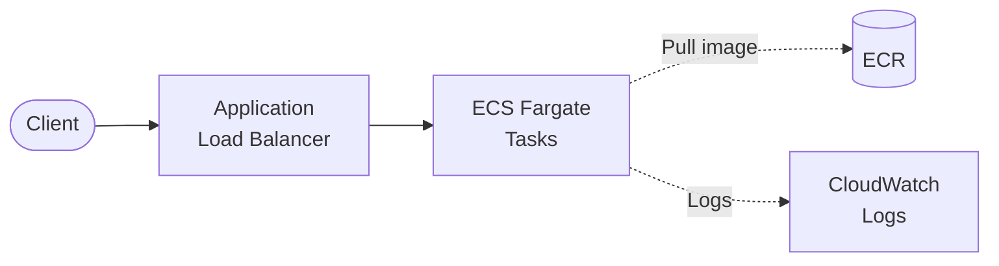

# ALB + ECS Fargate

Containerized REST API on Amazon ECS Fargate with Application Load Balancer.

## Architecture



## Requirements

- AWS Account with appropriate permissions
- AWS CLI installed and configured
- Terraform >= 1.9
- Docker installed

## Deployment

### 1. Deploy Infrastructure

```bash
cd environments/dev
terraform init
terraform apply
```

### 2. Build and Push Image

```bash
ECR_URL=$(terraform output -raw ecr_repository_url)

aws ecr get-login-password --region us-east-1 | docker login --username AWS --password-stdin $ECR_URL

cd ../../src/api
docker build -t $ECR_URL:latest .
docker push $ECR_URL:latest
```

### 3. Force New Deployment

```bash
CLUSTER=$(terraform output -raw ecs_cluster_name)
SERVICE=$(terraform output -raw ecs_service_name)

aws ecs update-service --cluster $CLUSTER --service $SERVICE --force-new-deployment
```

## How it works

ECS Fargate runs containerized applications without managing EC2 instances. The Application Load Balancer distributes traffic and handles health checks. Container images are stored in ECR (Elastic Container Registry).

Key benefits:
- **Serverless containers**: No EC2 management
- **Auto-scaling ready**: Add scaling policies as needed
- **VPC isolation**: Tasks run in private subnets
- **Custom runtimes**: Any language/framework via Docker

## Testing

```bash
ALB_URL=$(terraform output -raw alb_url)

curl $ALB_URL/health
curl $ALB_URL/items
curl -X POST $ALB_URL/items -H "Content-Type: application/json" -d '{"name": "Test"}'
```

## Configuration

| Variable | Default | Description |
|----------|---------|-------------|
| `project` | - | Project name (lowercase, alphanumeric) |
| `environment` | - | Environment: dev, staging, prod |
| `task_cpu` | 256 | CPU units (256 = 0.25 vCPU) |
| `task_memory` | 512 | Memory in MB |
| `desired_count` | 1 | Number of tasks |
| `use_fargate_spot` | false | Use Fargate Spot (70% savings) |

## Estimated Costs

| Resource | Cost (monthly) |
|----------|----------------|
| ALB | ~$16 + data |
| NAT Gateway | ~$32 + data |
| Fargate (256 CPU, 512MB, 24/7) | ~$9 |
| ECR | ~$0.10/GB/month |

**Dev estimate: ~$60/month**

## Cleanup

```bash
# Delete images first
aws ecr batch-delete-image --repository-name $(terraform output -raw ecr_repository_name) --image-ids imageTag=latest

terraform destroy
```

## Related Blueprints

| Blueprint | Relationship | Use Case |
|-----------|--------------|----------|
| `alb-ecs-fargate-rds` | Add database | Container API with PostgreSQL |
| `apigw-lambda-dynamodb` | Simpler | No containers needed |
| `eks-cluster` | Kubernetes | Need full Kubernetes ecosystem |
