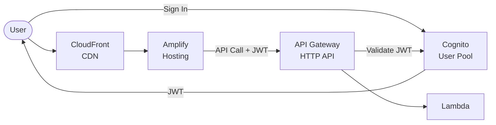

# Amplify + Cognito + API Gateway + Lambda

Full-stack serverless application with AWS Amplify frontend, Cognito authentication, and Lambda backend.

## Architecture



## Requirements

- AWS Account with appropriate permissions
- AWS CLI installed and configured
- Terraform >= 1.9
- Node.js >= 18.x

## Deployment

1. Update `environments/dev/terraform.tfvars`:

```hcl
# REQUIRED: Set a unique Cognito domain
cognito_domain = "myapp-auth-unique-123"

# Optional: Connect to Git repo for CI/CD
repository_url = "https://github.com/your-org/your-repo"
```

2. Deploy:

```bash
cd environments/dev
terraform init
terraform apply
```

## How it works

- **Amplify Hosting**: Static frontend with global CDN and CI/CD from Git
- **Cognito**: User sign up, sign in, password reset with hosted UI
- **API Gateway**: HTTP API with JWT authorizer validates Cognito tokens
- **Lambda**: Backend handler receives user context from JWT

Environment variables (User Pool ID, Client ID, API URL) are auto-injected into the Amplify frontend.

## Testing

```bash
# Get outputs
USER_POOL_ID=$(terraform output -raw user_pool_id)
CLIENT_ID=$(terraform output -raw user_pool_client_id)
API_URL=$(terraform output -raw api_endpoint)

# Create and confirm a user
aws cognito-idp sign-up \
  --client-id $CLIENT_ID \
  --username user@example.com \
  --password "Password123!"

aws cognito-idp admin-confirm-sign-up \
  --user-pool-id $USER_POOL_ID \
  --username user@example.com

# Get JWT token
TOKEN=$(aws cognito-idp initiate-auth \
  --client-id $CLIENT_ID \
  --auth-flow USER_PASSWORD_AUTH \
  --auth-parameters USERNAME=user@example.com,PASSWORD=Password123! \
  --query 'AuthenticationResult.IdToken' --output text)

# Call authenticated API
curl -H "Authorization: Bearer $TOKEN" "$API_URL/items"

curl -X POST "$API_URL/items" \
  -H "Authorization: Bearer $TOKEN" \
  -H "Content-Type: application/json" \
  -d '{"name": "test"}'
```

## Configuration

| Variable | Default | Description |
|----------|---------|-------------|
| `project` | - | Project name (lowercase, alphanumeric) |
| `environment` | - | Environment: dev, staging, prod |
| `cognito_domain` | - | Unique domain for hosted UI |
| `repository_url` | "" | Git repo for Amplify CI/CD |
| `lambda_memory_size` | 256 | Lambda memory (MB) |
| `mfa_configuration` | OFF | MFA: OFF, ON, OPTIONAL |

## Estimated Costs

| Resource | Cost |
|----------|------|
| Amplify Hosting | Free tier: 1000 min/month, 5GB/month |
| Cognito | Free up to 50K MAUs |
| API Gateway | ~$1/million requests |
| Lambda | Free tier: 1M requests/month |

**Often free tier eligible for development**

## Cleanup

```bash
terraform destroy
```

## Related Blueprints

| Blueprint | Relationship | Use Case |
|-----------|--------------|----------|
| `apigw-lambda-dynamodb-cognito` | Add storage | API with database |
| `apigw-lambda-rds` | Add SQL database | API with PostgreSQL |
| `apigw-lambda-bedrock-rag` | Add AI | AI-powered features |
