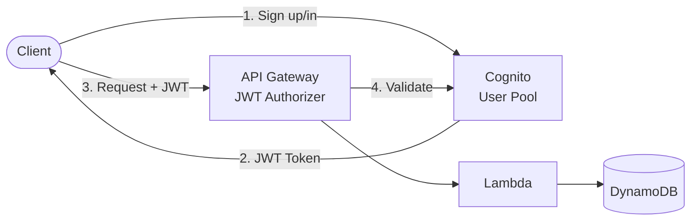

# API Gateway + Lambda + DynamoDB + Cognito

Serverless REST API with JWT authentication using Amazon Cognito. Each user's data is isolated.

## Architecture



## Requirements

- AWS Account with appropriate permissions
- AWS CLI installed and configured
- Terraform >= 1.9
- Node.js >= 18.x

## Deployment

```bash
cd environments/dev
cd ../../src/api && npm install && cd ../../environments/dev
terraform init
terraform apply
```

## How it works

When a user signs up or signs in via Cognito, they receive a JWT token. All API requests must include this token in the Authorization header. API Gateway validates the token automatically using the JWT Authorizer, then invokes Lambda which performs CRUD operations on DynamoDB. Each user only sees their own data (user isolation).

## Testing

```bash
# Get outputs
USER_POOL_ID=$(terraform output -raw user_pool_id)
CLIENT_ID=$(terraform output -raw user_pool_client_id)
API_URL=$(terraform output -raw api_endpoint)

# Sign up a user
aws cognito-idp sign-up \
  --client-id $CLIENT_ID \
  --username user@example.com \
  --password "Password123!"

# Confirm user (admin)
aws cognito-idp admin-confirm-sign-up \
  --user-pool-id $USER_POOL_ID \
  --username user@example.com

# Get token
TOKEN=$(aws cognito-idp initiate-auth \
  --client-id $CLIENT_ID \
  --auth-flow USER_PASSWORD_AUTH \
  --auth-parameters USERNAME=user@example.com,PASSWORD=Password123! \
  --query 'AuthenticationResult.IdToken' --output text)

# Create item (authenticated)
curl -X POST "$API_URL/items" \
  -H "Authorization: Bearer $TOKEN" \
  -H "Content-Type: application/json" \
  -d '{"name": "My Item"}'

# List items (only yours)
curl "$API_URL/items" -H "Authorization: Bearer $TOKEN"
```

## Configuration

| Variable | Default | Description |
|----------|---------|-------------|
| `project` | - | Project name (lowercase, alphanumeric) |
| `environment` | - | Environment: dev, staging, prod |
| `password_minimum_length` | 8 | Min password length |
| `mfa_configuration` | OFF | MFA: OFF, ON, OPTIONAL |
| `access_token_validity` | 1 | Token validity (hours) |

## Estimated Costs

| Resource | Cost |
|----------|------|
| Cognito | Free up to 50K MAUs |
| API Gateway | ~$1/million requests |
| Lambda | Free tier eligible |
| DynamoDB | Pay-per-request |

## Cleanup

```bash
terraform destroy
```

## Related Blueprints

| Blueprint | Relationship | Use Case |
|-----------|--------------|----------|
| `apigw-lambda-dynamodb` | Simpler | No authentication needed |
| `amplify-cognito-apigw-lambda` | Frontend | Add hosted UI with Cognito |
| `apigw-lambda-rds` | Alternative DB | Need relational data with auth |
