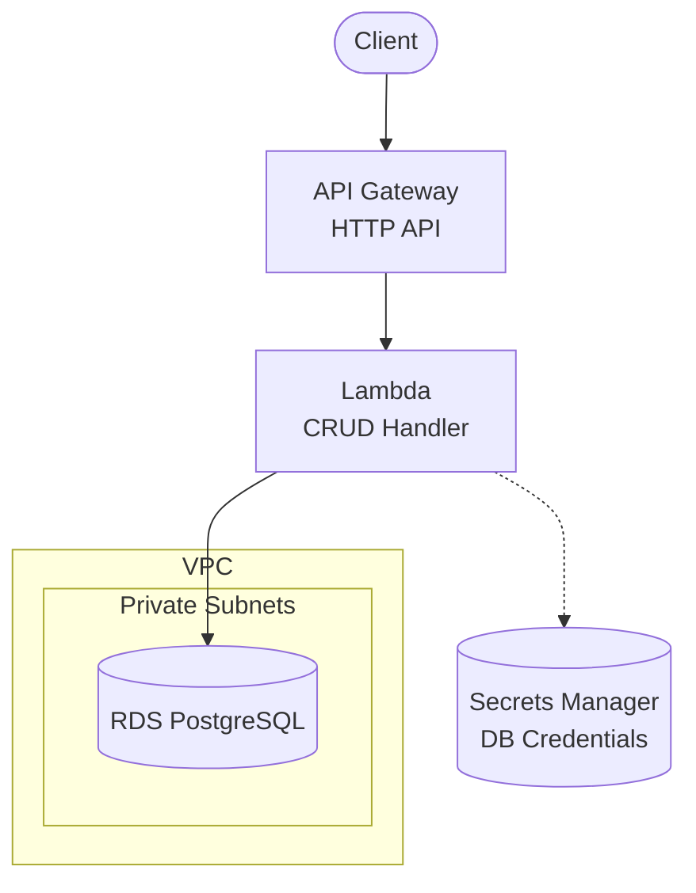

# API Gateway + Lambda + RDS PostgreSQL

Serverless REST API with Amazon API Gateway, AWS Lambda, and Amazon RDS PostgreSQL.

## Architecture



## Requirements

- AWS Account with appropriate permissions
- AWS CLI installed and configured
- Terraform >= 1.9
- Node.js >= 18.x

## Deployment

```bash
cd environments/dev
cd ../../src/api && npm install && cd ../../environments/dev
terraform init
terraform apply
```

> Deployment takes ~10-15 minutes due to RDS provisioning.

## How it works

When an HTTP request is sent to API Gateway, Lambda is invoked and performs CRUD operations on RDS PostgreSQL. Lambda retrieves database credentials from Secrets Manager. The database runs in private subnets with no public access.

**Note**: Each Lambda invocation creates a new database connection. For high-traffic production, consider `apigw-lambda-rds-proxy` for connection pooling.

## Testing

```bash
# Get the API endpoint
API_URL=$(terraform output -raw api_endpoint)

# Create an item
curl -X POST "$API_URL/items" \
  -H "Content-Type: application/json" \
  -d '{"name": "Test Item", "description": "My first item"}'

# List items
curl "$API_URL/items"

# Get item by ID
curl "$API_URL/items/{id}"

# Update item
curl -X PUT "$API_URL/items/{id}" \
  -H "Content-Type: application/json" \
  -d '{"name": "Updated Item"}'

# Delete item
curl -X DELETE "$API_URL/items/{id}"
```

## Configuration

| Variable | Default | Description |
|----------|---------|-------------|
| `project` | - | Project name (lowercase, alphanumeric) |
| `environment` | - | Environment: dev, staging, prod |
| `db_instance_class` | db.t3.micro | RDS instance size |
| `db_allocated_storage` | 20 | Initial storage (GB) |
| `lambda_memory_size` | 256 | Lambda memory (MB) |
| `lambda_timeout` | 30 | Lambda timeout (seconds) |

## Estimated Costs

| Resource | Dev (estimate) | Prod (estimate) |
|----------|----------------|-----------------|
| RDS (db.t3.micro) | ~$15/month | ~$50/month (db.t3.medium) |
| API Gateway | ~$1/month | ~$3.50/million requests |
| Lambda | Free tier | ~$0.20/million invocations |
| VPC Endpoints | ~$7/month | ~$7/month |
| Secrets Manager | ~$0.40/month | ~$0.40/month |

## Cleanup

```bash
terraform destroy
```

## Related Blueprints

| Blueprint | Relationship | Use Case |
|-----------|--------------|----------|
| `apigw-lambda-rds-proxy` | Add pooling | High-traffic production |
| `apigw-lambda-aurora` | Auto-scaling | Variable/unpredictable traffic |
| `apigw-lambda-dynamodb` | NoSQL | Don't need relational data |
