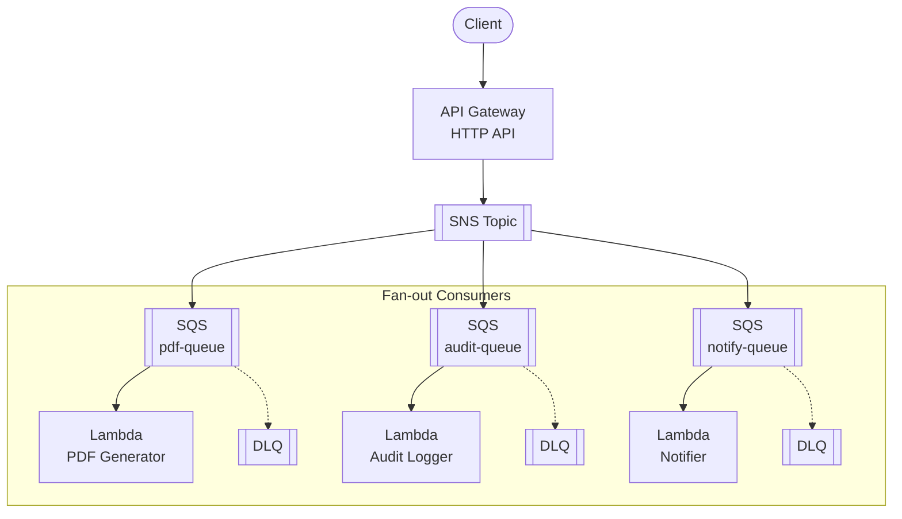

# API Gateway + SNS + Lambda

Event-driven API with Amazon SNS for pub/sub fan-out to multiple Lambda consumers.

## Architecture



## Requirements

- AWS Account with appropriate permissions
- AWS CLI installed and configured
- Terraform >= 1.9
- Node.js >= 18.x

## Deployment

```bash
cd environments/dev
cd ../../src/api && npm install && cd ../../environments/dev
terraform init
terraform apply
```

## How it works

API Gateway publishes messages to an SNS topic. SNS delivers the message to all subscribed SQS queues (fan-out), and each queue triggers its own Lambda consumer. Key concepts:

- **Fan-out**: One message delivered to multiple subscribers
- **Pub/Sub**: Publisher doesn't know who consumes messages
- **Independent failure**: Each consumer has its own queue and DLQ
- **Decoupling**: Add/remove consumers without changing the publisher

## Testing

```bash
# Get the API endpoint
API_URL=$(terraform output -raw api_endpoint)

# Publish an event (delivered to all consumers)
curl -X POST "$API_URL/events" \
  -H "Content-Type: application/json" \
  -d '{
    "eventType": "OrderCreated",
    "orderId": "123",
    "customerId": "456",
    "amount": 99.99
  }'

# Check Lambda logs for each consumer
aws logs tail /aws/lambda/pdf-generator --follow
aws logs tail /aws/lambda/audit-logger --follow
aws logs tail /aws/lambda/notifier --follow
```

## Configuration

| Variable | Default | Description |
|----------|---------|-------------|
| `project` | - | Project name (lowercase, alphanumeric) |
| `environment` | - | Environment: dev, staging, prod |
| `lambda_memory_size` | 256 | Lambda memory (MB) |
| `sqs_message_retention` | 86400 | Message retention (seconds) |
| `sqs_visibility_timeout` | 30 | Visibility timeout (seconds) |

## Estimated Costs

| Resource | Cost |
|----------|------|
| API Gateway | ~$1/million requests |
| SNS | ~$0.50/million publishes |
| SQS | ~$0.40/million requests |
| Lambda | Free tier / ~$0.20/million |

## Cleanup

```bash
terraform destroy
```

## Related Blueprints

| Blueprint | Relationship | Use Case |
|-----------|--------------|----------|
| `apigw-eventbridge-lambda` | Richer routing | Need content-based filtering, event replay |
| `apigw-sqs-lambda-dynamodb` | Single consumer | Task/job processing |
| `apigw-lambda-dynamodb` | Synchronous | Don't need event-driven architecture |
