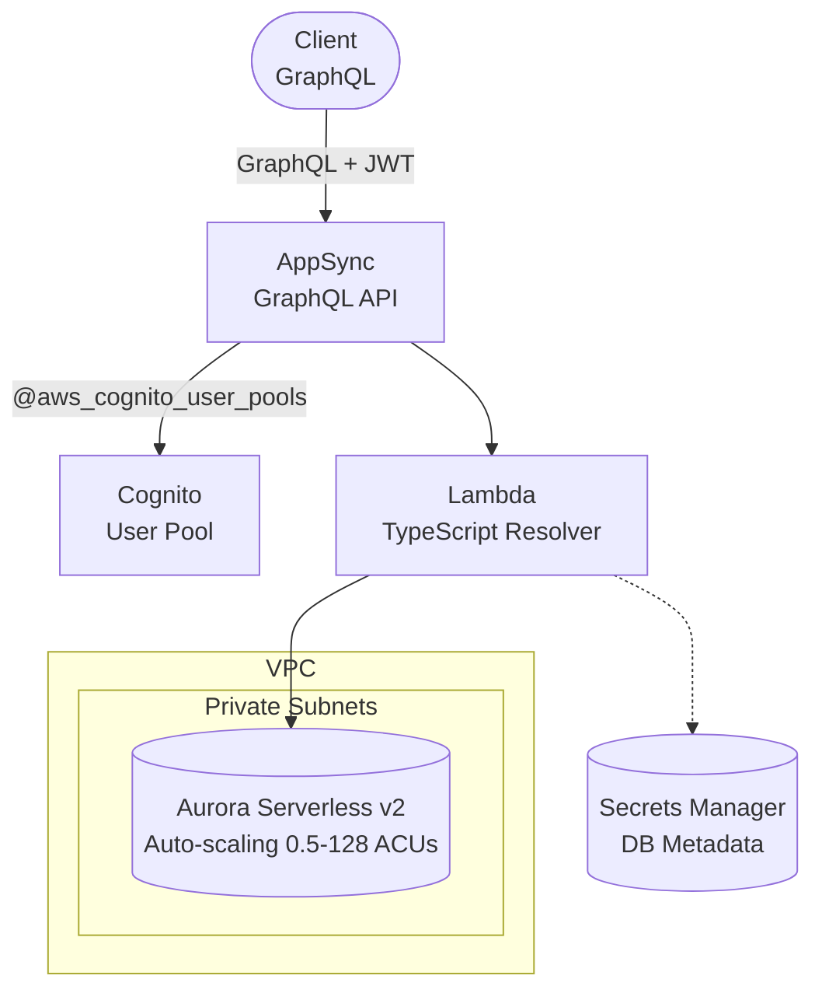

# AppSync + Lambda + Aurora Serverless v2 + Cognito

Serverless GraphQL API with AWS AppSync, Lambda resolvers, Aurora Serverless v2, and Cognito authentication. Based on The Body Coach project architecture (ustwo, 2020).

## Architecture



## Features

- **GraphQL API**: Type-safe queries and mutations with AppSync
- **Cognito Authentication**: User management with JWT tokens
- **Lambda Resolvers**: TypeScript resolvers with VPC access to Aurora
- **Aurora Serverless v2**: Auto-scaling PostgreSQL database
- **IAM Database Authentication**: Passwordless database access
- **VPC Isolation**: Secure network configuration

## Requirements

- AWS Account with appropriate permissions
- AWS CLI installed and configured
- Terraform >= 1.11 (required for ephemeral values)
- Node.js >= 20.x
- TypeScript >= 5.0

## Deployment

```bash
# Download the blueprint (use your preferred method - git clone, GitHub CLI, etc.)
git clone https://github.com/berTrindade/terraform-infrastructure-blueprints.git
cd terraform-infrastructure-blueprints/aws/appsync-lambda-aurora-cognito

# Navigate to environment
cd environments/dev

# Install Lambda dependencies
cd ../../src/api && npm install && npm run build && cd ../../environments/dev

# Configure variables (optional)
# Edit terraform.tfvars with your project name and region

# Initialize and deploy
terraform init
terraform plan
terraform apply
```

> Deployment takes ~15-20 minutes (Aurora cluster creation is the longest step).

## How it works

### GraphQL API

AppSync provides a managed GraphQL API with:
- **Real-time subscriptions**: Built-in WebSocket support
- **Caching**: Configurable response caching
- **Authorization**: Cognito User Pools integration
- **X-Ray tracing**: Distributed tracing enabled

### Authentication Flow

1. User authenticates with Cognito (email/password or passwordless)
2. Cognito returns JWT tokens (ID token, access token)
3. Client includes JWT in GraphQL requests
4. AppSync validates token and extracts user identity
5. Lambda resolver receives user context in `event.identity`

### Database Access

Lambda resolvers connect to Aurora using:
- **IAM Database Authentication**: Passwordless, token-based access
- **VPC Configuration**: Lambda in private subnets, Aurora in database subnets
- **Connection Pooling**: Aurora Serverless v2 handles connections automatically

### Aurora Serverless v2 Scaling

- **Minimum**: 0.5 ACU (~$0.06/hour when idle)
- **Maximum**: Configurable up to 128 ACU
- **Auto-scaling**: Scales based on query load
- **Cost-effective**: Pay only for capacity used

## Testing

### 1. Get AppSync Endpoint and API Key

```bash
# Get GraphQL endpoint
GRAPHQL_URL=$(terraform output -raw appsync_graphql_endpoint)

# Get API key (for testing without auth)
API_KEY=$(terraform output -raw appsync_api_key)

# Get Cognito User Pool ID
USER_POOL_ID=$(terraform output -raw cognito_user_pool_id)
CLIENT_ID=$(terraform output -raw cognito_user_pool_client_id)
```

### 2. Test with API Key (Development)

```bash
# Query: Get user
curl -X POST "$GRAPHQL_URL" \
  -H "Content-Type: application/json" \
  -H "x-api-key: $API_KEY" \
  -d '{
    "query": "query { getUser(id: \"test-id\") { id email name } }"
  }'

# Mutation: Create user
curl -X POST "$GRAPHQL_URL" \
  -H "Content-Type: application/json" \
  -H "x-api-key: $API_KEY" \
  -d '{
    "query": "mutation { createUser(input: { email: \"test@example.com\", name: \"Test User\" }) { id email name createdAt } }"
  }'
```

### 3. Test with Cognito Authentication

```bash
# Create a test user in Cognito
aws cognito-idp sign-up \
  --client-id $CLIENT_ID \
  --username test@example.com \
  --password Test123! \
  --user-attributes Name=email,Value=test@example.com

# Confirm user
aws cognito-idp admin-confirm-sign-up \
  --user-pool-id $USER_POOL_ID \
  --username test@example.com

# Get authentication token
TOKEN=$(aws cognito-idp initiate-auth \
  --client-id $CLIENT_ID \
  --auth-flow USER_PASSWORD_AUTH \
  --auth-parameters USERNAME=test@example.com,PASSWORD=Test123! \
  --query 'AuthenticationResult.IdToken' \
  --output text)

# Query with Cognito token
curl -X POST "$GRAPHQL_URL" \
  -H "Content-Type: application/json" \
  -H "Authorization: $TOKEN" \
  -d '{
    "query": "query { listUsers { items { id email name } } }"
  }'
```

### 4. Using GraphQL Playground

```bash
# Install GraphQL CLI
npm install -g graphql-cli

# Configure endpoint
graphql config add endpoint \
  --name dev \
  --url "$GRAPHQL_URL" \
  --header "x-api-key:$API_KEY"

# Open playground
graphql playground
```

## Configuration

| Variable | Default | Description |
|----------|---------|-------------|
| `project` | - | Project name (lowercase, alphanumeric) |
| `environment` | - | Environment: dev, staging, prod |
| `aws_region` | us-east-1 | AWS region |
| `aurora_min_capacity` | 0.5 | Minimum ACUs (0.5-128) |
| `aurora_max_capacity` | 4 | Maximum ACUs (0.5-128) |
| `lambda_memory_size` | 256 | Lambda memory (MB) |
| `lambda_timeout` | 30 | Lambda timeout (seconds) |
| `appsync_log_level` | ALL | CloudWatch log level |
| `appsync_xray_enabled` | true | Enable X-Ray tracing |
| `cognito_mfa_configuration` | OFF | MFA: OFF, ON, OPTIONAL |

## GraphQL Schema

The blueprint includes a sample schema with User management:

```graphql
type Query {
  getUser(id: ID!): User @aws_cognito_user_pools
  listUsers(limit: Int, nextToken: String): UserConnection @aws_cognito_user_pools
}

type Mutation {
  createUser(input: UserInput!): User! @aws_cognito_user_pools
  updateUser(id: ID!, input: UserInput!): User! @aws_cognito_user_pools
  deleteUser(id: ID!): Boolean! @aws_cognito_user_pools
}
```

Customize the schema in `src/graphql/schema.graphql` and update resolvers in `src/api/index.ts`.

## Estimated Costs

| Resource | Dev (estimate) | Prod (estimate) |
|----------|----------------|-----------------|
| Aurora (0.5 ACU idle) | ~$0.06/hour | - |
| Aurora (per ACU active) | ~$0.12/hour | ~$0.12/hour |
| AppSync (queries) | Free tier | ~$4/million |
| AppSync (mutations) | Free tier | ~$4/million |
| Lambda | Free tier | ~$0.20/million |
| Cognito | Free tier | ~$0.0055/MAU |
| VPC Endpoints | ~$7/month | ~$7/month |

**Cost advantage**: Scales to near-zero during idle periods. AppSync charges per request, making it cost-effective for low-to-medium traffic.

## Cleanup

```bash
terraform destroy
```

> **Note**: Aurora final snapshot is skipped by default in dev. Set `db_skip_final_snapshot = false` for production.

## Related Blueprints

| Blueprint | Relationship | Use Case |
|-----------|--------------|----------|
| `apigw-lambda-aurora` | REST alternative | Prefer REST over GraphQL |
| `apigw-lambda-dynamodb-cognito` | NoSQL alternative | Don't need relational data |
| `apigw-lambda-rds` | Fixed cost | Predictable workload, fixed capacity |

## Origin

This blueprint is based on the architecture used in **The Body Coach** project (ustwo, 2020), which required:
- GraphQL API for flexible data queries
- User authentication with passwordless email login
- Relational database for complex data relationships
- Serverless architecture for cost efficiency

## Troubleshooting

### Lambda Timeout

If Lambda times out connecting to Aurora:
- Check security group rules allow Lambda → Aurora (port 5432)
- Verify VPC endpoints are configured correctly
- Check Aurora cluster is in available state

### Authentication Errors

If Cognito authentication fails:
- Verify user is confirmed in Cognito User Pool
- Check token expiration (default: 1 hour)
- Ensure `@aws_cognito_user_pools` directive is on schema fields

### Database Connection Errors

If Lambda can't connect to Aurora:
- Verify IAM database user exists: `CREATE USER postgres WITH LOGIN;`
- Grant RDS IAM auth permission: `GRANT rds_iam TO postgres;`
- Check Lambda has `rds-db:connect` permission for cluster resource ID

## Next Steps

1. **Customize Schema**: Update `src/graphql/schema.graphql` with your data model
2. **Implement Resolvers**: Add business logic in `src/api/index.ts`
3. **Add Subscriptions**: Enable real-time updates with AppSync subscriptions
4. **Configure Caching**: Add response caching for frequently accessed data
5. **Set Up CI/CD**: Automate deployments with GitHub Actions or similar
