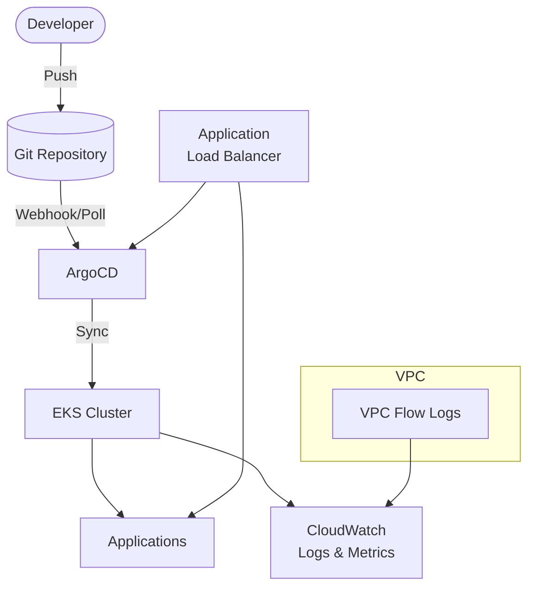

# EKS + ArgoCD

Production-ready Amazon EKS cluster with ArgoCD for GitOps deployments.

## Architecture



## Requirements

- AWS Account with appropriate permissions
- AWS CLI installed and configured
- Terraform >= 1.9
- kubectl installed
- Git repository for manifests

## Deployment

```bash
cd environments/dev
terraform init
terraform apply
```

> EKS + ArgoCD deployment takes ~15-20 minutes.

## How it works

ArgoCD implements GitOps for Kubernetes - it watches a Git repository and automatically syncs changes to your cluster. This blueprint includes:

- **EKS 1.29+** with managed node groups
- **ArgoCD** for GitOps continuous deployment
- **AWS Load Balancer Controller** for ALB Gateway API
- **App of Apps** pattern ready
- **Sample application** included
- **IRSA** (IAM Roles for Service Accounts)
- **VPC Flow Logs** enabled for network visibility
- **CloudWatch Container Insights** ready (log group created)

## Testing

### Configure kubectl

```bash
aws eks update-kubeconfig --region us-east-1 --name $(terraform output -raw cluster_name)
```

### Access ArgoCD UI

```bash
# Get ArgoCD Gateway URL (wait for Gateway to be ready)
kubectl get gateway argocd-gateway -n argocd -o jsonpath='{.status.addresses[0].value}'

# Or use port-forward if Gateway is not ready yet
terraform output argocd_port_forward

# Get admin password
terraform output argocd_get_admin_password
```

Login with username `admin` and the password from above.

### Set Up GitOps

1. Push manifests to your Git repository
2. Update `manifests/argocd-apps/sample-app.yaml` with your repo URL:

```yaml
spec:
  source:
    repoURL: https://github.com/YOUR-ORG/YOUR-REPO.git
```

1. Register the app:

```bash
kubectl apply -f manifests/argocd-apps/sample-app.yaml
```

Now edit manifests and push to Git - ArgoCD will automatically sync!

### Enable Pod Security Standards

Apply Pod Security Standards for baseline security:

```bash
kubectl label namespace default pod-security.kubernetes.io/enforce=baseline pod-security.kubernetes.io/audit=restricted pod-security.kubernetes.io/warn=restricted --overwrite
kubectl label namespace argocd pod-security.kubernetes.io/enforce=baseline pod-security.kubernetes.io/audit=restricted pod-security.kubernetes.io/warn=restricted --overwrite
```

### Enable CloudWatch Container Insights

After cluster creation, enable Container Insights for observability:

```bash
# Option 1: Via kubectl
kubectl apply -f https://raw.githubusercontent.com/aws-samples/amazon-cloudwatch-container-insights/latest/k8s-deployment-manifest-templates/deployment-mode/daemonset/container-insights-monitoring/quickstart/cwagent-fluentd-quickstart.yaml

# Option 2: Via AWS Console
# EKS > Cluster > Observability > Add-ons > CloudWatch Observability
```

View metrics in CloudWatch Console under Container Insights.

## Configuration

| Variable | Default | Description |
|----------|---------|-------------|
| `project` | - | Project name (lowercase, alphanumeric) |
| `environment` | - | Environment: dev, staging, prod |
| `cluster_version` | 1.29 | EKS version |
| `node_instance_types` | t3.medium | Node instance types |
| `node_desired_size` | 2 | Desired node count |
| `argocd_version` | 2.9.3 | ArgoCD Helm chart version |

## Estimated Costs

| Resource | Cost (monthly) |
|----------|----------------|
| EKS Control Plane | $72 |
| NAT Gateway | ~$32 + data |
| t3.medium nodes (2x) | ~$60 |
| ALB (ArgoCD + apps) | ~$32 + data |

**Total estimate: ~$200/month**

## Cleanup

```bash
# Delete ArgoCD apps first
kubectl delete applications --all -n argocd

# Delete workloads
kubectl delete httproute --all -A
kubectl delete gateway --all -A
kubectl delete svc --all -A --field-selector="spec.type=LoadBalancer"

# Wait for ALB cleanup
sleep 60

terraform destroy
```

## Related Blueprints

| Blueprint | Relationship | Use Case |
|-----------|--------------|----------|
| `eks-cluster` | Without GitOps | Manual kubectl/Helm deployments |
| `alb-ecs-fargate` | Simpler | Don't need Kubernetes |
| `apigw-lambda-dynamodb` | Serverless | Prefer serverless over containers |
