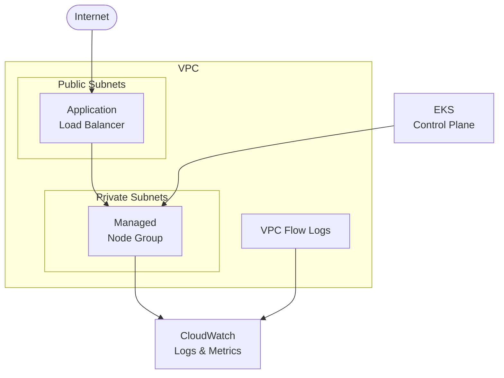

# EKS Cluster

Production-ready Amazon EKS cluster with managed node groups and essential addons.

## Architecture



## Requirements

- AWS Account with appropriate permissions
- AWS CLI installed and configured
- Terraform >= 1.9
- kubectl installed

## Deployment

```bash
cd environments/dev
terraform init
terraform apply
```

> EKS cluster creation takes ~10-15 minutes.

## How it works

Amazon EKS provides a managed Kubernetes control plane. This blueprint includes:

- **EKS 1.29+** with managed control plane
- **Managed Node Groups** with auto-scaling ready
- **IRSA** (IAM Roles for Service Accounts)
- **AWS Load Balancer Controller** for ALB/NLB Gateway API
- **EBS CSI Driver** for persistent volumes
- **VPC-CNI, CoreDNS, Kube-proxy** addons
- **VPC Flow Logs** enabled for network visibility
- **CloudWatch Container Insights** ready (log group created)

## Testing

```bash
# Configure kubectl
aws eks update-kubeconfig --region us-east-1 --name $(terraform output -raw cluster_name)

# Verify cluster
kubectl get nodes
kubectl get pods -n kube-system

# Deploy sample app with Gateway API
kubectl apply -f - <<EOF
apiVersion: apps/v1
kind: Deployment
metadata:
  name: nginx
spec:
  replicas: 2
  selector:
    matchLabels:
      app: nginx
  template:
    metadata:
      labels:
        app: nginx
    spec:
      containers:
      - name: nginx
        image: nginx:latest
        ports:
        - containerPort: 80
---
apiVersion: v1
kind: Service
metadata:
  name: nginx
spec:
  type: ClusterIP
  ports:
  - port: 80
  selector:
    app: nginx
---
apiVersion: gateway.networking.k8s.io/v1
kind: Gateway
metadata:
  name: nginx-gateway
spec:
  gatewayClassName: alb
  listeners:
  - name: http
    protocol: HTTP
    port: 80
---
apiVersion: gateway.networking.k8s.io/v1
kind: HTTPRoute
metadata:
  name: nginx-route
spec:
  parentRefs:
  - name: nginx-gateway
  rules:
  - matches:
    - path:
        type: PathPrefix
        value: /
    backendRefs:
    - name: nginx
      port: 80
EOF

kubectl get gateway nginx-gateway -w
kubectl get httproute nginx-route -w
```

### Enable Pod Security Standards

Apply Pod Security Standards for baseline security:

```bash
kubectl label namespace default pod-security.kubernetes.io/enforce=baseline pod-security.kubernetes.io/audit=restricted pod-security.kubernetes.io/warn=restricted --overwrite
```

For production workloads, use `restricted` instead of `baseline`:

```bash
kubectl label namespace production pod-security.kubernetes.io/enforce=restricted pod-security.kubernetes.io/audit=restricted pod-security.kubernetes.io/warn=restricted --overwrite
```

### Enable CloudWatch Container Insights

After cluster creation, enable Container Insights for observability:

```bash
# Option 1: Via kubectl
kubectl apply -f https://raw.githubusercontent.com/aws-samples/amazon-cloudwatch-container-insights/latest/k8s-deployment-manifest-templates/deployment-mode/daemonset/container-insights-monitoring/quickstart/cwagent-fluentd-quickstart.yaml

# Option 2: Via AWS Console
# EKS > Cluster > Observability > Add-ons > CloudWatch Observability
```

View metrics in CloudWatch Console under Container Insights.

## Configuration

| Variable | Default | Description |
|----------|---------|-------------|
| `project` | - | Project name (lowercase, alphanumeric) |
| `environment` | - | Environment: dev, staging, prod |
| `cluster_version` | 1.29 | EKS version |
| `node_instance_types` | t3.medium | Node instance types |
| `node_desired_size` | 2 | Desired node count |
| `node_capacity_type` | ON_DEMAND | ON_DEMAND or SPOT |

## Estimated Costs

| Resource | Cost (monthly) |
|----------|----------------|
| EKS Control Plane | $72 |
| NAT Gateway | ~$32 + data |
| t3.medium nodes (2x) | ~$60 |
| ALB (if created) | ~$16 + data |

**Total estimate: ~$180/month**

## Cleanup

```bash
# Delete workloads first
kubectl delete httproute --all -A
kubectl delete gateway --all -A
kubectl delete svc --all -A --field-selector="spec.type=LoadBalancer"

# Wait for ALB/NLB cleanup
sleep 60

terraform destroy
```

## Related Blueprints

| Blueprint | Relationship | Use Case |
|-----------|--------------|----------|
| `eks-argocd` | Add GitOps | Automated deployments from Git |
| `alb-ecs-fargate` | Simpler | Don't need full Kubernetes |
| `apigw-lambda-dynamodb` | Serverless | Prefer serverless over containers |
