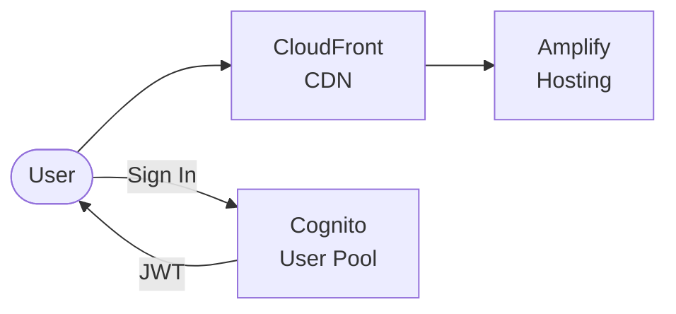
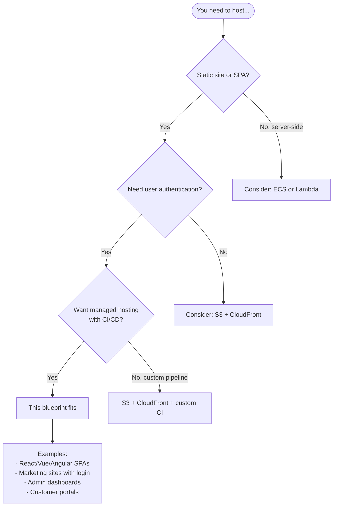

# Amplify Hosting with Cognito Authentication

Static site hosting on **AWS Amplify** with **Cognito** user authentication.

## Architecture



## Features

- **Amplify Hosting**: Global CDN, CI/CD
- **Cognito Authentication**: Sign up, sign in, password reset
- **Hosted UI**: Ready-to-use login pages
- **Environment injection**: Auth config auto-injected
- **SPA routing**: Single-page app support

## Quick Start

### 1. Update Configuration

Edit `environments/dev/terraform.tfvars`:

```hcl
# REQUIRED: Set a unique Cognito domain
cognito_domain = "myapp-auth-unique-123"

# Optional: Connect to Git repo for CI/CD
repository_url = "https://github.com/your-org/your-repo"
```

### 2. Deploy

```bash
cd environments/dev
terraform init
terraform apply
```

### 3. Manual Deployment (without Git)

If not using a Git repository:

```bash
# Get app ID
APP_ID=$(terraform output -raw amplify_app_id)
BRANCH=$(terraform output -raw branch_name)

# Deploy sample app
cd ../../src/app
npm run build
zip -r build.zip build/

aws amplify start-deployment \
  --app-id $APP_ID \
  --branch-name $BRANCH \
  --source-url s3://your-bucket/build.zip
```

Or use the AWS Console to deploy manually.

### 4. Test

```bash
# Get URLs
terraform output app_url
terraform output hosted_ui_url
```

## Sample App

The `src/app/` directory contains a simple HTML/JS demo with:
- Sign up form
- Sign in form
- Email confirmation
- Session management

## When to Use This Blueprint

### Decision Flowchart



### Ideal Use Cases

| Requirement | This Blueprint Provides |
|-------------|------------------------|
| Static/SPA hosting | Amplify with global CDN |
| User authentication | Cognito User Pool + Hosted UI |
| CI/CD from Git | Automatic builds on push |
| Environment variables | Auth config injected at build |
| Preview deployments | Branch previews available |

**Real-world examples this pattern fits:**

- **React/Vue/Angular SPAs** - Modern frontend frameworks
- **Marketing sites** - With gated content or user accounts
- **Admin dashboards** - Internal tools with authentication
- **Documentation sites** - With member-only sections
- **Landing pages** - With signup/waitlist functionality

### When NOT to Use This Blueprint

| Scenario | Better Alternative |
|----------|-------------------|
| **Server-side rendering** | ECS Fargate or Lambda |
| **No authentication needed** | S3 + CloudFront |
| **Complex backend API** | Add serverless-api-cognito |
| **Self-hosted CI/CD** | S3 + CloudFront + GitHub Actions |
| **Multi-region active-active** | Custom CloudFront + S3 |

## Directory Structure

```
├── environments/dev/
├── modules/
│   ├── naming/
│   ├── tagging/
│   ├── auth/         # Cognito User Pool
│   └── hosting/      # Amplify App
├── src/app/
│   └── index.html    # Sample auth app
└── README.md
```

## Configuration

| Variable | Default | Description |
|----------|---------|-------------|
| `cognito_domain` | Required | Unique domain for hosted UI |
| `repository_url` | "" | Git repo for CI/CD |
| `framework` | React | Build framework |
| `main_branch_name` | main | Branch to deploy |

## Environment Variables

Amplify automatically injects these variables:

| Variable | Description |
|----------|-------------|
| `REACT_APP_USER_POOL_ID` | Cognito User Pool ID |
| `REACT_APP_USER_POOL_CLIENT_ID` | Cognito Client ID |
| `REACT_APP_AWS_REGION` | AWS Region |

## Using with React

```jsx
import { Amplify } from 'aws-amplify';

Amplify.configure({
  Auth: {
    Cognito: {
      userPoolId: process.env.REACT_APP_USER_POOL_ID,
      userPoolClientId: process.env.REACT_APP_USER_POOL_CLIENT_ID,
      region: process.env.REACT_APP_AWS_REGION,
    }
  }
});
```

## Estimated Costs

| Resource | Cost |
|----------|------|
| Amplify Hosting | Free tier: 1000 min/month, 5GB/month |
| Cognito | Free up to 50K MAUs |
| CloudFront | Included with Amplify |

**Often free tier eligible**

## Production Considerations

1. **Custom domain**: Add domain in Amplify Console
2. **MFA**: Set `mfa_configuration = "OPTIONAL"` or `"ON"`
3. **Branch previews**: Enable `enable_pull_request_preview`
4. **Identity Pool**: Set `create_identity_pool = true` for AWS access

## Deployment

This blueprint includes a GitHub Actions workflow for progressive CD.

### Phase 1: Dev Only (Default)

```bash
# Copy, init, push to GitHub
cp -r aws/example-amplify-hosting-auth ~/my-project && cd ~/my-project
git init && git add . && git commit -m "Initial commit"
gh repo create my-project --private --push

# Add AWS credentials: Settings → Secrets → AWS_ROLE_ARN
# Deploy: Actions → Deploy → dev → apply
```

### Phase 2: Add Staging

```bash
./scripts/create-environment.sh staging
git add . && git commit -m "feat: add staging" && git push
# Deploy: Actions → Deploy → staging → apply
```

### Phase 3: Add Production

```bash
./scripts/create-environment.sh prod
git add . && git commit -m "feat: add production" && git push
# Configure: Settings → Environments → production (add reviewers)
# Deploy: Actions → Deploy → prod → apply
```

## Cleanup

```bash
terraform destroy
```

## Related Blueprints

| Blueprint | Relationship | Use Case |
|-----------|--------------|----------|
| `example-serverless-api-cognito` | Backend | Add API backend with same Cognito |
| `example-serverless-api-dynamodb` | Backend | Add unauthenticated API |
| `example-bedrock-rag-api` | AI Backend | Add AI-powered features |

## License

MIT
