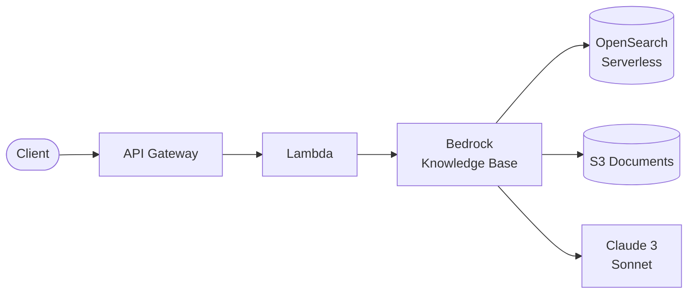
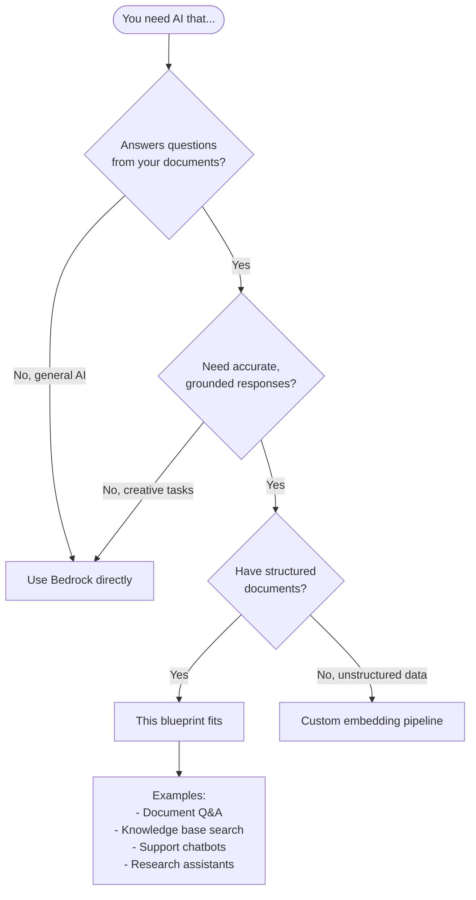

# Bedrock RAG API

Production-ready **RAG (Retrieval Augmented Generation)** API using Amazon Bedrock Knowledge Bases.

## Architecture



## How RAG Works

1. **Upload**: Documents uploaded to S3
2. **Index**: Knowledge Base chunks, embeds, and stores in OpenSearch
3. **Query**: User question is embedded, similar chunks retrieved
4. **Generate**: Retrieved context + question sent to Claude for grounded response

## Features

- **Managed RAG**: Bedrock handles chunking, embedding, retrieval
- **OpenSearch Serverless**: No cluster management
- **Auto-sync**: Documents automatically indexed from S3
- **Citations**: Responses include source references
- **Pre-signed uploads**: Secure document ingestion

## Quick Start

### Prerequisites

1. **Enable Bedrock models** in AWS Console:
   - Claude 3 Sonnet (for generation)
   - Titan Text Embeddings V2 (for embeddings)

### Deploy

```bash
cd environments/dev
cd ../../src/api && npm install && cd ../../environments/dev
terraform init
terraform apply
```

> Note: OpenSearch Serverless collection takes ~5 minutes to create

### Upload Documents

```bash
API_URL=$(terraform output -raw api_endpoint)

# Get upload URL
UPLOAD_RESPONSE=$(curl -s -X POST "$API_URL/ingest" \
  -H "Content-Type: application/json" \
  -d '{"filename": "document.pdf", "contentType": "application/pdf"}')

UPLOAD_URL=$(echo $UPLOAD_RESPONSE | jq -r '.uploadUrl')

# Upload file
curl -X PUT "$UPLOAD_URL" \
  -H "Content-Type: application/pdf" \
  --data-binary @document.pdf

# Trigger indexing
curl -X POST "$API_URL/sync"
```

### Query

```bash
curl -X POST "$API_URL/query" \
  -H "Content-Type: application/json" \
  -d '{"question": "What is the main topic of the document?"}'
```

## API Endpoints

| Method | Path | Description |
|--------|------|-------------|
| POST | /query | RAG query with generation |
| POST | /ingest | Get pre-signed upload URL |
| POST | /sync | Trigger knowledge base sync |
| GET | /sources | List indexed documents |

## Adding New Routes

Routes are defined declaratively in `variables.tf` - similar to Serverless Framework's `serverless.yml`:

```hcl
# environments/dev/variables.tf
variable "api_routes" {
  default = {
    # Existing routes...
    
    # Add new routes here!
    summarize = {
      method      = "POST"
      path        = "/summarize"
      description = "Summarize a document"
    }
    chat = {
      method      = "POST"
      path        = "/chat"
      description = "Multi-turn conversation with RAG"
    }
  }
}
```

Then update the Lambda handler in `src/api/index.js` to handle the new routes.

**Benefits of this pattern:**
- Routes visible in Terraform config (not hidden in Lambda code)
- Easy to see the full API surface at a glance
- Validation catches invalid methods early
- Follows terraform-aws-modules best practices

## References

This example follows patterns recommended by:

### Official Terraform Modules
- [terraform-aws-modules/lambda](https://registry.terraform.io/modules/terraform-aws-modules/lambda/aws/latest) - Lambda packaging, IAM, and CloudWatch integration
- [terraform-aws-modules/apigateway-v2](https://registry.terraform.io/modules/terraform-aws-modules/apigateway-v2/aws/latest) - HTTP API with dynamic route definitions via `routes` map

### AWS & HashiCorp Best Practices
- [AWS Prescriptive Guidance: Using Community Modules](https://docs.aws.amazon.com/prescriptive-guidance/latest/terraform-aws-provider-best-practices/community.html)
- [AWS Prescriptive Guidance: Code Structure](https://docs.aws.amazon.com/prescriptive-guidance/latest/terraform-aws-provider-best-practices/structure.html)
- [HashiCorp: Standard Module Structure](https://developer.hashicorp.com/terraform/language/modules/develop/structure)
- [HashiCorp: Module Creation Pattern](https://developer.hashicorp.com/terraform/tutorials/modules/pattern-module-creation)

### Query Request

```json
{
  "question": "What are the key findings?",
  "maxResults": 5
}
```

### Query Response

```json
{
  "answer": "Based on the documents...",
  "citations": [
    {
      "text": "Generated text portion",
      "sources": [
        {
          "content": "Source chunk text",
          "location": "s3://bucket/documents/file.pdf"
        }
      ]
    }
  ]
}
```

## When to Use This Blueprint

### Decision Flowchart



### Ideal Use Cases

| Requirement | This Blueprint Provides |
|-------------|------------------------|
| Document-grounded AI | RAG with Bedrock Knowledge Base |
| Citation support | Sources returned with answers |
| Managed infrastructure | OpenSearch Serverless (no clusters) |
| Multiple file formats | PDF, Word, Excel, HTML, etc. |
| Easy document updates | S3 sync with auto-indexing |

**Real-world examples this pattern fits:**

- **Internal knowledge base** - Search company docs with AI
- **Customer support chatbot** - Answer FAQs from documentation
- **Research assistant** - Query research papers and reports
- **Legal document analysis** - Find relevant clauses and precedents
- **Product documentation** - Help users find answers quickly

### When NOT to Use This Blueprint

| Scenario | Better Alternative |
|----------|-------------------|
| **General chat (no docs)** | Direct Bedrock API |
| **Real-time data** | Custom solution with streaming |
| **Very large datasets (TB+)** | Custom Kendra or OpenSearch |
| **Sub-second latency required** | Pre-computed responses |
| **Cost-sensitive prototype** | Consider minimum ~$180/mo cost |

## Directory Structure

```
├── environments/dev/
├── modules/
│   ├── naming/
│   ├── tagging/
│   ├── storage/       # S3 bucket
│   ├── vector/        # OpenSearch Serverless
│   ├── knowledge/     # Bedrock Knowledge Base
│   └── api/           # API Gateway + Lambda
├── src/api/
│   └── index.js
└── README.md
```

## Configuration

| Variable | Default | Description |
|----------|---------|-------------|
| `generation_model_id` | claude-3-sonnet | LLM for responses |
| `embedding_model_id` | titan-embed-v2 | Embedding model |
| `chunk_max_tokens` | 300 | Tokens per chunk |
| `chunk_overlap_percentage` | 20 | Chunk overlap |
| `opensearch_standby_replicas` | DISABLED | HA mode |

## Supported Document Types

- PDF
- TXT, MD, HTML
- CSV
- DOC, DOCX
- XLS, XLSX

## Estimated Costs

| Resource | Cost |
|----------|------|
| OpenSearch Serverless | ~$0.24/OCU-hour (min ~$175/mo with DISABLED replicas) |
| Bedrock Claude 3 Sonnet | $0.003/1K input, $0.015/1K output |
| Bedrock Titan Embeddings | $0.0001/1K tokens |
| S3, Lambda, API Gateway | Minimal |

**Minimum dev cost: ~$180/month** (mostly OpenSearch Serverless)

> To reduce costs in dev, consider destroying when not in use.

## Production Considerations

1. **Enable standby replicas**: `opensearch_standby_replicas = "ENABLED"`
2. **API authentication**: Add Cognito or API key
3. **Rate limiting**: Configure API Gateway throttling
4. **Monitoring**: Set up CloudWatch alarms
5. **VPC**: Consider VPC endpoints for security

## Manual Sync

To manually sync documents after upload:

```bash
aws bedrock-agent start-ingestion-job \
  --knowledge-base-id $(terraform output -raw knowledge_base_id) \
  --data-source-id $(terraform output -raw data_source_id)
```

## Deployment

This blueprint includes a GitHub Actions workflow for progressive CD.

### Phase 1: Dev Only (Default)

```bash
# Copy, init, push to GitHub
cp -r aws/example-bedrock-rag-api ~/my-project && cd ~/my-project
git init && git add . && git commit -m "Initial commit"
gh repo create my-project --private --push

# Add AWS credentials: Settings → Secrets → AWS_ROLE_ARN
# Deploy: Actions → Deploy → dev → apply
```

### Phase 2: Add Staging

```bash
./scripts/create-environment.sh staging
git add . && git commit -m "feat: add staging" && git push
# Deploy: Actions → Deploy → staging → apply
```

### Phase 3: Add Production

```bash
./scripts/create-environment.sh prod
git add . && git commit -m "feat: add production" && git push
# Configure: Settings → Environments → production (add reviewers)
# Deploy: Actions → Deploy → prod → apply
```

## Cleanup

```bash
# Empty S3 bucket first
aws s3 rm s3://$(terraform output -raw documents_bucket) --recursive

terraform destroy
```

## Related Blueprints

| Blueprint | Relationship | Use Case |
|-----------|--------------|----------|
| `example-serverless-api-dynamodb` | Simpler | Basic API without AI |
| `example-serverless-api-cognito` | Add auth | Secure RAG API with users |
| `example-amplify-hosting-auth` | Frontend | Add chat UI for RAG |
| `example-ecs-fargate-api` | Alternative | Container-based AI workloads |

## License

MIT
