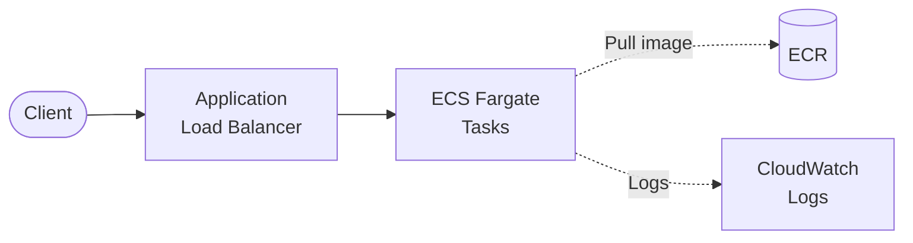
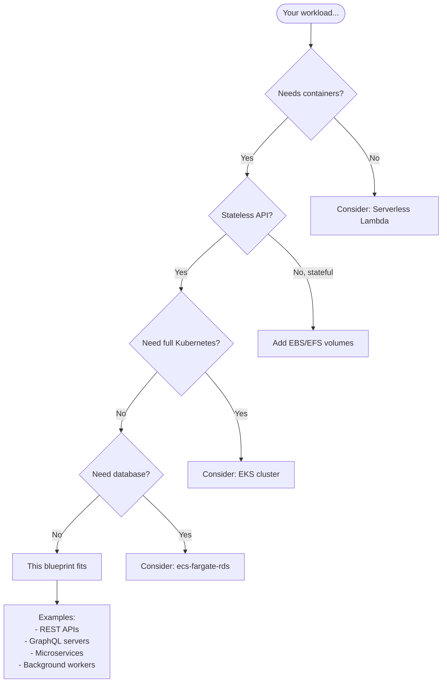

# ECS Fargate API

Containerized REST API on **ECS Fargate** with Application Load Balancer.

## Architecture



## Features

- **ECS Fargate**: Serverless containers, no EC2 management
- **ALB**: Load balancing, health checks
- **ECR**: Private container registry
- **Auto-scaling ready**: Add scaling policies as needed
- **VPC isolation**: Private subnets for tasks

## Quick Start

### 1. Deploy Infrastructure

```bash
cd environments/dev
terraform init
terraform apply
```

### 2. Build and Push Image

```bash
# Get ECR URL
ECR_URL=$(terraform output -raw ecr_repository_url)

# Login to ECR
aws ecr get-login-password --region us-east-1 | docker login --username AWS --password-stdin $ECR_URL

# Build and push
cd ../../src/api
docker build -t $ECR_URL:latest .
docker push $ECR_URL:latest
```

### 3. Force New Deployment

```bash
CLUSTER=$(terraform output -raw ecs_cluster_name)
SERVICE=$(terraform output -raw ecs_service_name)

aws ecs update-service --cluster $CLUSTER --service $SERVICE --force-new-deployment
```

### 4. Test

```bash
ALB_URL=$(terraform output -raw alb_url)
curl $ALB_URL/health
curl $ALB_URL/items
```

## API Endpoints

| Method | Path | Description |
|--------|------|-------------|
| GET | /health | Health check |
| POST | /items | Create item |
| GET | /items | List items |
| GET | /items/{id} | Get item |
| PUT | /items/{id} | Update item |
| DELETE | /items/{id} | Delete item |

## When to Use This Blueprint

### Decision Flowchart



### Ideal Use Cases

| Requirement | This Blueprint Provides |
|-------------|------------------------|
| Container workloads | ECS Fargate (no EC2 management) |
| Load balancing | Application Load Balancer |
| Private registry | ECR for container images |
| Auto-scaling ready | Add scaling policies easily |
| VPC isolation | Private subnets for tasks |

**Real-world examples this pattern fits:**

- **REST/GraphQL APIs** - Containerized backend services
- **Microservices** - Independent deployable units
- **Legacy app migration** - Lift-and-shift to containers
- **Long-running processes** - Beyond Lambda's 15-min limit
- **Custom runtimes** - Languages not supported by Lambda

### When NOT to Use This Blueprint

| Scenario | Better Alternative |
|----------|-------------------|
| **Simple APIs** | serverless-api-dynamodb (cheaper) |
| **Short-lived functions** | Lambda (no container overhead) |
| **Need a database** | ecs-fargate-rds |
| **Full Kubernetes needed** | eks-cluster |
| **Event-driven processing** | sqs-worker-api or sns-fanout-api |

## Directory Structure

```
├── environments/dev/
├── modules/
│   ├── naming/
│   ├── tagging/
│   ├── vpc/           # VPC, subnets, NAT, security groups
│   ├── cluster/       # ECS Cluster
│   └── service/       # ECS Service, Task, ALB, ECR
├── src/api/
│   ├── Dockerfile
│   └── index.js
└── README.md
```

## Configuration

| Variable | Default | Description |
|----------|---------|-------------|
| `task_cpu` | 256 | CPU units (256 = 0.25 vCPU) |
| `task_memory` | 512 | Memory in MB |
| `desired_count` | 1 | Number of tasks |
| `use_fargate_spot` | false | Use Fargate Spot (70% savings) |

## Estimated Costs

| Resource | Cost (monthly) |
|----------|----------------|
| ALB | ~$16 + data |
| NAT Gateway | ~$32 + data |
| Fargate (256 CPU, 512MB, 24/7) | ~$9 |
| ECR | ~$0.10/GB/month |

**Dev estimate: ~$60/month**

## Production Considerations

1. **Multiple AZs**: Set `az_count = 3`
2. **Auto-scaling**: Add `aws_appautoscaling_target` and policies
3. **HTTPS**: Add certificate and HTTPS listener
4. **Fargate Spot**: Set `use_fargate_spot = true` for non-critical workloads

## Cleanup

```bash
# Delete images first
aws ecr batch-delete-image --repository-name $(terraform output -raw ecr_repository_name) --image-ids imageTag=latest

terraform destroy
```

## Related Blueprints

| Blueprint | Relationship | Use Case |
|-----------|--------------|----------|
| `example-ecs-fargate-rds` | Add database | Container API with PostgreSQL |
| `example-serverless-api-dynamodb` | Simpler | No containers needed |
| `example-eks-cluster` | More complex | Need full Kubernetes |
| `example-sqs-worker-api` | Event-driven | Async processing pattern |

## License

MIT
