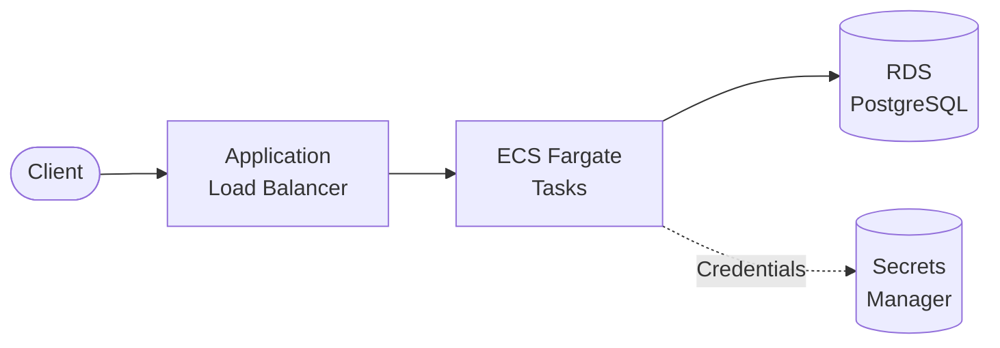
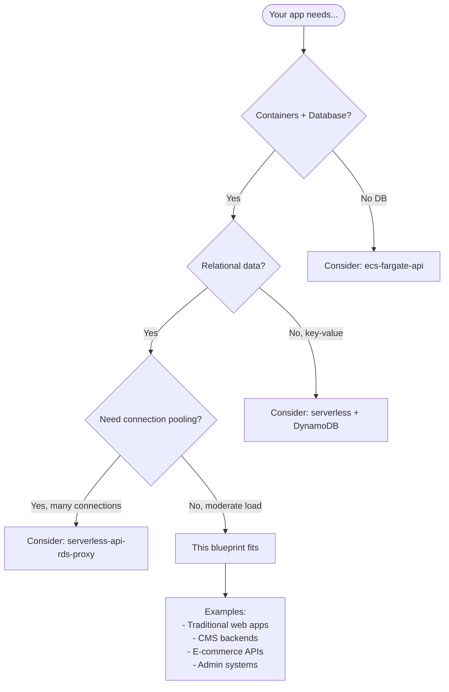

# ECS Fargate with RDS PostgreSQL

Containerized REST API on **ECS Fargate** with **RDS PostgreSQL** database.

## Architecture



## Features

- **ECS Fargate**: Serverless containers
- **RDS PostgreSQL**: Managed database
- **Secrets Manager**: Secure credential storage
- **Multi-AZ ready**: HA configuration available
- **Private networking**: Database in isolated subnets

## Quick Start

### 1. Deploy Infrastructure

```bash
cd environments/dev
terraform init
terraform apply
```

> ⏱️ RDS takes ~5-10 minutes to create

### 2. Build and Push Image

```bash
ECR_URL=$(terraform output -raw ecr_repository_url)

aws ecr get-login-password --region us-east-1 | docker login --username AWS --password-stdin $ECR_URL

cd ../../src/api
docker build -t $ECR_URL:latest .
docker push $ECR_URL:latest
```

### 3. Force Deployment

```bash
cd ../../environments/dev
CLUSTER=$(terraform output -raw ecs_cluster_name)
SERVICE=$(terraform output -raw ecs_service_name)

aws ecs update-service --cluster $CLUSTER --service $SERVICE --force-new-deployment
```

### 4. Test

```bash
ALB_URL=$(terraform output -raw alb_url)
curl $ALB_URL/health
curl -X POST $ALB_URL/items -H "Content-Type: application/json" -d '{"name": "Test"}'
curl $ALB_URL/items
```

## API Endpoints

| Method | Path | Description |
|--------|------|-------------|
| GET | /health | Health check (includes DB) |
| POST | /items | Create item |
| GET | /items | List items |
| GET | /items/{id} | Get item |
| PUT | /items/{id} | Update item |
| DELETE | /items/{id} | Delete item |

## When to Use This Blueprint

### Decision Flowchart



### Ideal Use Cases

| Requirement | This Blueprint Provides |
|-------------|------------------------|
| Containerized workloads | ECS Fargate |
| Relational database | RDS PostgreSQL |
| Secure credentials | Secrets Manager |
| VPC isolation | Private subnets for DB and tasks |
| Managed infrastructure | No EC2 or DB servers to manage |

**Real-world examples this pattern fits:**

- **Traditional web applications** - Ruby/Django/Spring apps
- **CMS backends** - WordPress, Strapi, Ghost
- **E-commerce APIs** - Product catalog, orders, inventory
- **Admin dashboards** - Internal tools with complex queries
- **Legacy modernization** - Containerize existing apps

### When NOT to Use This Blueprint

| Scenario | Better Alternative |
|----------|-------------------|
| **No database needed** | ecs-fargate-api |
| **Simple CRUD, no containers** | serverless-api-rds |
| **High connection count** | serverless-api-rds-proxy |
| **NoSQL/key-value data** | serverless-api-dynamodb |
| **Need Kubernetes** | eks-cluster + RDS |

## Directory Structure

```
├── environments/dev/
├── modules/
│   ├── naming/
│   ├── tagging/
│   ├── vpc/           # VPC with database subnets
│   ├── secrets/       # DB credentials
│   ├── data/          # RDS PostgreSQL
│   ├── cluster/       # ECS Cluster
│   └── service/       # ECS Service + ALB
├── src/api/
│   ├── Dockerfile
│   └── index.js
└── README.md
```

## Configuration

| Variable | Default | Description |
|----------|---------|-------------|
| `db_instance_class` | db.t3.micro | RDS instance type |
| `db_multi_az` | false | Enable Multi-AZ |
| `task_cpu` | 256 | Fargate CPU units |
| `task_memory` | 512 | Fargate memory (MB) |

## Estimated Costs

| Resource | Cost (monthly) |
|----------|----------------|
| RDS db.t3.micro | ~$12 |
| ALB | ~$16 + data |
| NAT Gateway | ~$32 + data |
| Fargate | ~$9 |
| Secrets Manager | ~$0.40 |

**Dev estimate: ~$70/month**

## Production Considerations

1. **Multi-AZ RDS**: Set `db_multi_az = true`
2. **Larger instances**: Upgrade `db_instance_class`
3. **Auto-scaling**: Add ECS service scaling
4. **HTTPS**: Add SSL certificate
5. **Backup**: Adjust `db_backup_retention_period`

## Deployment

This blueprint includes a GitHub Actions workflow for progressive CD.

### Phase 1: Dev Only (Default)

```bash
# Copy, init, push to GitHub
cp -r aws/example-ecs-fargate-rds ~/my-project && cd ~/my-project
git init && git add . && git commit -m "Initial commit"
gh repo create my-project --private --push

# Add AWS credentials: Settings → Secrets → AWS_ROLE_ARN
# Deploy: Actions → Deploy → dev → apply
# Then build and push your Docker image (see Quick Start)
```

### Phase 2: Add Staging

```bash
./scripts/create-environment.sh staging
git add . && git commit -m "feat: add staging" && git push
# Deploy: Actions → Deploy → staging → apply
```

### Phase 3: Add Production

```bash
./scripts/create-environment.sh prod
git add . && git commit -m "feat: add production" && git push
# Configure: Settings → Environments → production (add reviewers)
# Deploy: Actions → Deploy → prod → apply
```

## Cleanup

```bash
# Delete ECR images first
aws ecr batch-delete-image --repository-name $(terraform output -raw ecr_repository_name) --image-ids imageTag=latest

terraform destroy
```

## Related Blueprints

| Blueprint | Relationship | Use Case |
|-----------|--------------|----------|
| `example-ecs-fargate-api` | Simpler | No database needed |
| `example-serverless-api-rds` | Serverless | Lambda instead of containers |
| `example-serverless-api-rds-proxy` | High scale | Many DB connections |
| `example-eks-cluster` | Kubernetes | Need K8s orchestration |

## License

MIT
