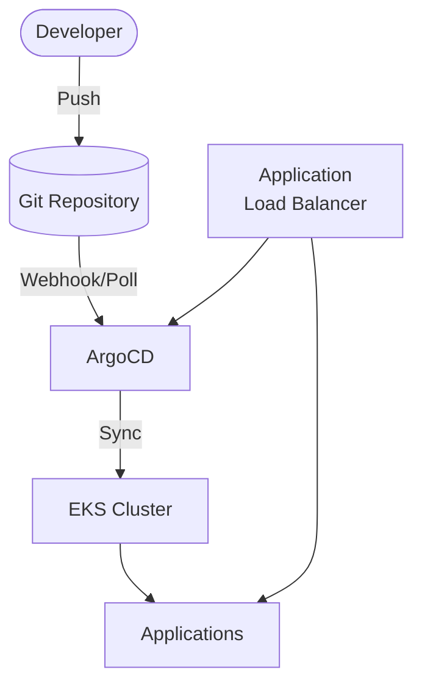
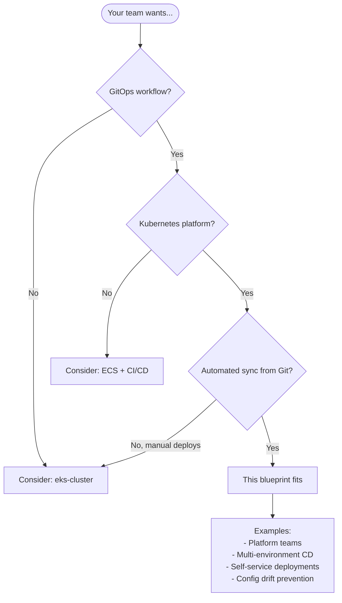

# EKS with ArgoCD

Production-ready **Amazon EKS** cluster with **ArgoCD** for GitOps deployments.

## Architecture



## Features

- **EKS 1.29+** with managed node groups
- **ArgoCD** for GitOps continuous deployment
- **AWS Load Balancer Controller** for ALB ingress
- **App of Apps** pattern ready
- **Sample application** included
- **IRSA** (IAM Roles for Service Accounts)

## Quick Start

### Deploy

```bash
cd environments/dev
terraform init
terraform apply
```

> EKS + ArgoCD deployment takes ~15-20 minutes

### Configure kubectl

```bash
aws eks update-kubeconfig --region us-east-1 --name $(terraform output -raw cluster_name)
```

### Access ArgoCD UI

```bash
# Get ArgoCD URL
terraform output argocd_url

# Get admin password
kubectl -n argocd get secret argocd-initial-admin-secret -o jsonpath='{.data.password}' | base64 -d
```

Login with username `admin` and the password from above.

## GitOps Workflow

### 1. Fork/Clone This Repository

Push to your Git repository.

### 2. Update ArgoCD Application

Edit `manifests/argocd-apps/sample-app.yaml`:

```yaml
spec:
  source:
    repoURL: https://github.com/YOUR-ORG/YOUR-REPO.git  # Update this
```

### 3. Register the App in ArgoCD

```bash
kubectl apply -f manifests/argocd-apps/sample-app.yaml
```

Or use the App of Apps pattern:

```bash
kubectl apply -f manifests/argocd-apps/app-of-apps.yaml
```

### 4. Make Changes

Edit manifests and push to Git. ArgoCD will automatically sync changes!

## When to Use This Blueprint

### Decision Flowchart



### Ideal Use Cases

| Requirement | This Blueprint Provides |
|-------------|------------------------|
| GitOps deployments | ArgoCD continuous delivery |
| Git as source of truth | Auto-sync from repository |
| Multi-app management | App of Apps pattern |
| Drift detection | Self-healing configuration |
| Declarative CD | No imperative scripts |

**Real-world examples this pattern fits:**

- **Platform engineering** - Self-service app deployments
- **Multi-environment** - Dev/staging/prod from Git branches
- **Microservices CD** - Manage many services declaratively
- **Compliance** - Audit trail via Git history
- **Disaster recovery** - Rebuild from Git state

### When NOT to Use This Blueprint

| Scenario | Better Alternative |
|----------|-------------------|
| **Don't need GitOps** | eks-cluster (base EKS) |
| **Simple CI/CD sufficient** | GitHub Actions + kubectl |
| **Single application** | ECS with CodePipeline |
| **Not using Kubernetes** | ECS-based blueprints |
| **Flux preference** | Add Flux instead of ArgoCD |

## Directory Structure

```
├── environments/dev/
├── modules/
│   ├── naming/
│   ├── tagging/
│   ├── vpc/
│   ├── cluster/
│   ├── nodes/
│   ├── addons/
│   └── argocd/          # ArgoCD Helm + Ingress
├── manifests/
│   ├── sample-app/      # Sample Kubernetes app
│   │   ├── deployment.yaml
│   │   ├── service.yaml
│   │   ├── ingress.yaml
│   │   └── kustomization.yaml
│   └── argocd-apps/     # ArgoCD Application CRDs
│       ├── sample-app.yaml
│       └── app-of-apps.yaml
└── README.md
```

## Configuration

| Variable | Default | Description |
|----------|---------|-------------|
| `cluster_version` | 1.29 | EKS version |
| `node_instance_types` | t3.medium | Node instance types |
| `argocd_chart_version` | 5.55.0 | ArgoCD Helm chart version |
| `argocd_ha_enabled` | false | Enable HA mode |
| `argocd_enable_ingress` | true | Create ALB for ArgoCD UI |

## ArgoCD CLI

```bash
# Install CLI
brew install argocd

# Login
argocd login $(terraform output -raw argocd_url | sed 's|http://||')

# List apps
argocd app list

# Sync app
argocd app sync sample-app

# Watch sync status
argocd app get sample-app --watch
```

## Adding New Applications

1. Create manifests in `manifests/your-app/`
2. Create ArgoCD Application in `manifests/argocd-apps/your-app.yaml`:

```yaml
apiVersion: argoproj.io/v1alpha1
kind: Application
metadata:
  name: your-app
  namespace: argocd
spec:
  project: default
  source:
    repoURL: https://github.com/your-org/your-repo.git
    targetRevision: HEAD
    path: manifests/your-app
  destination:
    server: https://kubernetes.default.svc
    namespace: your-app
  syncPolicy:
    automated:
      prune: true
      selfHeal: true
```

3. Apply: `kubectl apply -f manifests/argocd-apps/your-app.yaml`

## Estimated Costs

| Resource | Cost (monthly) |
|----------|----------------|
| EKS Control Plane | $72 |
| NAT Gateway | ~$32 + data |
| t3.medium nodes (2x) | ~$60 |
| ALB (ArgoCD + Apps) | ~$32 + data |

**Total estimate: ~$200/month**

## Production Considerations

1. **Multi-AZ**: Set `az_count = 3`
2. **HA ArgoCD**: Set `argocd_ha_enabled = true`
3. **HTTPS**: Add ACM certificate and configure HTTPS on ALB
4. **Private ArgoCD**: Set `argocd_ingress_scheme = "internal"`
5. **SSO**: Configure Dex for OIDC/SAML authentication
6. **RBAC**: Configure ArgoCD RBAC policies

## Cleanup

```bash
# Delete ArgoCD apps first
kubectl delete applications --all -n argocd

# Delete workloads
kubectl delete ingress --all -A
kubectl delete svc --all -A --field-selector="spec.type=LoadBalancer"

# Wait for ALB cleanup
sleep 60

terraform destroy
```

## Related Blueprints

| Blueprint | Relationship | Use Case |
|-----------|--------------|----------|
| `example-eks-cluster` | Base | EKS without GitOps |
| `example-ecs-fargate-api` | Simpler | Don't need Kubernetes |

## License

MIT
