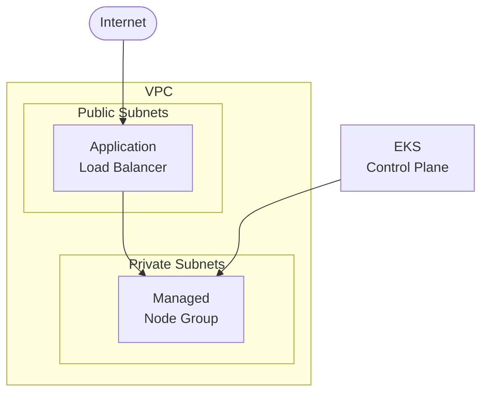
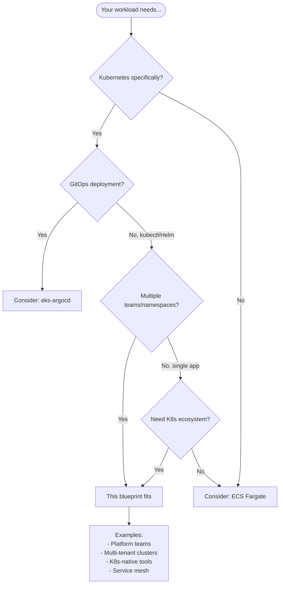

# EKS Cluster

Production-ready **Amazon EKS** cluster with managed node groups and essential addons.

## Architecture



## Features

- **EKS 1.29+** with managed control plane
- **Managed Node Groups** with auto-scaling ready
- **IRSA** (IAM Roles for Service Accounts)
- **AWS Load Balancer Controller** for ALB/NLB ingress
- **EBS CSI Driver** for persistent volumes
- **VPC-CNI, CoreDNS, Kube-proxy** addons

## Quick Start

### Deploy

```bash
cd environments/dev
terraform init
terraform apply
```

> EKS cluster creation takes ~10-15 minutes

### Configure kubectl

```bash
aws eks update-kubeconfig --region us-east-1 --name $(terraform output -raw cluster_name)
```

### Verify

```bash
kubectl get nodes
kubectl get pods -n kube-system
```

## Deploy a Sample App with ALB

```yaml
# sample-app.yaml
apiVersion: apps/v1
kind: Deployment
metadata:
  name: nginx
spec:
  replicas: 2
  selector:
    matchLabels:
      app: nginx
  template:
    metadata:
      labels:
        app: nginx
    spec:
      containers:
      - name: nginx
        image: nginx:latest
        ports:
        - containerPort: 80
---
apiVersion: v1
kind: Service
metadata:
  name: nginx
spec:
  type: ClusterIP
  ports:
  - port: 80
  selector:
    app: nginx
---
apiVersion: networking.k8s.io/v1
kind: Ingress
metadata:
  name: nginx
  annotations:
    kubernetes.io/ingress.class: alb
    alb.ingress.kubernetes.io/scheme: internet-facing
    alb.ingress.kubernetes.io/target-type: ip
spec:
  rules:
  - http:
      paths:
      - path: /
        pathType: Prefix
        backend:
          service:
            name: nginx
            port:
              number: 80
```

```bash
kubectl apply -f sample-app.yaml
kubectl get ingress nginx -w
```

## When to Use This Blueprint

### Decision Flowchart



### Ideal Use Cases

| Requirement | This Blueprint Provides |
|-------------|------------------------|
| Kubernetes workloads | EKS managed control plane |
| AWS integration | IRSA, ALB Controller, EBS CSI |
| Managed nodes | Auto-scaling node groups |
| Multi-tenancy | Namespace isolation ready |
| Ecosystem compatibility | Helm, operators, service mesh |

**Real-world examples this pattern fits:**

- **Platform engineering** - Shared cluster for multiple teams
- **Microservices platform** - Service mesh, observability stack
- **K8s-native applications** - Operators, CRDs, controllers
- **Hybrid cloud** - Consistent K8s across environments
- **Migration from on-prem K8s** - Familiar tooling

### When NOT to Use This Blueprint

| Scenario | Better Alternative |
|----------|-------------------|
| **Simple container apps** | ecs-fargate-api (simpler) |
| **Serverless preference** | Lambda-based blueprints |
| **GitOps workflow** | eks-argocd |
| **Single application** | ECS unless K8s required |
| **Cost-sensitive** | ECS (~$72/mo less, no control plane fee) |

## Directory Structure

```
├── environments/dev/
├── modules/
│   ├── naming/
│   ├── tagging/
│   ├── vpc/           # VPC with EKS-tagged subnets
│   ├── cluster/       # EKS cluster + OIDC
│   ├── nodes/         # Managed node group
│   └── addons/        # EKS addons + LB Controller
└── README.md
```

## Configuration

| Variable | Default | Description |
|----------|---------|-------------|
| `cluster_version` | 1.29 | EKS version |
| `node_instance_types` | t3.medium | Node instance types |
| `node_desired_size` | 2 | Desired node count |
| `node_capacity_type` | ON_DEMAND | ON_DEMAND or SPOT |
| `enable_lb_controller` | true | Deploy AWS LB Controller |

## IRSA (IAM Roles for Service Accounts)

Create a role for your application:

```hcl
module "app_irsa" {
  source = "../../modules/irsa"  # You can add this module

  role_name        = "my-app-role"
  oidc_provider_arn = module.cluster.oidc_provider_arn
  oidc_issuer      = module.cluster.oidc_issuer
  namespace        = "default"
  service_account  = "my-app-sa"
  policy_arns      = ["arn:aws:iam::aws:policy/AmazonS3ReadOnlyAccess"]
}
```

## Estimated Costs

| Resource | Cost (monthly) |
|----------|----------------|
| EKS Control Plane | $72 |
| NAT Gateway | ~$32 + data |
| t3.medium nodes (2x) | ~$60 |
| ALB (if created) | ~$16 + data |

**Total estimate: ~$180/month**

## Production Considerations

1. **Multi-AZ**: Set `az_count = 3`
2. **HA NAT**: Set `single_nat_gateway = false`
3. **Private cluster**: Set `endpoint_public_access = false`
4. **Node diversity**: Add multiple instance types
5. **Cluster Autoscaler**: Add for dynamic scaling

## Cleanup

```bash
# Delete workloads first
kubectl delete ingress --all -A
kubectl delete svc --all -A --field-selector="spec.type=LoadBalancer"

# Wait for ALB/NLB cleanup
sleep 60

terraform destroy
```

## Related Blueprints

| Blueprint | Relationship | Use Case |
|-----------|--------------|----------|
| `example-eks-argocd` | Add GitOps | Automated deployments from Git |
| `example-ecs-fargate-api` | Simpler | Don't need full Kubernetes |
| `example-ecs-fargate-rds` | Simpler + DB | Containers with database |

## License

MIT
