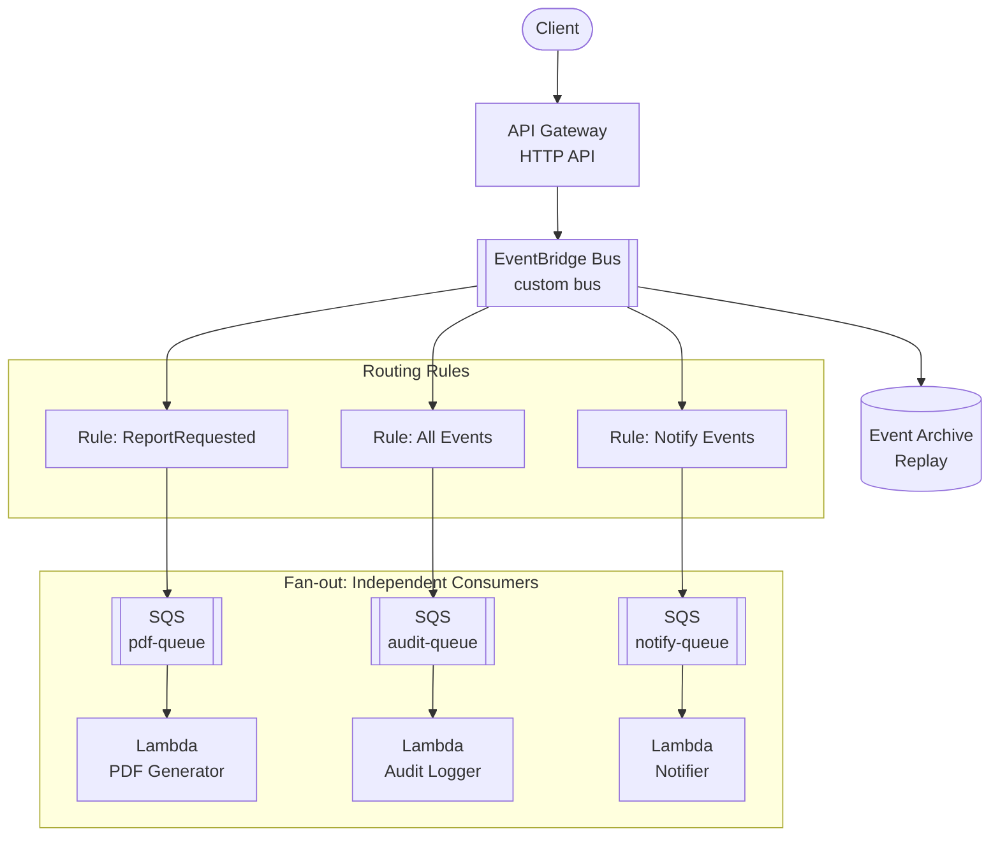
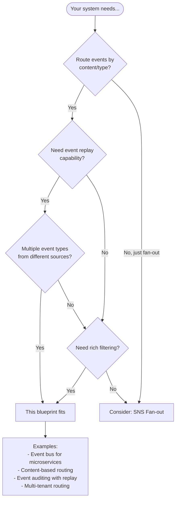

# Event-Driven API with EventBridge Fan-out

A complete AWS Terraform blueprint for **event-driven architecture** using API Gateway, EventBridge, SQS, and Lambda. Demonstrates the event bus pattern with routing rules and content-based filtering.

## Architecture



### Key Concepts

| Concept | Description |
|---------|-------------|
| **Event Bus** | Central event routing with rules |
| **Routing Rules** | Pattern-based event filtering |
| **Content Filtering** | Route by event type, source, or content |
| **Event Archive** | Store events for replay/debugging |

### How It Differs from SNS Fan-out

| Aspect | SNS Fan-out | EventBridge (This Blueprint) |
|--------|-------------|------------------------------|
| **Routing** | Subscription filter policies | Rule patterns (richer) |
| **Filtering** | Message attributes | Event content (JSON path) |
| **Replay** | Not built-in | Archive + replay |
| **Schema** | None | Schema registry |
| **Integrations** | AWS services | 20+ AWS services + SaaS |
| **Use case** | Simple pub/sub | Event bus with governance |

## Event Pattern Examples

EventBridge rules use JSON patterns for routing:

### Match by Detail Type (Event Type)

```json
{
  "source": ["reports.api"],
  "detail-type": ["ReportRequested"]
}
```

### Match All Events from Source

```json
{
  "source": ["reports.api"]
}
```

### Content-Based Filtering

```json
{
  "source": ["reports.api"],
  "detail-type": ["ReportRequested"],
  "detail": {
    "reportType": ["monthly-summary", "annual-report"]
  }
}
```

### Numeric Matching

```json
{
  "source": ["reports.api"],
  "detail": {
    "priority": [{ "numeric": [">=", 5] }]
  }
}
```

### Prefix Matching

```json
{
  "source": ["reports.api"],
  "detail": {
    "userId": [{ "prefix": "admin-" }]
  }
}
```

## Event Schema

Events sent to the API follow the EventBridge format:

```json
{
  "detailType": "ReportRequested",
  "detail": "{\"eventId\":\"evt-123\",\"reportId\":\"rpt-456\",\"userId\":\"user-789\",\"reportType\":\"monthly-summary\"}"
}
```

EventBridge envelope (what consumers receive):

```json
{
  "version": "0",
  "id": "12345678-1234-1234-1234-123456789012",
  "detail-type": "ReportRequested",
  "source": "reports.api",
  "account": "123456789012",
  "time": "2026-01-20T10:00:00Z",
  "region": "us-east-1",
  "detail": {
    "eventId": "evt-123",
    "reportId": "rpt-456",
    "userId": "user-789",
    "reportType": "monthly-summary"
  }
}
```

## Prerequisites

Before using this blueprint, ensure you have:

### Required

| Requirement | Minimum Version | Purpose |
|-------------|-----------------|---------|
| **AWS Account** | - | Resources will be created in your account |
| **AWS CLI** | v2.x | Credential configuration and testing |
| **Terraform** | >= 1.9 | Infrastructure provisioning |
| **Node.js** | >= 18.x | Lambda runtime |

### Required IAM Permissions

| Service | Resources |
|---------|-----------|
| **API Gateway** | HTTP APIs, stages, routes, integrations |
| **EventBridge** | Event buses, rules, targets, archives |
| **SQS** | Queues (standard), DLQs, policies |
| **Lambda** | Functions, event source mappings |
| **IAM** | Roles, policies |
| **CloudWatch** | Log groups |

## When to Use This Blueprint

### Decision Flowchart



### Ideal Use Cases

| Requirement | This Blueprint Provides |
|-------------|------------------------|
| Content-based routing | Rule patterns with JSON path |
| Event replay/debugging | Archive with configurable retention |
| Schema governance | Schema registry integration |
| Complex filtering | Numeric, prefix, exists-check patterns |
| Event history | Searchable event archive |

**Real-world examples this pattern fits:**

- **Microservices event bus** - Central routing for domain events
- **Multi-tenant routing** - Route by tenant ID in event content
- **Priority-based processing** - Route high-priority to fast lane
- **Geographic routing** - Route by region in event data
- **A/B testing** - Route percentage of events to test consumers

### When NOT to Use This Blueprint

| Scenario | Better Alternative |
|----------|-------------------|
| **Simple pub/sub** | SNS Fan-out blueprint |
| **Single consumer per message** | SQS Worker blueprint |
| **Complex workflows** | AWS Step Functions |
| **Streaming data** | Kinesis Data Streams |
| **Need exactly-once** | Step Functions or custom |

## Quick Start

```bash
# 1. Navigate to environment
cd environments/dev

# 2. Copy backend template (optional, for remote state)
cp backend.tf.example backend.tf
# Edit backend.tf with your S3 bucket

# 3. Initialize Terraform
terraform init

# 4. Review the plan
terraform plan

# 5. Apply
terraform apply

# 6. Test event routing
curl -X POST $(terraform output -raw events_endpoint) \
  -H "Content-Type: application/json" \
  -d '{
    "detailType": "ReportRequested",
    "detail": "{\"eventId\":\"evt-test-001\",\"reportId\":\"rpt-123\",\"userId\":\"user-456\",\"reportType\":\"monthly-summary\"}"
  }'

# 7. Verify consumers processed the event
aws logs tail /aws/lambda/$(terraform output -raw pdf_generator_function_name) --since 1m
aws logs tail /aws/lambda/$(terraform output -raw audit_logger_function_name) --since 1m
aws logs tail /aws/lambda/$(terraform output -raw notifier_function_name) --since 1m
```

## Directory Structure

```
.
├── environments/
│   └── dev/                    # Development environment
│       ├── main.tf             # Module composition with rules
│       ├── variables.tf        # Input variables
│       ├── outputs.tf          # Output values
│       ├── versions.tf         # Provider constraints
│       ├── backend.tf.example  # S3 backend template
│       └── terraform.tfvars    # Environment values
├── modules/
│   ├── naming/                 # Resource naming convention
│   ├── tagging/                # Standard tagging
│   ├── event_bus/              # EventBridge bus + archive
│   ├── rule/                   # EventBridge rule (reusable)
│   ├── consumer/               # SQS + Lambda (reusable)
│   └── api/                    # API Gateway → EventBridge
├── src/
│   ├── pdf-generator/          # PDF generation Lambda
│   ├── audit-logger/           # Audit logging Lambda
│   └── notifier/               # Notification Lambda
└── tests/
    ├── unit/                   # Validation tests (mock)
    └── integration/            # Full deployment tests
```

## Routing Rules

This blueprint creates 3 EventBridge rules:

### PDF Generator Rule

- **Pattern**: `detail-type = ReportRequested`
- **Target**: PDF Generator queue
- **Purpose**: Generate PDFs for report requests

### Audit Logger Rule

- **Pattern**: `source = reports.api` (all events)
- **Target**: Audit Logger queue
- **Purpose**: Log ALL events for compliance

### Notifier Rule

- **Pattern**: Configurable (default: ReportRequested, ReportGenerated, ReportFailed)
- **Target**: Notifier queue
- **Purpose**: Send notifications for specific events

## Event Archive (Replay)

EventBridge archives enable event replay:

```bash
# List archives
aws events list-archives

# Start replay
aws events start-replay \
  --replay-name "debug-replay-$(date +%s)" \
  --event-source-arn $(terraform output -raw event_bus_arn) \
  --destination-arn $(terraform output -raw event_bus_arn) \
  --event-start-time 2026-01-20T00:00:00Z \
  --event-end-time 2026-01-20T23:59:59Z

# Check replay status
aws events describe-replay --replay-name "debug-replay-..."
```

## Configuration Reference

### Key Variables

| Variable | Default | Description |
|----------|---------|-------------|
| `project` | - | Project name (lowercase, alphanumeric) |
| `environment` | - | Environment: dev, staging, prod |
| `event_source` | `reports.api` | Source identifier for events |
| `enable_archive` | `true` | Enable event archiving |
| `archive_retention_days` | `7` | Days to retain archived events |
| `notifier_event_pattern` | null | Custom event pattern for notifier |

### Custom Event Patterns

Configure the notifier to receive specific events:

```hcl
# In terraform.tfvars
notifier_event_pattern = <<EOF
{
  "source": ["reports.api"],
  "detail-type": ["ReportRequested"],
  "detail": {
    "reportType": ["monthly-summary", "annual-report"],
    "priority": [{ "numeric": [">=", 5] }]
  }
}
EOF
```

## Testing

### Unit Tests (Validation)

```bash
cd environments/dev
terraform test -filter=tests/unit/validation.tftest.hcl
```

### Integration Tests

```bash
cd environments/dev
terraform test -filter=tests/integration/full.tftest.hcl
```

**Warning**: Creates real AWS resources.

### Manual Testing

```bash
# Put an event
curl -X POST $(terraform output -raw events_endpoint) \
  -H "Content-Type: application/json" \
  -d '{
    "detailType": "ReportRequested",
    "detail": "{\"eventId\":\"evt-manual\",\"reportId\":\"rpt-test\",\"userId\":\"user-1\",\"reportType\":\"monthly-summary\"}"
  }'

# List rules
aws events list-rules --event-bus-name $(terraform output -raw event_bus_name)

# Describe a rule
aws events describe-rule \
  --name $(terraform output -raw pdf_generator_function_name | sed 's/-pdf-generator/-pdf-rule/') \
  --event-bus-name $(terraform output -raw event_bus_name)

# Watch all consumer logs
aws logs tail /aws/lambda/eb-fanout-dev-pdf-generator --follow
aws logs tail /aws/lambda/eb-fanout-dev-audit-logger --follow
aws logs tail /aws/lambda/eb-fanout-dev-notifier --follow
```

## Outputs

| Output | Description |
|--------|-------------|
| `api_endpoint` | API Gateway endpoint URL |
| `events_endpoint` | Full POST /events URL |
| `event_bus_arn` | EventBridge bus ARN |
| `event_bus_name` | EventBridge bus name |
| `archive_arn` | Event archive ARN (if enabled) |
| `*_function_name` | Lambda function names |
| `*_rule_arn` | EventBridge rule ARNs |
| `*_queue_url` | SQS queue URLs |
| `*_dlq_url` | Dead-letter queue URLs |

## Cleanup

```bash
cd environments/dev
terraform destroy
```

## Related Blueprints

| Blueprint | Pattern | Use Case |
|-----------|---------|----------|
| `example-sqs-worker-api` | Queue-driven | Single consumer, task processing |
| `example-sns-fanout-api` | Pub/Sub | Simple fan-out without routing |

## License

MIT
