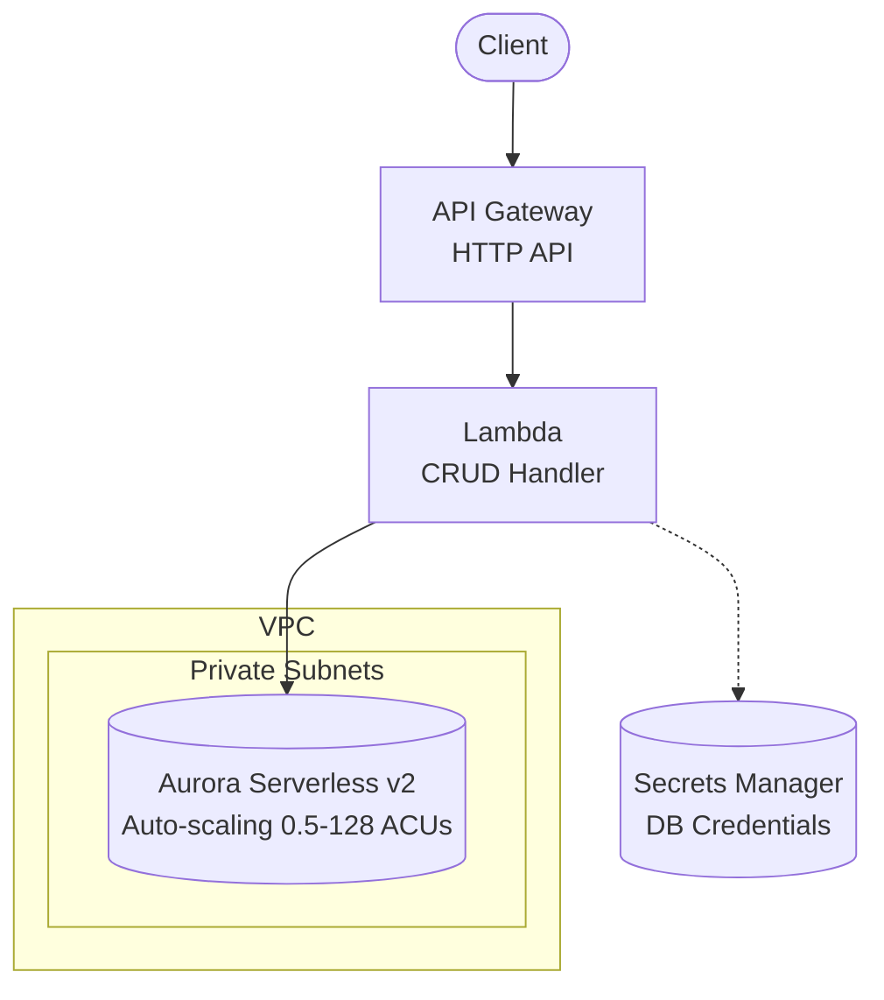
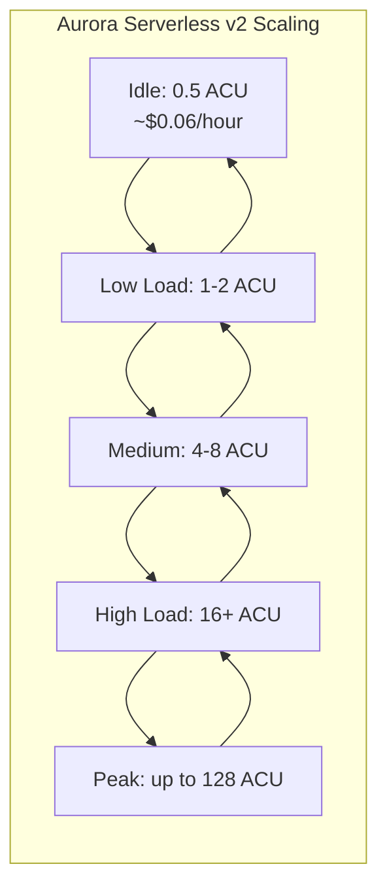

# Serverless REST API with Aurora Serverless v2

A complete AWS Terraform blueprint demonstrating the modern **API Gateway + Lambda + Aurora Serverless v2** pattern for CRUD operations with automatic scaling.

## Architecture



## Why Aurora Serverless v2?

Aurora Serverless v2 provides **automatic scaling** that matches your workload:

| Feature | Standard RDS | RDS Proxy | Aurora Serverless v2 |
|---------|-------------|-----------|---------------------|
| **Scaling** | Manual | Manual | Auto (0.5-128 ACUs) |
| **Cost when idle** | Fixed | Fixed | ~$0 at 0.5 ACU |
| **Connection handling** | Client-side | Proxy managed | Built-in |
| **Cold start** | N/A | Low | Variable (scale-up) |
| **Max capacity** | Instance-bound | Instance-bound | 128 ACUs |

### ACU (Aurora Capacity Unit)

- 1 ACU ≈ 2 GB RAM
- Min: 0.5 ACU (~1 GB RAM)
- Max: 128 ACU (~256 GB RAM)
- Scales in increments of 0.5 ACU

### When to Use This Blueprint

| Scenario | Recommendation |
|----------|----------------|
| Variable/unpredictable traffic | ✅ This blueprint |
| Cost optimization (pay-per-use) | ✅ This blueprint |
| Auto-scaling requirements | ✅ This blueprint |
| Consistent low-latency | ⚠️ Consider `serverless-api-rds-proxy` |
| Fixed, predictable workload | ⚠️ Consider `serverless-api-rds` |

## Prerequisites

| Requirement | Minimum Version | Purpose |
|-------------|-----------------|---------|
| **AWS Account** | - | Resources will be created in your account |
| **AWS CLI** | v2.x | Credential configuration and testing |
| **Terraform** | >= 1.9 | Infrastructure provisioning |
| **Node.js** | >= 18.x | Lambda runtime |

### AWS Credentials

```bash
# Option 1: AWS CLI profile
aws configure --profile myproject
export AWS_PROFILE=myproject

# Option 2: Environment variables
export AWS_ACCESS_KEY_ID="your-access-key"
export AWS_SECRET_ACCESS_KEY="your-secret-key"
export AWS_REGION="us-east-1"
```

## Quick Start

```bash
# 1. Navigate to environment
cd environments/dev

# 2. Install Lambda dependencies
cd ../../src/api && npm install && cd ../../environments/dev

# 3. Initialize Terraform
terraform init

# 4. Review the plan
terraform plan

# 5. Apply (takes ~10-15 minutes)
terraform apply

# 6. Test the API
API_URL=$(terraform output -raw api_endpoint)

# Create an item
curl -X POST "$API_URL/items" \
  -H "Content-Type: application/json" \
  -d '{"name": "Test Item", "description": "My first item"}'

# List items
curl "$API_URL/items"
```

## Directory Structure

```
.
├── environments/
│   └── dev/                    # Development environment
│       ├── main.tf             # Module composition
│       ├── variables.tf        # Input variables
│       ├── outputs.tf          # Output values
│       ├── versions.tf         # Provider constraints
│       ├── backend.tf.example  # S3 backend template
│       └── terraform.tfvars    # Environment values
├── modules/
│   ├── naming/                 # Resource naming convention
│   ├── tagging/                # Standard tagging
│   ├── vpc/                    # VPC, subnets, security groups
│   ├── secrets/                # Secrets Manager for DB credentials
│   ├── data/                   # Aurora Serverless v2 cluster
│   └── api/                    # API Gateway + Lambda CRUD
├── src/
│   └── api/                    # Lambda CRUD handler
│       ├── index.js            # Main handler
│       └── package.json        # Dependencies
├── scripts/
│   └── db-init.sql             # Database schema
└── README.md
```

## API Endpoints

| Method | Path | Description |
|--------|------|-------------|
| POST | /items | Create a new item |
| GET | /items | List all items (with pagination) |
| GET | /items/{id} | Get item by ID |
| PUT | /items/{id} | Update item |
| DELETE | /items/{id} | Delete item |

## Configuration

### Key Variables

| Variable | Default | Description |
|----------|---------|-------------|
| `project` | - | Project name (lowercase, alphanumeric) |
| `environment` | - | Environment: dev, staging, prod |
| `aurora_min_capacity` | 0.5 | Minimum ACUs (0.5 - 128) |
| `aurora_max_capacity` | 4 | Maximum ACUs (0.5 - 128) |
| `aurora_instance_count` | 1 | Number of Aurora instances |
| `lambda_memory_size` | 256 | Lambda memory (MB) |

### Scaling Configuration

```hcl
# Dev: Minimal costs, scale down when idle
aurora_min_capacity = 0.5  # ~$0.06/hour when running
aurora_max_capacity = 4    # Enough for dev workloads

# Staging: More headroom
aurora_min_capacity = 1    # Faster response to traffic
aurora_max_capacity = 16   # Handle load testing

# Production: High availability
aurora_min_capacity = 2    # Always ready for traffic
aurora_max_capacity = 64   # Handle peak loads
aurora_instance_count = 2  # Multi-AZ readers
```

### Environment-Specific Values

| Setting | Dev | Staging | Prod |
|---------|-----|---------|------|
| `aurora_min_capacity` | 0.5 | 1 | 2 |
| `aurora_max_capacity` | 4 | 16 | 64 |
| `aurora_instance_count` | 1 | 1 | 2 |
| `db_deletion_protection` | false | true | true |
| `lambda_memory_size` | 256 | 512 | 1024 |

## Scaling Behavior



### Scale-up Time

- **Incremental**: ~15-30 seconds per 0.5 ACU
- **Large jump**: May take 1-2 minutes for significant scale-up
- **Scale-down**: Gradual, based on cooldown period

### Handling Scale-up Latency

For first requests after idle:

```javascript
// Lambda handler has longer timeout for Aurora scale-up
connectionTimeoutMillis: 10000 // 10 seconds
```

## Estimated Costs

| Resource | Dev (estimate) | Prod (estimate) |
|----------|----------------|-----------------|
| Aurora (0.5 ACU idle) | ~$0.06/hour | - |
| Aurora (1 ACU) | ~$0.12/hour | ~$0.12/hour |
| Aurora (per ACU) | - | ~$0.12/hour |
| API Gateway | ~$1/month | ~$3.50/million |
| Lambda | Free tier | ~$0.20/million |
| VPC Endpoints | ~$7/month | ~$7/month |
| Secrets Manager | ~$0.40/month | ~$0.40/month |

**Cost Advantage**: Aurora Serverless v2 scales to near-zero cost during idle periods, unlike fixed-instance RDS.

> **Tip**: Use `terraform destroy` to clean up after testing.

## Security

### IAM Least Privilege

| Component | Permissions |
|-----------|-------------|
| Lambda | `secretsmanager:GetSecretValue` (own secret) |
| Aurora | No public access, SG restricted to Lambda |

### Encryption

| Resource | Encryption |
|----------|------------|
| Aurora | Storage encrypted (AWS managed) |
| Secrets Manager | AWS managed KMS |
| API Gateway | TLS 1.2+ |

## Monitoring Aurora Serverless v2

### CloudWatch Metrics

```bash
# View current capacity
aws cloudwatch get-metric-statistics \
  --namespace AWS/RDS \
  --metric-name ServerlessDatabaseCapacity \
  --dimensions Name=DBClusterIdentifier,Value=$(terraform output -raw aurora_cluster_id) \
  --start-time $(date -u -d '1 hour ago' +%Y-%m-%dT%H:%M:%SZ) \
  --end-time $(date -u +%Y-%m-%dT%H:%M:%SZ) \
  --period 60 \
  --statistics Average
```

### Key Metrics to Watch

| Metric | Description |
|--------|-------------|
| `ServerlessDatabaseCapacity` | Current ACU usage |
| `ACUUtilization` | % of max capacity used |
| `DatabaseConnections` | Active connections |
| `CPUUtilization` | CPU usage per ACU |

## Troubleshooting

### Slow first request after idle

Aurora may need to scale up from minimum capacity. This is expected behavior. Solutions:

1. Increase `aurora_min_capacity` for production
2. Implement health checks to keep Aurora warm
3. Add retry logic in client applications

### Connection timeout

Aurora Serverless v2 may take time to scale up:

1. Increase Lambda `connectionTimeoutMillis` (currently 10s)
2. Verify security groups allow traffic
3. Check Aurora is in same VPC as Lambda

### Unexpected costs

1. Monitor `ServerlessDatabaseCapacity` metric
2. Check for queries holding connections
3. Review `aurora_max_capacity` setting

## Related Blueprints

| Blueprint | Description |
|-----------|-------------|
| `serverless-api-rds` | Simple RDS (dev/learning, fixed cost) |
| `serverless-api-rds-proxy` | RDS + Proxy (production, connection pooling) |

## Cleanup

```bash
cd environments/dev
terraform destroy
```

## License

MIT
