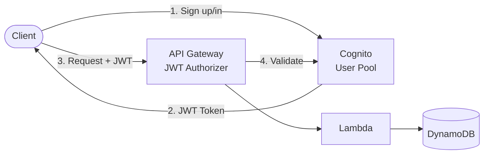
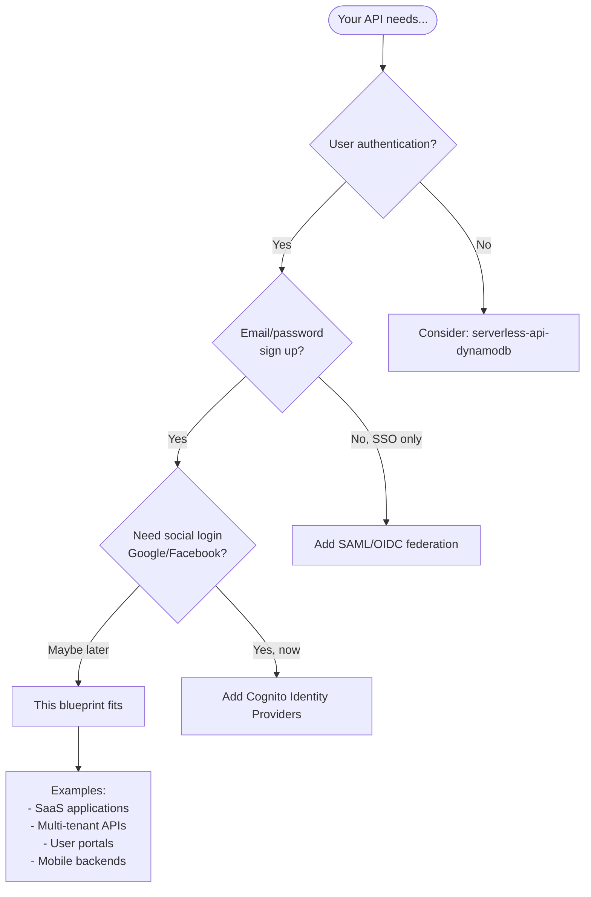

# Serverless REST API with Cognito Authentication

Secure REST API with **JWT authentication** using Amazon Cognito. Each user's data is isolated.

## Architecture



## Features

- **JWT Authentication**: API Gateway validates tokens automatically
- **User isolation**: Each user only sees their own data
- **Cognito User Pool**: Email-based signup, password policies
- **No VPC required**: Fast cold starts

## Quick Start

```bash
cd environments/dev
cd ../../src/api && npm install && cd ../../environments/dev
terraform init
terraform apply

# Get outputs
USER_POOL_ID=$(terraform output -raw user_pool_id)
CLIENT_ID=$(terraform output -raw user_pool_client_id)
API_URL=$(terraform output -raw api_endpoint)
```

### Create a User

```bash
# Sign up
aws cognito-idp sign-up \
  --client-id $CLIENT_ID \
  --username user@example.com \
  --password "Password123"

# Confirm (admin)
aws cognito-idp admin-confirm-sign-up \
  --user-pool-id $USER_POOL_ID \
  --username user@example.com

# Get token
TOKEN=$(aws cognito-idp initiate-auth \
  --client-id $CLIENT_ID \
  --auth-flow USER_PASSWORD_AUTH \
  --auth-parameters USERNAME=user@example.com,PASSWORD=Password123 \
  --query 'AuthenticationResult.IdToken' --output text)
```

### Call the API

```bash
# Create item (authenticated)
curl -X POST "$API_URL/items" \
  -H "Authorization: Bearer $TOKEN" \
  -H "Content-Type: application/json" \
  -d '{"name": "My Item"}'

# List items (only yours)
curl "$API_URL/items" -H "Authorization: Bearer $TOKEN"
```

## API Endpoints

All endpoints require `Authorization: Bearer <token>` header.

| Method | Path | Description |
|--------|------|-------------|
| POST | /items | Create item |
| GET | /items | List your items |
| GET | /items/{id} | Get item (if yours) |
| PUT | /items/{id} | Update item (if yours) |
| DELETE | /items/{id} | Delete item (if yours) |

## When to Use This Blueprint

### Decision Flowchart



### Ideal Use Cases

| Requirement | This Blueprint Provides |
|-------------|------------------------|
| User sign up/sign in | Cognito User Pool with email verification |
| JWT authentication | API Gateway JWT Authorizer |
| User data isolation | DynamoDB with user ID partition |
| Password policies | Configurable strength requirements |
| MFA support | Optional TOTP/SMS MFA |

**Real-world examples this pattern fits:**

- **SaaS applications** - Each user has their own data
- **Mobile app backends** - Secure API with user accounts
- **Customer portals** - Self-service user management
- **Multi-tenant systems** - Data isolation per user/tenant

### When NOT to Use This Blueprint

| Scenario | Better Alternative |
|----------|-------------------|
| **Public API (no auth)** | serverless-api-dynamodb |
| **API key authentication** | API Gateway usage plans |
| **Machine-to-machine auth** | Cognito Client Credentials |
| **Enterprise SSO only** | Cognito with SAML/OIDC federation |
| **Complex authorization** | Add custom authorizer Lambda |

## Directory Structure

```
├── environments/dev/
├── modules/
│   ├── naming/
│   ├── tagging/
│   ├── auth/          # Cognito User Pool
│   ├── data/          # DynamoDB
│   └── api/           # API Gateway + JWT Authorizer + Lambda
├── src/api/
└── README.md
```

## Configuration

| Variable | Default | Description |
|----------|---------|-------------|
| `password_minimum_length` | 8 | Min password length |
| `mfa_configuration` | OFF | MFA: OFF, ON, OPTIONAL |
| `access_token_validity` | 1 | Token validity (hours) |

## Estimated Costs

| Resource | Cost |
|----------|------|
| Cognito | Free up to 50K MAUs |
| API Gateway | ~$1/million requests |
| Lambda | Free tier eligible |
| DynamoDB | Pay-per-request |

## Deployment

This blueprint includes a GitHub Actions workflow for progressive CD.

### Phase 1: Dev Only (Default)

```bash
# Copy, init, push to GitHub
cp -r aws/example-serverless-api-cognito ~/my-project && cd ~/my-project
git init && git add . && git commit -m "Initial commit"
gh repo create my-project --private --push

# Add AWS credentials: Settings → Secrets → AWS_ROLE_ARN
# Deploy: Actions → Deploy → dev → apply
```

### Phase 2: Add Staging

```bash
./scripts/create-environment.sh staging
git add . && git commit -m "feat: add staging" && git push
# Deploy: Actions → Deploy → staging → apply
```

### Phase 3: Add Production

```bash
./scripts/create-environment.sh prod
git add . && git commit -m "feat: add production" && git push
# Configure: Settings → Environments → production (add reviewers)
# Deploy: Actions → Deploy → prod → apply
```

## Cleanup

```bash
terraform destroy
```

## Related Blueprints

| Blueprint | Relationship | Use Case |
|-----------|--------------|----------|
| `example-serverless-api-dynamodb` | Simpler | No authentication needed |
| `example-amplify-hosting-auth` | Frontend | Add hosted UI with Cognito |
| `example-serverless-api-rds` | Alternative DB | Need relational data with auth |

## License

MIT
