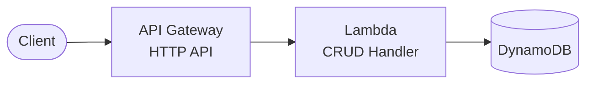

# Serverless REST API with DynamoDB

The **simplest serverless pattern** - API Gateway + Lambda + DynamoDB. No VPC required, fastest to deploy, lowest cost.

## Architecture



## Why This Pattern?

| Feature | Benefit |
|---------|---------|
| **No VPC** | Faster cold starts, simpler setup |
| **DynamoDB** | Serverless, auto-scaling, pay-per-request |
| **Minimal resources** | ~5 resources total |
| **Fastest deploy** | ~2 minutes |

### When to Use

| Scenario | Recommendation |
|----------|----------------|
| Simple CRUD APIs | ✅ This blueprint |
| Prototypes/MVPs | ✅ This blueprint |
| High-scale read/write | ✅ This blueprint |
| Complex queries/joins | ⚠️ Consider RDS variants |
| Relational data | ⚠️ Consider RDS variants |

## Quick Start

```bash
cd environments/dev
cd ../../src/api && npm install && cd ../../environments/dev
terraform init
terraform plan
terraform apply

# Test
API_URL=$(terraform output -raw api_endpoint)
curl -X POST "$API_URL/items" -H "Content-Type: application/json" -d '{"name": "Test"}'
curl "$API_URL/items"
```

## API Endpoints

| Method | Path | Description |
|--------|------|-------------|
| POST | /items | Create item |
| GET | /items | List items |
| GET | /items/{id} | Get by ID |
| PUT | /items/{id} | Update item |
| DELETE | /items/{id} | Delete item |

## Directory Structure

```
├── environments/dev/
├── modules/
│   ├── naming/
│   ├── tagging/
│   ├── data/          # DynamoDB
│   └── api/           # API Gateway + Lambda
├── src/api/           # Lambda code
└── README.md
```

## Estimated Costs

| Resource | Cost |
|----------|------|
| API Gateway | ~$1/million requests |
| Lambda | Free tier / ~$0.20/million |
| DynamoDB | Free tier / pay-per-request |

**Total: Often free tier eligible**

## Deployment

This blueprint includes a GitHub Actions workflow for progressive CD.

### Phase 1: Dev Only (Default)

```bash
# Copy, init, push to GitHub
cp -r aws/example-serverless-api-dynamodb ~/my-project && cd ~/my-project
git init && git add . && git commit -m "Initial commit"
gh repo create my-project --private --push

# Add AWS credentials: Settings → Secrets → AWS_ROLE_ARN
# Deploy: Actions → Deploy → dev → apply
```

### Phase 2: Add Staging

```bash
./scripts/create-environment.sh staging
git add . && git commit -m "feat: add staging" && git push
# Deploy: Actions → Deploy → staging → apply
```

### Phase 3: Add Production

```bash
./scripts/create-environment.sh prod
git add . && git commit -m "feat: add production" && git push
# Configure: Settings → Environments → production (add reviewers)
# Deploy: Actions → Deploy → prod → apply
```

## Cleanup

```bash
terraform destroy
```

## Related Blueprints

| Blueprint | Relationship | Use Case |
|-----------|--------------|----------|
| `example-serverless-api-cognito` | Add auth | User authentication needed |
| `example-serverless-api-rds` | Relational | Need SQL queries/joins |
| `example-sqs-worker-api` | Async | Long-running background tasks |
| `example-sns-fanout-api` | Events | Notify multiple systems |
| `example-ecs-fargate-api` | Containers | Need custom runtime |

## License

MIT
