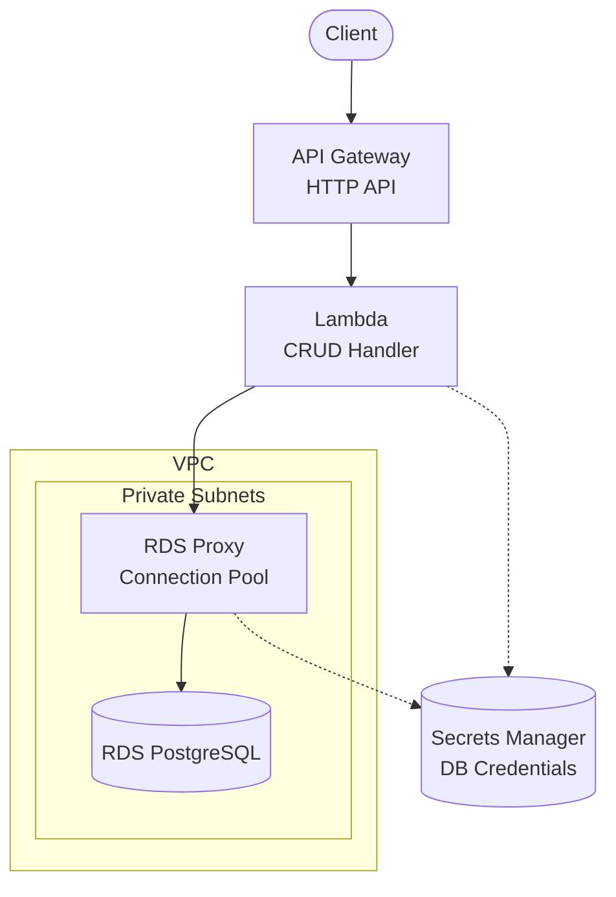

# Serverless REST API with RDS Proxy

A complete AWS Terraform blueprint demonstrating the production-ready **API Gateway + Lambda + RDS Proxy + PostgreSQL** pattern for CRUD operations with connection pooling.

## Architecture



## Why RDS Proxy?

RDS Proxy provides **connection pooling** between Lambda and RDS, solving common serverless database challenges:

| Challenge | Without Proxy | With Proxy |
|-----------|---------------|------------|
| **Connection overhead** | New connection per invocation | Pooled connections reused |
| **Cold start latency** | 200-500ms connection setup | Near-instant from pool |
| **Connection limits** | Easy to exhaust `max_connections` | Proxy manages pool |
| **Failover** | Connection drops | Automatic reconnection |
| **Scaling** | Limited by DB connections | Scales with Lambda |

### When to Use This Blueprint

| Scenario | Recommendation |
|----------|----------------|
| Production workloads | ✅ This blueprint |
| High-concurrency Lambda | ✅ This blueprint |
| Cost-sensitive dev/test | ⚠️ Consider `serverless-api-rds` |
| Auto-scaling needs | ⚠️ Consider `serverless-api-aurora` |

## Prerequisites

| Requirement | Minimum Version | Purpose |
|-------------|-----------------|---------|
| **AWS Account** | - | Resources will be created in your account |
| **AWS CLI** | v2.x | Credential configuration and testing |
| **Terraform** | >= 1.9 | Infrastructure provisioning |
| **Node.js** | >= 18.x | Lambda runtime |

### AWS Credentials

```bash
# Option 1: AWS CLI profile
aws configure --profile myproject
export AWS_PROFILE=myproject

# Option 2: Environment variables
export AWS_ACCESS_KEY_ID="your-access-key"
export AWS_SECRET_ACCESS_KEY="your-secret-key"
export AWS_REGION="us-east-1"
```

## Quick Start

```bash
# 1. Navigate to environment
cd environments/dev

# 2. Install Lambda dependencies
cd ../../src/api && npm install && cd ../../environments/dev

# 3. Initialize Terraform
terraform init

# 4. Review the plan
terraform plan

# 5. Apply (takes ~15-20 minutes due to RDS + Proxy)
terraform apply

# 6. Test the API
API_URL=$(terraform output -raw api_endpoint)

# Create an item
curl -X POST "$API_URL/items" \
  -H "Content-Type: application/json" \
  -d '{"name": "Test Item", "description": "My first item"}'

# List items
curl "$API_URL/items"
```

## Directory Structure

```
.
├── environments/
│   └── dev/                    # Development environment
│       ├── main.tf             # Module composition
│       ├── variables.tf        # Input variables
│       ├── outputs.tf          # Output values
│       ├── versions.tf         # Provider constraints
│       ├── backend.tf.example  # S3 backend template
│       └── terraform.tfvars    # Environment values
├── modules/
│   ├── naming/                 # Resource naming convention
│   ├── tagging/                # Standard tagging
│   ├── vpc/                    # VPC, subnets, security groups
│   ├── secrets/                # Secrets Manager for DB credentials
│   ├── data/                   # RDS PostgreSQL + RDS Proxy
│   └── api/                    # API Gateway + Lambda CRUD
├── src/
│   └── api/                    # Lambda CRUD handler
│       ├── index.js            # Main handler
│       └── package.json        # Dependencies
├── scripts/
│   └── db-init.sql             # Database schema
└── README.md
```

## API Endpoints

| Method | Path | Description |
|--------|------|-------------|
| POST | /items | Create a new item |
| GET | /items | List all items (with pagination) |
| GET | /items/{id} | Get item by ID |
| PUT | /items/{id} | Update item |
| DELETE | /items/{id} | Delete item |

## Adding New Routes

Routes are defined declaratively in `variables.tf` - similar to Serverless Framework's `serverless.yml`:

```hcl
# environments/dev/variables.tf
variable "api_routes" {
  default = {
    # Existing routes...
    
    # Add new routes here!
    search_items = {
      method      = "GET"
      path        = "/items/search"
      description = "Search items"
    }
    bulk_create = {
      method      = "POST"
      path        = "/items/bulk"
      description = "Bulk create items"
    }
  }
}
```

Then update the Lambda handler in `src/api/index.js` to handle the new routes.

**Benefits of this pattern:**
- Routes visible in Terraform config (not hidden in Lambda code)
- Easy to see the full API surface at a glance
- Validation catches invalid methods early
- Follows terraform-aws-modules best practices

## Configuration

### Key Variables

| Variable | Default | Description |
|----------|---------|-------------|
| `project` | - | Project name (lowercase, alphanumeric) |
| `environment` | - | Environment: dev, staging, prod |
| `db_instance_class` | db.t3.micro | RDS instance size |
| `proxy_max_connections_percent` | 100 | Max connections to RDS |
| `proxy_idle_timeout` | 1800 | Idle connection timeout (seconds) |
| `lambda_memory_size` | 256 | Lambda memory (MB) |

### RDS Proxy Configuration

| Setting | Default | Description |
|---------|---------|-------------|
| `proxy_debug_logging` | false | Enable verbose logging |
| `proxy_idle_timeout` | 1800 | Idle timeout (30 min) |
| `proxy_connection_borrow_timeout` | 120 | Wait time for connection |
| `proxy_max_connections_percent` | 100 | % of RDS max_connections |
| `proxy_max_idle_connections_percent` | 50 | % of idle connections to keep |

### Environment-Specific Values

| Setting | Dev | Staging | Prod |
|---------|-----|---------|------|
| `db_instance_class` | db.t3.micro | db.t3.small | db.t3.medium |
| `db_multi_az` | false | false | true |
| `proxy_max_connections_percent` | 100 | 100 | 80 |
| `lambda_memory_size` | 256 | 512 | 1024 |

## RDS Proxy Best Practices

### 1. Connection Pooling Tuning

```hcl
# For high-concurrency workloads
proxy_max_connections_percent      = 80   # Leave headroom
proxy_max_idle_connections_percent = 30   # Reduce idle connections
proxy_connection_borrow_timeout    = 60   # Fail fast
```

### 2. Monitoring

```bash
# Check proxy connections
aws rds describe-db-proxy-targets \
  --db-proxy-name $(terraform output -raw proxy_name)

# View CloudWatch metrics
# - DatabaseConnections
# - DatabaseConnectionRequests
# - MaxDatabaseConnectionsAllowed
```

### 3. TLS Configuration

RDS Proxy requires TLS by default (`require_tls = true`). The Lambda handler uses:

```javascript
ssl: { rejectUnauthorized: false }
```

For stricter security, download the RDS CA bundle and configure proper certificate validation.

## Estimated Costs

| Resource | Dev (estimate) | Prod (estimate) |
|----------|----------------|-----------------|
| RDS (db.t3.micro) | ~$15/month | ~$50/month |
| RDS Proxy | ~$20/month | ~$20/month |
| API Gateway | ~$1/month | ~$3.50/million |
| Lambda | Free tier | ~$0.20/million |
| VPC Endpoints | ~$7/month | ~$7/month |
| Secrets Manager | ~$0.40/month | ~$0.40/month |

**Total Dev: ~$43/month** (vs ~$15/month without Proxy)

> **Tip**: Use `terraform destroy` to clean up after testing.

## Security

### IAM Least Privilege

| Component | Permissions |
|-----------|-------------|
| Lambda | `secretsmanager:GetSecretValue` (own secret) |
| RDS Proxy | `secretsmanager:GetSecretValue` (DB credentials) |
| RDS | No public access, SG restricted to Proxy |

### Network Flow

```
Lambda → (SG) → RDS Proxy → (SG) → RDS
              ↓
        Secrets Manager (via VPC Endpoint)
```

### Encryption

| Resource | Encryption |
|----------|------------|
| RDS | Storage encrypted (AWS managed) |
| RDS Proxy | TLS required for all connections |
| Secrets Manager | AWS managed KMS |

## Troubleshooting

### Lambda can't connect to Proxy

1. Check Lambda security group allows outbound to Proxy SG on port 5432
2. Verify Proxy security group allows inbound from Lambda SG
3. Check Proxy is in same subnets as Lambda

### "Target group is not available" error

RDS Proxy needs time to establish connections to RDS. Wait 2-3 minutes after deployment.

### Connection timeout from Lambda

1. Check `proxy_connection_borrow_timeout` isn't too low
2. Verify `proxy_max_connections_percent` isn't exhausted
3. Check RDS `max_connections` parameter

### Proxy taking long to respond

Enable debug logging:

```hcl
proxy_debug_logging = true
```

Then check CloudWatch Logs for the proxy.

## Related Blueprints

| Blueprint | Description |
|-----------|-------------|
| `serverless-api-rds` | Simpler, no proxy (dev/learning) |
| `serverless-api-aurora` | Aurora Serverless v2 (auto-scaling) |

## Deployment

This blueprint includes a GitHub Actions workflow for progressive CD.

### Phase 1: Dev Only (Default)

```bash
# Copy, init, push to GitHub
cp -r aws/example-serverless-api-rds-proxy ~/my-project && cd ~/my-project
git init && git add . && git commit -m "Initial commit"
gh repo create my-project --private --push

# Add AWS credentials: Settings → Secrets → AWS_ROLE_ARN
# Deploy: Actions → Deploy → dev → apply
```

### Phase 2: Add Staging

```bash
./scripts/create-environment.sh staging
git add . && git commit -m "feat: add staging" && git push
# Deploy: Actions → Deploy → staging → apply
```

### Phase 3: Add Production

```bash
./scripts/create-environment.sh prod
git add . && git commit -m "feat: add production" && git push
# Configure: Settings → Environments → production (add reviewers)
# Deploy: Actions → Deploy → prod → apply
```

## Cleanup

```bash
cd environments/dev
terraform destroy
```

## License

MIT
