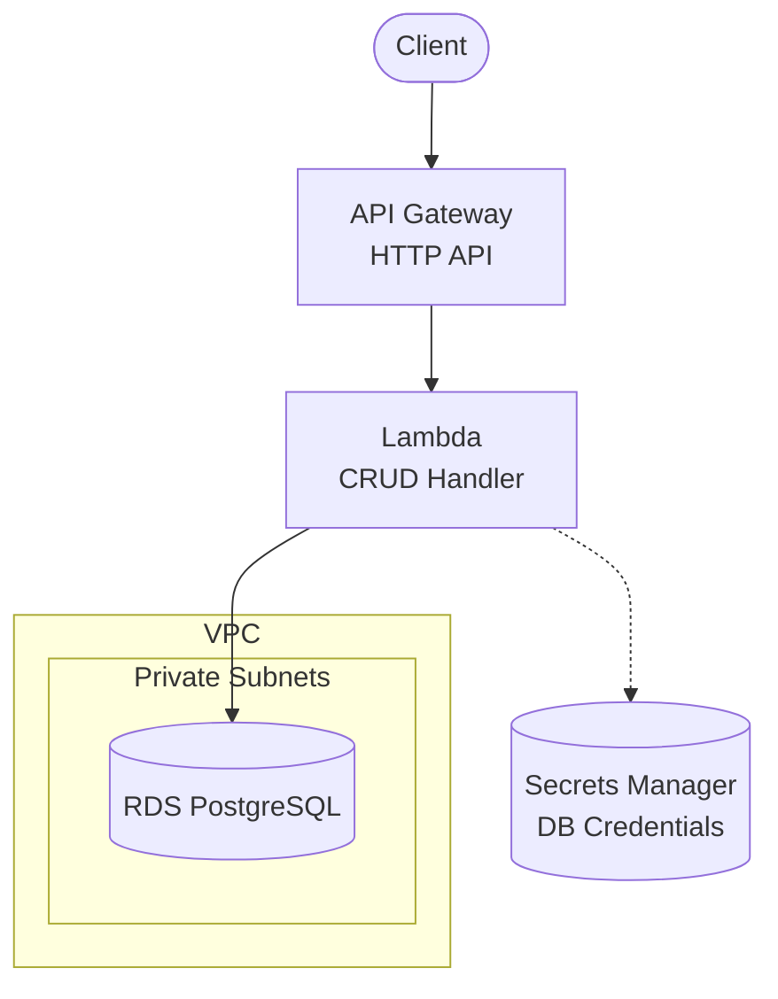

# Serverless REST API with RDS PostgreSQL

A complete AWS Terraform blueprint demonstrating the classic **API Gateway + Lambda + RDS PostgreSQL** pattern for CRUD operations.

## Architecture



## When to Use This Blueprint

| Scenario | Recommendation |
|----------|----------------|
| Development/Learning | ✅ This blueprint |
| Low-traffic production | ✅ This blueprint |
| High-traffic production | ⚠️ Consider `serverless-api-rds-proxy` |
| Variable/unpredictable traffic | ⚠️ Consider `serverless-api-aurora` |

### Limitations

- **No connection pooling**: Each Lambda invocation creates a new database connection
- **Cold start impact**: First connection after cold start takes longer
- **Connection limits**: RDS `max_connections` can be exhausted under high concurrency

## Prerequisites

| Requirement | Minimum Version | Purpose |
|-------------|-----------------|---------|
| **AWS Account** | - | Resources will be created in your account |
| **AWS CLI** | v2.x | Credential configuration and testing |
| **Terraform** | >= 1.9 | Infrastructure provisioning |
| **Node.js** | >= 18.x | Lambda runtime |

### AWS Credentials

```bash
# Option 1: AWS CLI profile
aws configure --profile myproject
export AWS_PROFILE=myproject

# Option 2: Environment variables
export AWS_ACCESS_KEY_ID="your-access-key"
export AWS_SECRET_ACCESS_KEY="your-secret-key"
export AWS_REGION="us-east-1"
```

## Quick Start

```bash
# 1. Navigate to environment
cd environments/dev

# 2. Install Lambda dependencies
cd ../../src/api && npm install && cd ../../environments/dev

# 3. Initialize Terraform
terraform init

# 4. Review the plan
terraform plan

# 5. Apply (takes ~10-15 minutes due to RDS)
terraform apply

# 6. Test the API
API_URL=$(terraform output -raw api_endpoint)

# Create an item
curl -X POST "$API_URL/items" \
  -H "Content-Type: application/json" \
  -d '{"name": "Test Item", "description": "My first item"}'

# List items
curl "$API_URL/items"
```

## Directory Structure

```
.
├── environments/
│   └── dev/                    # Development environment
│       ├── main.tf             # Module composition
│       ├── variables.tf        # Input variables
│       ├── outputs.tf          # Output values
│       ├── versions.tf         # Provider constraints
│       ├── backend.tf.example  # S3 backend template
│       └── terraform.tfvars    # Environment values
├── modules/
│   ├── naming/                 # Resource naming convention
│   ├── tagging/                # Standard tagging
│   ├── vpc/                    # VPC, subnets, security groups
│   ├── secrets/                # Secrets Manager for DB credentials
│   ├── data/                   # RDS PostgreSQL instance
│   └── api/                    # API Gateway + Lambda CRUD
├── src/
│   └── api/                    # Lambda CRUD handler
│       ├── index.js            # Main handler
│       └── package.json        # Dependencies
├── scripts/
│   └── db-init.sql             # Database schema
└── README.md
```

## API Endpoints

| Method | Path | Description |
|--------|------|-------------|
| POST | /items | Create a new item |
| GET | /items | List all items (with pagination) |
| GET | /items/{id} | Get item by ID |
| PUT | /items/{id} | Update item |
| DELETE | /items/{id} | Delete item |

### Request/Response Examples

**Create Item:**
```bash
curl -X POST "$API_URL/items" \
  -H "Content-Type: application/json" \
  -d '{
    "name": "My Item",
    "description": "A description",
    "data": {"key": "value"}
  }'

# Response: 201 Created
{
  "id": "uuid",
  "name": "My Item",
  "description": "A description",
  "data": {"key": "value"},
  "created_at": "2024-01-01T00:00:00Z",
  "updated_at": "2024-01-01T00:00:00Z"
}
```

**List Items (with pagination):**
```bash
curl "$API_URL/items?limit=10&offset=0"

# Response: 200 OK
{
  "items": [...],
  "total": 100,
  "limit": 10,
  "offset": 0
}
```

## Configuration

### Key Variables

| Variable | Default | Description |
|----------|---------|-------------|
| `project` | - | Project name (lowercase, alphanumeric) |
| `environment` | - | Environment: dev, staging, prod |
| `db_instance_class` | db.t3.micro | RDS instance size |
| `db_allocated_storage` | 20 | Initial storage (GB) |
| `lambda_memory_size` | 256 | Lambda memory (MB) |
| `lambda_timeout` | 30 | Lambda timeout (seconds) |

### Environment-Specific Values

| Setting | Dev | Staging | Prod |
|---------|-----|---------|------|
| `db_instance_class` | db.t3.micro | db.t3.small | db.t3.medium |
| `db_multi_az` | false | false | true |
| `db_deletion_protection` | false | true | true |
| `db_skip_final_snapshot` | true | false | false |
| `lambda_memory_size` | 256 | 512 | 1024 |
| `log_retention_days` | 14 | 30 | 90 |

## Creating Additional Environments

```bash
# 1. Copy the dev environment
cp -r environments/dev environments/staging

# 2. Update terraform.tfvars
cd environments/staging
# Edit terraform.tfvars with staging-specific values

# 3. Create backend.tf
cp backend.tf.example backend.tf
# Edit backend.tf: change the state key to staging/

# 4. Initialize and apply
terraform init
terraform plan
terraform apply
```

## Estimated Costs

| Resource | Dev (estimate) | Prod (estimate) |
|----------|----------------|-----------------|
| RDS (db.t3.micro) | ~$15/month | ~$50/month (db.t3.medium) |
| API Gateway | ~$1/month | ~$3.50/million requests |
| Lambda | Free tier | ~$0.20/million invocations |
| VPC Endpoints | ~$7/month | ~$7/month |
| Secrets Manager | ~$0.40/month | ~$0.40/month |
| CloudWatch Logs | ~$0.50/GB | ~$0.50/GB |

> **Tip**: Use `terraform destroy` to clean up after testing.

## Security

### IAM Least Privilege

| Component | Permissions |
|-----------|-------------|
| Lambda | `secretsmanager:GetSecretValue` (own secret only) |
| Lambda | VPC access (private subnets only) |
| RDS | No public access, SG restricted to Lambda |

### Encryption

| Resource | Encryption |
|----------|------------|
| RDS | Storage encrypted (AWS managed) |
| Secrets Manager | AWS managed KMS |
| API Gateway | TLS 1.2+ |

## Troubleshooting

### Lambda can't connect to RDS

1. Check security group rules allow port 5432
2. Verify Lambda is in same VPC as RDS
3. Check VPC endpoint for Secrets Manager is working

### Connection timeouts

Lambda in VPC requires NAT Gateway or VPC Endpoints for AWS services. This blueprint uses VPC Endpoints for Secrets Manager.

### "Too many connections" error

Consider upgrading to `serverless-api-rds-proxy` for connection pooling.

## Related Blueprints

| Blueprint | Description |
|-----------|-------------|
| `serverless-api-rds-proxy` | Same pattern + RDS Proxy for connection pooling |
| `serverless-api-aurora` | Aurora Serverless v2 for auto-scaling |

## Cleanup

```bash
cd environments/dev
terraform destroy
```

## License

MIT
