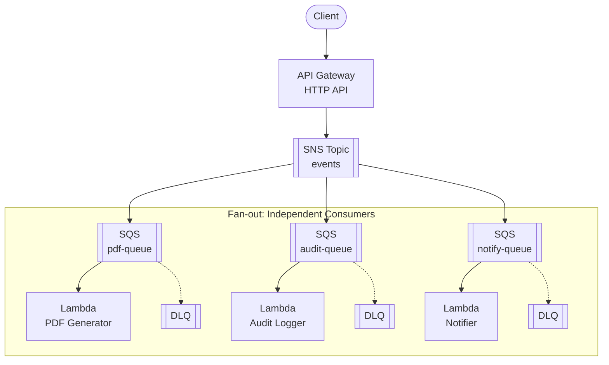
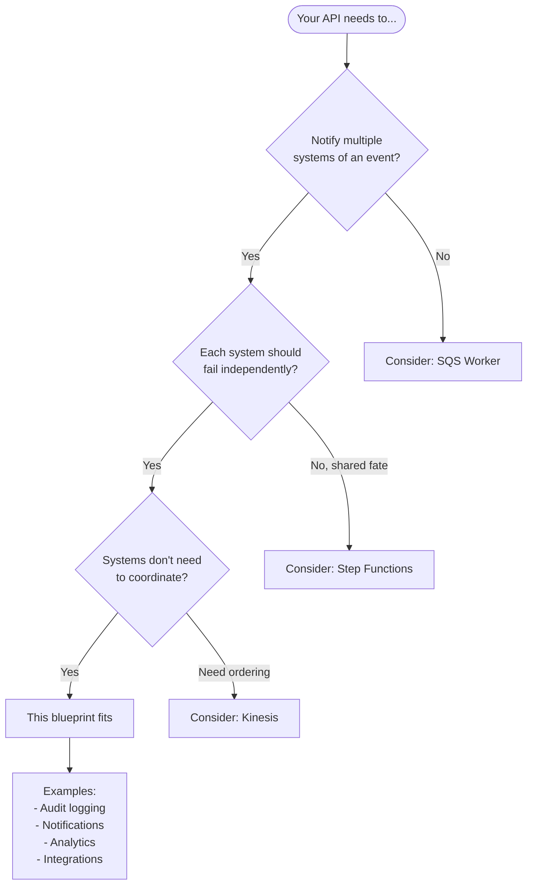

# Event-Driven API with SNS Fan-out

A complete AWS Terraform blueprint for **event-driven architecture** using API Gateway, SNS, SQS, and Lambda. Demonstrates the pub/sub fan-out pattern where one event triggers multiple independent consumers.

## Architecture



### Key Concepts

| Concept | Description |
|---------|-------------|
| **Fan-out** | One event is delivered to multiple subscribers |
| **Pub/Sub** | Publisher doesn't know who consumes events |
| **Independent Failure** | Each consumer has its own queue and DLQ |
| **Decoupling** | Consumers can be added/removed without changing the publisher |

### How It Differs from Queue-based Architecture

| Aspect | Queue (SQS Worker) | Event-Driven (This Blueprint) |
|--------|-------------------|------------------------------|
| **Message intent** | "Do this work" (command) | "This happened" (fact/event) |
| **Consumers** | One worker processes each message | Multiple subscribers receive each event |
| **Coupling** | Producer knows work needs to be done | Producer doesn't know who consumes |
| **Failure domain** | Shared queue and DLQ | Independent per consumer |
| **Use case** | Task/job processing | Notifications, audit, integrations |

## Prerequisites

Before using this blueprint, ensure you have:

### Required

| Requirement | Minimum Version | Purpose |
|-------------|-----------------|---------|
| **AWS Account** | - | Resources will be created in your account |
| **AWS CLI** | v2.x | Credential configuration and testing |
| **Terraform** | >= 1.9 | Infrastructure provisioning |
| **Node.js** | >= 18.x | Lambda runtime |

### AWS Credentials

Configure AWS credentials with sufficient permissions:

```bash
# Option 1: AWS CLI profile
aws configure --profile myproject
export AWS_PROFILE=myproject

# Option 2: Environment variables
export AWS_ACCESS_KEY_ID="your-access-key"
export AWS_SECRET_ACCESS_KEY="your-secret-key"
export AWS_REGION="us-east-1"
```

### Required IAM Permissions

The deploying user/role needs permissions to create:

| Service | Resources |
|---------|-----------|
| **API Gateway** | HTTP APIs, stages, routes, integrations |
| **SNS** | Topics, subscriptions, policies |
| **SQS** | Queues (standard), DLQs, policies |
| **Lambda** | Functions, event source mappings |
| **IAM** | Roles, policies |
| **CloudWatch** | Log groups |

## When to Use This Blueprint

### Decision Flowchart



### Ideal Use Cases

| Requirement | This Blueprint Provides |
|-------------|------------------------|
| Multiple reactions to one event | SNS fans out to N subscribers |
| Independent failure domains | Each consumer has own queue + DLQ |
| Add consumers without code changes | Just add SNS subscription |
| Audit/compliance logging | Audit logger receives ALL events |
| Selective notifications | Filter policies for specific event types |

**Real-world examples this pattern fits:**

- **Audit logging** - Record all events for compliance
- **Notifications** - Email, Slack, webhooks for certain events
- **Analytics** - Stream events to analytics pipeline
- **Integrations** - Trigger external systems
- **Cache invalidation** - Multiple caches react to data changes

### When NOT to Use This Blueprint

| Scenario | Better Alternative |
|----------|-------------------|
| **Single consumer for each message** | SQS Worker blueprint |
| **Complex multi-step workflows** | AWS Step Functions |
| **Need message ordering** | Kinesis Data Streams |
| **Need exactly-once processing** | Step Functions or custom idempotency |
| **Request-response pattern** | Synchronous API |

## Event Schema

Events published to the SNS topic should follow this structure:

```json
{
  "eventType": "ReportRequested",
  "eventId": "evt-550e8400-e29b-41d4-a716-446655440000",
  "timestamp": "2026-01-20T10:15:00Z",
  "data": {
    "reportId": "rpt-123",
    "userId": "user-456",
    "reportType": "monthly-summary"
  }
}
```

| Field | Required | Description |
|-------|----------|-------------|
| `eventType` | Yes | Type of event (used for filtering) |
| `eventId` | Yes | Unique ID for idempotency |
| `timestamp` | Yes | When the event occurred |
| `data` | Yes | Event-specific payload |

## Quick Start

```bash
# 1. Navigate to environment
cd environments/dev

# 2. Copy backend template (optional, for remote state)
cp backend.tf.example backend.tf
# Edit backend.tf with your S3 bucket

# 3. Initialize Terraform
terraform init

# 4. Review the plan
terraform plan

# 5. Apply
terraform apply

# 6. Test the fan-out pattern
curl -X POST $(terraform output -raw events_endpoint) \
  -H "Content-Type: application/json" \
  -d '{
    "eventType": "ReportRequested",
    "eventId": "evt-test-001",
    "timestamp": "2026-01-20T10:00:00Z",
    "data": {
      "reportId": "rpt-123",
      "userId": "user-456",
      "reportType": "monthly-summary"
    }
  }'

# 7. Verify all 3 consumers processed the event
aws logs tail /aws/lambda/$(terraform output -raw pdf_generator_function_name) --since 1m
aws logs tail /aws/lambda/$(terraform output -raw audit_logger_function_name) --since 1m
aws logs tail /aws/lambda/$(terraform output -raw notifier_function_name) --since 1m
```

## Directory Structure

```
.
├── environments/
│   └── dev/                    # Development environment
│       ├── main.tf             # Module composition
│       ├── variables.tf        # Input variables
│       ├── outputs.tf          # Output values
│       ├── versions.tf         # Provider constraints
│       ├── backend.tf.example  # S3 backend template
│       └── terraform.tfvars    # Environment values
├── modules/
│   ├── naming/                 # Resource naming convention
│   ├── tagging/                # Standard tagging
│   ├── topic/                  # SNS topic
│   ├── subscriber/             # SQS + Lambda consumer (reusable)
│   └── api/                    # API Gateway → SNS integration
├── src/
│   ├── pdf-generator/          # PDF generation Lambda
│   ├── audit-logger/           # Audit logging Lambda
│   └── notifier/               # Notification Lambda
└── tests/
    ├── unit/                   # Validation tests (mock)
    └── integration/            # Full deployment tests
```

## Subscribers

### PDF Generator

Generates PDF reports from `ReportRequested` events.

- **Receives**: All events (no filter)
- **Action**: Simulates PDF generation, would upload to S3
- **Failure**: Own DLQ, doesn't affect other consumers

### Audit Logger

Logs all events for audit/compliance purposes.

- **Receives**: ALL events (no filter)
- **Action**: Writes immutable audit record
- **Failure**: Own DLQ, audit trail preserved

### Notifier

Sends notifications for events.

- **Receives**: Configurable via filter policy
- **Action**: Sends email/Slack/webhook
- **Failure**: Own DLQ, other consumers unaffected

## SNS Filter Policies

You can filter which events reach a subscriber:

```hcl
# Only receive specific event types
notifier_filter_policy = {
  eventType = ["ReportRequested", "ReportGenerated"]
}

# Filter by data content (MessageBody scope)
notifier_filter_policy = {
  data = {
    reportType = ["monthly-summary", "annual-report"]
  }
}
```

## Configuration Reference

### Key Variables

| Variable | Default | Description |
|----------|---------|-------------|
| `project` | - | Project name (lowercase, alphanumeric) |
| `environment` | - | Environment: dev, staging, prod |
| `consumer_memory_size` | 256 | Consumer Lambda memory (MB) |
| `consumer_timeout` | 30 | Consumer Lambda timeout (seconds) |
| `sqs_max_receive_count` | 3 | Retries before DLQ |
| `notifier_filter_policy` | null | SNS filter policy for notifier |

### Environment-Specific Values

| Setting | Dev | Staging | Prod |
|---------|-----|---------|------|
| `consumer_memory_size` | 256 | 512 | 1024 |
| `log_retention_days` | 7 | 30 | 90 |
| `sqs_retention_seconds` | 1 day | 7 days | 14 days |

## Testing

### Unit Tests (Validation)

```bash
cd environments/dev
terraform test -filter=tests/unit/validation.tftest.hcl
```

Uses mock providers — no AWS resources created.

### Integration Tests

```bash
cd environments/dev
terraform test -filter=tests/integration/full.tftest.hcl
```

**Warning**: Creates real AWS resources. Ensure cleanup.

### Manual Testing

```bash
# Publish an event
curl -X POST $(terraform output -raw events_endpoint) \
  -H "Content-Type: application/json" \
  -d '{
    "eventType": "ReportRequested",
    "eventId": "evt-manual-test",
    "timestamp": "2026-01-20T10:00:00Z",
    "data": {"reportId": "rpt-test", "userId": "user-1", "reportType": "test"}
  }'

# Watch all consumer logs simultaneously (3 terminals)
aws logs tail /aws/lambda/sns-fanout-dev-pdf-generator --follow
aws logs tail /aws/lambda/sns-fanout-dev-audit-logger --follow
aws logs tail /aws/lambda/sns-fanout-dev-notifier --follow

# Check DLQs for failed messages
aws sqs receive-message --queue-url $(terraform output -raw pdf_generator_dlq_url)
```

## Outputs

| Output | Description |
|--------|-------------|
| `api_endpoint` | API Gateway endpoint URL |
| `events_endpoint` | Full POST /events URL |
| `sns_topic_arn` | SNS topic ARN |
| `pdf_generator_function_name` | PDF Generator Lambda |
| `audit_logger_function_name` | Audit Logger Lambda |
| `notifier_function_name` | Notifier Lambda |
| `*_queue_url` | SQS queue URLs |
| `*_dlq_url` | Dead-letter queue URLs |

## Cleanup

```bash
cd environments/dev
terraform destroy
```

## Related Blueprints

| Blueprint | Pattern | Use Case |
|-----------|---------|----------|
| `example-sqs-worker-api` | Queue-driven | Single consumer, task processing |
| `example-eventbridge-fanout-api` | Event bus | Routing rules, content filtering |

## License

MIT
