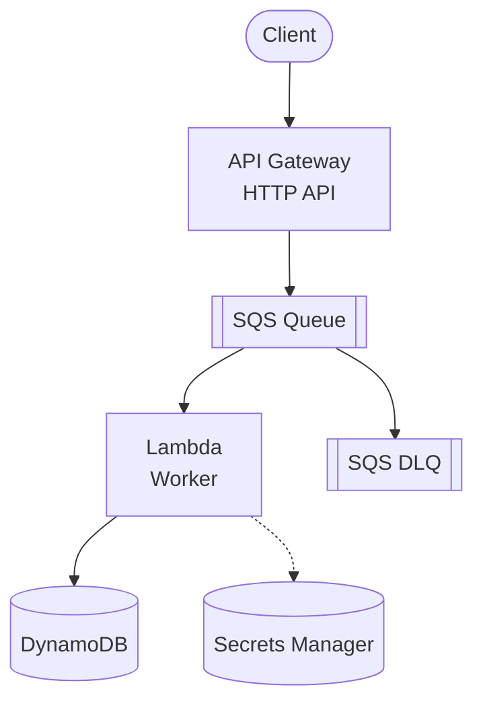
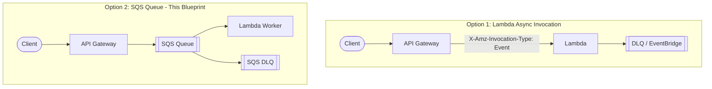
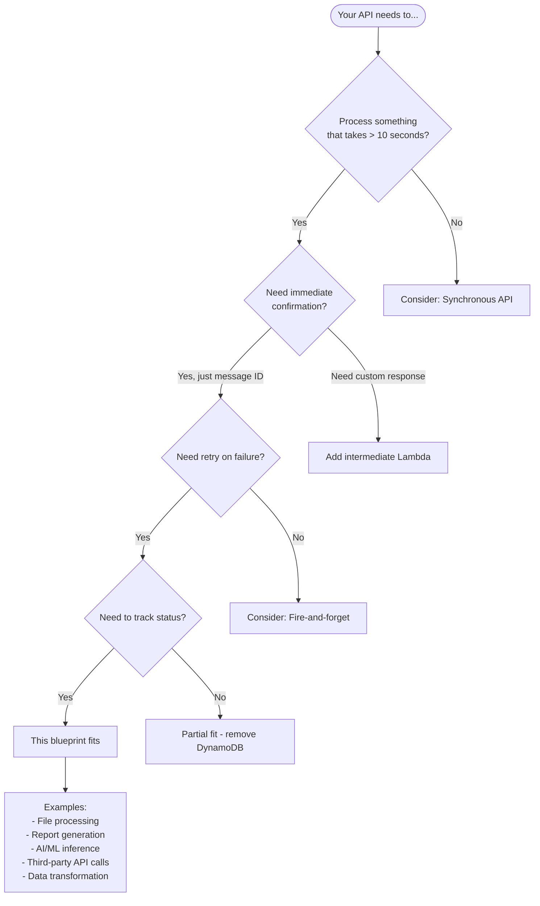
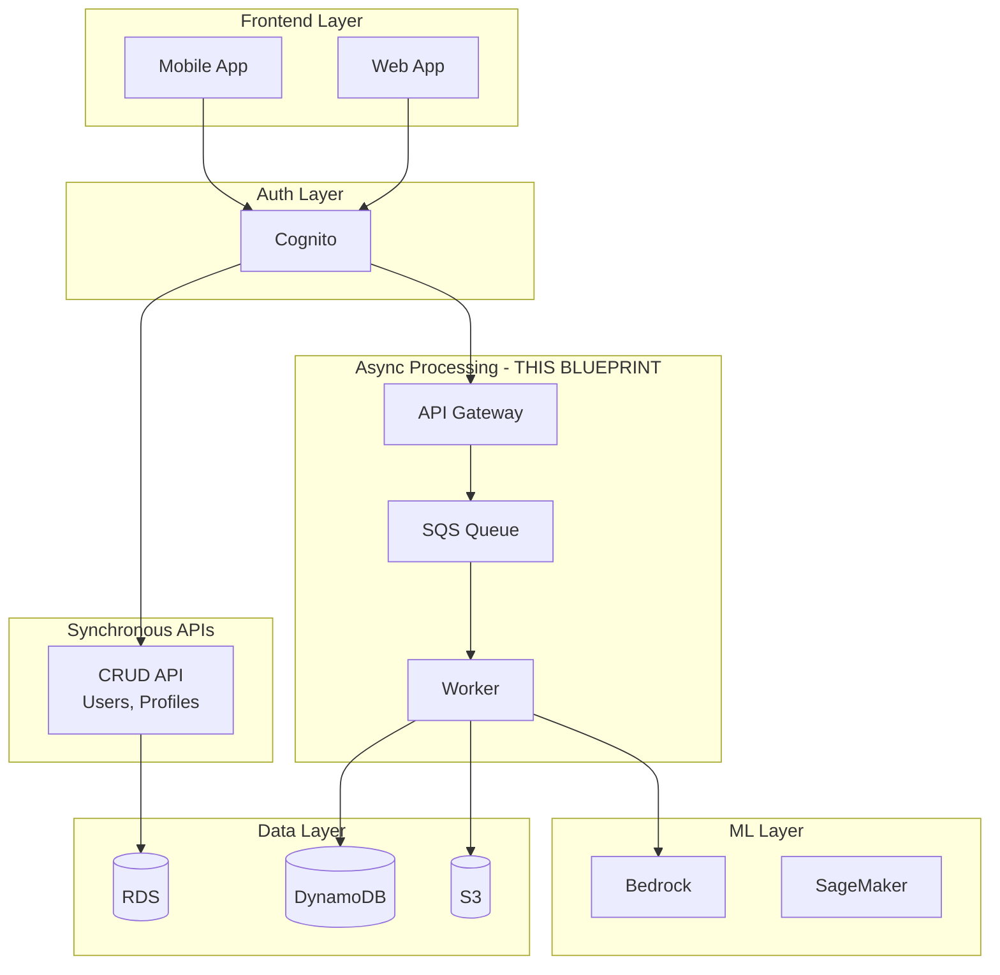
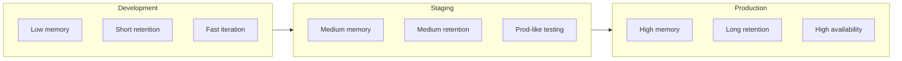
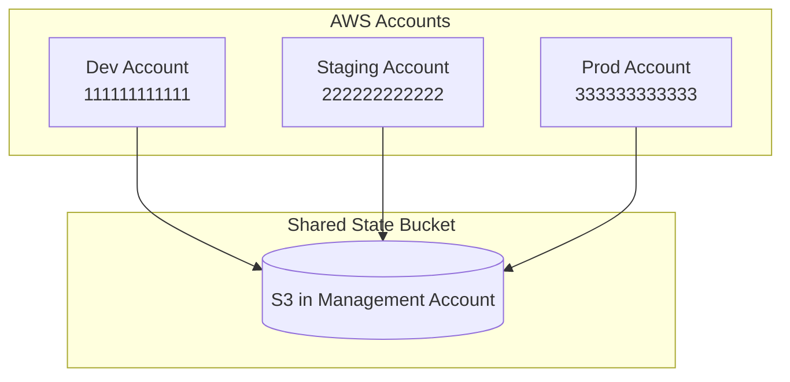

# Async API with SQS Worker

A complete AWS Terraform blueprint for **async API processing** using API Gateway, SQS, Lambda, and DynamoDB. API Gateway sends messages to SQS, which triggers a Worker Lambda for asynchronous processing.

## Architecture



### How It Differs

This blueprint sends requests from API Gateway to SQS without an intermediate Lambda:

| Aspect | This Blueprint | With Intermediate Lambda |
|--------|-------------------|------------------------|
| **Latency** | ~10-20ms | ~50-100ms |
| **Cost** | Lower (no Lambda) | Higher (extra invocation) |
| **Response** | SQS MessageId | Custom response |
| **Validation** | Worker-side | Handler-side |
| **Complexity** | Simpler | More control |

**Client receives SQS response:**

```json
{
  "MD5OfMessageBody": "...",
  "MessageId": "abc123-...",
  "SequenceNumber": null
}
```

## Lambda Async vs SQS Queue

When building async APIs, you have two main options: **Lambda async invocation** or **SQS queue**. This section helps you choose.

### Architecture Comparison



### Tradeoffs

| Aspect | Lambda Async | SQS Queue |
|--------|-------------|-----------|
| **Retry behavior** | 2 automatic retries (3 total) | Configurable, messages persist up to 14 days |
| **Backpressure** | Throttling can reject/drop events | Queue absorbs spikes indefinitely |
| **Max payload** | 256 KB | 256 KB |
| **Ordering** | No guarantees | FIFO queues available |
| **Visibility** | CloudWatch Logs only | Queue depth metrics, message inspection |
| **Cost** | Lambda only | Lambda + SQS (~$0.40/million requests) |
| **Batch processing** | No | Yes (up to 10 messages per invocation) |

### When to Use Each

**Choose Lambda Async when:**

- Lower latency is critical
- Simple fire-and-forget scenarios
- Cost-sensitive workloads
- Acceptable to lose events after 3 retry attempts
- You have an existing API Gateway + Lambda setup (minimal changes)

**Choose SQS Queue (this blueprint) when:**

- You need guaranteed delivery with extended retry windows
- Traffic spikes could exceed Lambda concurrency limits
- You need to inspect or debug messages in flight
- You require FIFO ordering
- You want visibility into queue depth for monitoring/alerting
- You need batch processing for efficiency

### Migration Path

If you have an **existing API Gateway + Lambda setup** and want to add async processing:

1. **Start with Lambda async invocation** — it's mostly a config change:

```hcl
# Change API Gateway integration to async
resource "aws_api_gateway_integration" "async" {
  # ... existing config ...
  request_parameters = {
    "integration.request.header.X-Amz-Invocation-Type" = "'Event'"
  }
}
```

2. **Upgrade to SQS later** if you find you need better durability, queue visibility, or traffic buffering

This approach gives you 80% of the benefits with minimal effort, and you can evolve to the full SQS pattern when requirements demand it.

### References

- [AWS Sample: API Gateway + Lambda Async (CDK)](https://github.com/aws-samples/asynchronous-event-processing-api-gateway-lambda-cdk)
- [AWS Sample: API Gateway + SQS (CDK)](https://github.com/aws-samples/asynchronous-event-processing-api-gateway-sqs-cdk)

## Prerequisites

Before using this blueprint, ensure you have the following:

### Required

| Requirement | Minimum Version | Purpose |
|-------------|-----------------|---------|
| **AWS Account** | - | Resources will be created in your account |
| **AWS CLI** | v2.x | Credential configuration and testing |
| **Terraform** | >= 1.9 | Infrastructure provisioning |
| **Node.js** | >= 18.x | Lambda runtime and scripts |

### AWS Credentials

Configure AWS credentials with sufficient permissions:

```bash
# Option 1: AWS CLI profile
aws configure --profile myproject
export AWS_PROFILE=myproject

# Option 2: Environment variables
export AWS_ACCESS_KEY_ID="your-access-key"
export AWS_SECRET_ACCESS_KEY="your-secret-key"
export AWS_REGION="us-east-1"

# Option 3: IAM role (recommended for CI/CD)
# Configure in your CI/CD platform
```

### Required IAM Permissions

The deploying user/role needs permissions to create:

| Service | Resources |
|---------|-----------|
| **API Gateway** | HTTP APIs, stages, routes, integrations |
| **Lambda** | Functions, event source mappings |
| **DynamoDB** | Tables |
| **SQS** | Queues (standard), DLQ |
| **Secrets Manager** | Secrets |
| **IAM** | Roles, policies |
| **CloudWatch** | Log groups |
| **S3** | State bucket (if using remote state) |

<details>
<summary>Example IAM Policy (click to expand)</summary>

```json
{
  "Version": "2012-10-17",
  "Statement": [
    {
      "Effect": "Allow",
      "Action": [
        "apigateway:*",
        "lambda:*",
        "dynamodb:*",
        "sqs:*",
        "secretsmanager:*",
        "iam:*",
        "logs:*",
        "s3:*"
      ],
      "Resource": "*"
    }
  ]
}
```

> **Note**: For production, scope down to specific resources using ARN patterns.

</details>

### Optional (Recommended)

| Tool | Purpose |
|------|---------|
| **pre-commit** | Automated code quality checks |
| **TFLint** | Terraform linting |
| **Trivy** | Security scanning |
| **Checkov** | Policy compliance |

Install optional tools:

```bash
# macOS
brew install pre-commit tflint trivy checkov

# Or via pip
pip install pre-commit checkov

# Enable pre-commit hooks
cd aws/example-sqs-worker-api
pre-commit install
```

### Remote State (Production)

For team collaboration, set up remote state:

```bash
# 1. Create S3 bucket for state
aws s3 mb s3://my-terraform-state-bucket --region us-east-1
aws s3api put-bucket-versioning \
  --bucket my-terraform-state-bucket \
  --versioning-configuration Status=Enabled

# 2. Create DynamoDB table for locking
aws dynamodb create-table \
  --table-name terraform-locks \
  --attribute-definitions AttributeName=LockID,AttributeType=S \
  --key-schema AttributeName=LockID,KeyType=HASH \
  --billing-mode PAY_PER_REQUEST

# 3. Copy and configure backend
cd environments/dev
cp backend.tf.example backend.tf
# Edit backend.tf with your bucket name
```

### Estimated Costs

| Resource | Dev (estimate) | Prod (estimate) |
|----------|----------------|-----------------|
| API Gateway | ~$1/month | ~$3.50/million requests |
| Lambda | Free tier eligible | ~$0.20/million invocations |
| DynamoDB | Free tier eligible | Pay per request |
| SQS | Free tier eligible | ~$0.40/million requests |
| Secrets Manager | ~$0.40/secret/month | ~$0.40/secret/month |
| CloudWatch Logs | ~$0.50/GB ingested | ~$0.50/GB ingested |

> **Tip**: Use `terraform destroy` to clean up after testing to avoid ongoing costs.

## When to Use This Blueprint

### Decision Flowchart



### Ideal Use Cases

This blueprint is designed for scenarios where you need:

| Requirement | This Blueprint Provides |
|-------------|------------------------|
| Accept requests quickly | API Gateway sends to SQS in ~10-20ms |
| Process asynchronously | SQS-triggered Worker Lambda |
| Retry on failure | SQS with configurable retries + DLQ |
| Track job status | DynamoDB with PENDING → PROCESSING → COMPLETED |
| Handle traffic spikes | SQS buffers load, Worker scales independently |

**Real-world examples this pattern fits:**

- **File/Image processing** - Upload triggers processing, user polls for result
- **Report generation** - User requests report, downloads when ready
- **AI/ML inference** - Send data for prediction, retrieve results async
- **Third-party integrations** - Call slow external APIs without timeout
- **Data transformation** - ETL jobs triggered by API
- **Notification systems** - Queue emails/SMS for reliable delivery

### When NOT to Use This Blueprint

| Scenario | Better Alternative |
|----------|-------------------|
| **Need custom API response** | Add intermediate Lambda |
| **Need request validation at API layer** | Add intermediate Lambda |
| **Simple CRUD operations** | Direct Lambda → DynamoDB |
| **Real-time responses required** | Synchronous API + caching |
| **Complex multi-step workflows** | AWS Step Functions |
| **Fan-out to multiple services** | EventBridge + multiple consumers |
| **Streaming data processing** | Kinesis Data Streams |

### Combining with Other Patterns

This blueprint is often **one piece of a larger architecture**:



## How It Works

### Request Flow

1. **Client** sends POST to `/commands` with JSON body
2. **API Gateway** forwards body directly to SQS (no Lambda)
3. **SQS** returns MessageId to client via API Gateway
4. **Worker Lambda** is triggered by SQS message
5. **Worker** creates DynamoDB record, processes, updates status

### Worker Responsibilities

Since there's no intermediate Lambda, the Worker handles everything:

```javascript
// Worker receives raw request body from SQS
const { input } = JSON.parse(record.body);

// Worker creates the command record
await createCommand(commandId, input, sqsMessageId);

// Worker processes and updates status
await updateCommandStatus(commandId, 'COMPLETED', result);
```

### Benefits

- **Lower Latency**: No Lambda cold start on the request path
- **Lower Cost**: One less Lambda invocation per request
- **Simpler**: Fewer moving parts to manage
- **Reliable**: SQS provides at-least-once delivery
- **Observable**: Status tracked in DynamoDB
- **Resilient**: DLQ captures permanent failures

## Quick Start

```bash
# 1. Navigate to environment
cd environments/dev

# 2. Copy backend template (optional, for remote state)
cp backend.tf.example backend.tf
# Edit backend.tf with your S3 bucket

# 3. Initialize Terraform
terraform init

# 4. Review the plan
terraform plan

# 5. Apply
terraform apply

# 6. Test the API
curl -X POST $(terraform output -raw api_endpoint)/commands \
  -H "Content-Type: application/json" \
  -d '{"input": {"message": "Hello, World!"}}'

# Response: {"MD5OfMessageBody": "...", "MessageId": "abc123-...", ...}
```

## Directory Structure

```
.
├── environments/
│   └── dev/                    # Development environment
│       ├── main.tf             # Module composition
│       ├── variables.tf        # Input variables
│       ├── outputs.tf          # Output values
│       ├── versions.tf         # Provider constraints
│       ├── backend.tf.example  # S3 backend template
│       └── terraform.tfvars    # Environment values
├── modules/
│   ├── naming/                 # Resource naming convention
│   ├── tagging/                # Standard tagging
│   ├── secrets/                # Secrets Manager (Flow B)
│   ├── data/                   # DynamoDB
│   ├── queue/                  # SQS + DLQ
│   ├── api/                    # API Gateway → SQS integration
│   └── worker/                 # Worker Lambda + SQS trigger
├── src/
│   └── worker/                 # Worker Lambda code
├── scripts/
│   └── secrets.js              # Flow B secrets CLI
└── tests/
    ├── unit/                   # Validation tests (mock)
    └── integration/            # Full deployment tests
```

## Creating Additional Environments

This blueprint uses the **hybrid environment pattern**: `environments/dev/` is a working template you copy to create staging, production, or any custom environment.

### Step-by-Step: Add a New Environment

```bash
# 1. Copy the dev environment
cp -r environments/dev environments/staging

# 2. Navigate to the new environment
cd environments/staging

# 3. Update terraform.tfvars with environment-specific values
# (see recommended values below)

# 4. Create backend.tf from template
cp backend.tf.example backend.tf
# Edit backend.tf: change the state key to staging/

# 5. Initialize and apply
terraform init
terraform plan
terraform apply
```

### Environment Configuration Guide



### Recommended Values by Environment

| Setting | Dev | Staging | Production |
|---------|-----|---------|------------|
| `environment` | `"dev"` | `"staging"` | `"prod"` |
| `worker_memory_size` | 256 | 512 | 1024 |
| `worker_timeout` | 30 | 60 | 120 |
| `sqs_retention_seconds` | 86400 (1d) | 604800 (7d) | 1209600 (14d) |
| `dlq_retention_seconds` | 604800 (7d) | 1209600 (14d) | 1209600 (14d) |
| `log_retention_days` | 7 | 30 | 90 |
| `enable_dynamodb_pitr` | true | true | true |
| `worker_max_concurrency` | 10 | 50 | 100 |
| `sqs_max_receive_count` | 3 | 3 | 5 |

### Example: staging/terraform.tfvars

```hcl
# Staging environment configuration
project     = "sqs-worker"
environment = "staging"
aws_region  = "us-east-1"

# Secrets (same structure, different prefix automatically)
secrets = {
  "external-api-key" = {
    description = "External API key for third-party service"
  }
  "webhook-secret" = {
    description = "Webhook signature validation secret"
  }
}

# Medium resources for staging
worker_memory_size = 512
worker_timeout     = 60

# Longer retention than dev
sqs_retention_seconds = 604800   # 7 days
dlq_retention_seconds = 1209600  # 14 days
log_retention_days    = 30

# Higher concurrency for load testing
worker_max_concurrency = 50
```

### Example: staging/backend.tf

```hcl
terraform {
  backend "s3" {
    bucket         = "my-terraform-state-bucket"
    key            = "sqs-worker/staging/terraform.tfstate"  # Changed!
    region         = "us-east-1"
    dynamodb_table = "terraform-locks"
    encrypt        = true
  }
}
```

### Multi-Account Strategy (Optional)

For true environment isolation, use separate AWS accounts:



Configure via AWS profiles in `versions.tf`:

```hcl
provider "aws" {
  region  = var.aws_region
  profile = var.aws_profile  # Add this variable

  default_tags {
    tags = {
      Project     = var.project
      Environment = var.environment
    }
  }
}
```

Then in `terraform.tfvars`:

```hcl
aws_profile = "staging"  # or "prod"
```

## Secrets Management

This blueprint implements two secrets management flows:

### Flow A: Terraform-Generated Secrets

For secrets **we control** (e.g., database passwords):

```hcl
# Uses ephemeral values + write-only arguments (TF 1.10+)
ephemeral "random_password" "db" {
  length = 32
}

resource "aws_db_instance" "this" {
  password_wo = ephemeral.random_password.db.result
}
```

### Flow B: Third-Party Secrets

For secrets from **external sources** (e.g., API keys):

```bash
# 1. Terraform creates empty shell
terraform apply

# 2. Engineer seeds actual value
node scripts/secrets.js seed

# 3. Application reads at runtime
# Lambda uses AWS SDK to fetch secret
```

### Secrets CLI

```bash
# List secrets
node scripts/secrets.js list

# Seed secrets interactively
node scripts/secrets.js seed

# Read secrets (masked)
node scripts/secrets.js read

# Custom prefix
SECRET_PREFIX=/prod/sqs-worker node scripts/secrets.js list
```

### Naming Convention

```
/{env}/{app}/{purpose}

Examples:
/dev/sqs-worker/external-api-key
/prod/sqs-worker/webhook-secret
```

## Failure and Retry Handling

### SQS Visibility Timeout

```
visibility_timeout (60s) > Lambda timeout (30s)
```

If Lambda fails, the message becomes visible again after the timeout.

### Dead Letter Queue (DLQ)

After `max_receive_count` (default: 3) failures:

1. Message is moved to DLQ
2. Command status remains PROCESSING or FAILED
3. Alert/monitor DLQ for investigation

### Handling DLQ Messages

```bash
# View DLQ messages
aws sqs receive-message --queue-url $(terraform output -raw sqs_dlq_url)

# Redrive to main queue (after fixing issue)
aws sqs start-message-move-task \
  --source-arn $(terraform output -raw sqs_queue_arn) \
  --destination-arn $(terraform output -raw sqs_queue_arn)
```

## When to Extend This Pattern

### Add EventBridge When

- You need fan-out to multiple consumers
- You want event-driven microservices
- You need content-based routing

### Add Step Functions When

- You have complex multi-step workflows
- You need human approval steps
- You want visual workflow monitoring
- You need parallel processing with aggregation

### Add Intermediate Lambda When

- You need custom API response format
- You need request validation before queueing
- You need to enrich requests with additional data

## Testing

### Unit Tests (Validation)

```bash
cd environments/dev
terraform test -filter=tests/unit/validation.tftest.hcl
```

Uses mock providers — no AWS resources created.

### Integration Tests

```bash
cd environments/dev
terraform test -filter=tests/integration/full.tftest.hcl
```

**Warning**: Creates real AWS resources. Ensure cleanup.

### Manual Testing

```bash
# Send command
curl -X POST $(terraform output -raw api_endpoint)/commands \
  -H "Content-Type: application/json" \
  -d '{"input": {"action": "process", "data": "test"}}'

# Check DynamoDB (after worker processes)
aws dynamodb scan --table-name $(terraform output -raw dynamodb_table_name)

# View worker logs
aws logs tail /aws/lambda/$(terraform output -raw worker_function_name) --follow
```

## CI/CD

This blueprint includes GitHub Actions workflows:

### `.github/workflows/terraform.yml`

| Job | Trigger | Actions |
|-----|---------|---------|
| **validate** | push/PR | fmt, init, validate, tflint |
| **security** | after validate | trivy, checkov |
| **test** | after security | terraform test (unit) |
| **plan** | PR only | terraform plan, PR comment |
| **apply** | main push | terraform apply (with approval) |

### `.github/workflows/cleanup.yml`

Runs every 2 hours to clean up orphaned test resources tagged with `Environment=test`.

## Security

### IAM Least Privilege

| Component | DynamoDB | SQS | Secrets |
|-----------|----------|-----|---------|
| API Gateway Role | - | SendMessage | - |
| Worker Lambda | PutItem, GetItem, UpdateItem | ReceiveMessage, DeleteMessage | GetSecretValue |

### Encryption

| Resource | Encryption |
|----------|------------|
| DynamoDB | AWS managed (default) |
| SQS | SQS-managed SSE |
| Secrets Manager | AWS managed |
| CloudWatch Logs | AWS managed |

### Scanning

Pre-commit and CI run:

- **Trivy** — Vulnerability scanning
- **Checkov** — Policy compliance

## Configuration Reference

### Key Variables

| Variable | Default | Description |
|----------|---------|-------------|
| `project` | - | Project name (lowercase, alphanumeric) |
| `environment` | - | Environment: dev, staging, prod |
| `worker_memory_size` | 256 | Worker memory (MB) |
| `worker_timeout` | 30 | Worker timeout (seconds) |
| `sqs_max_receive_count` | 3 | Retries before DLQ |
| `secrets` | {} | Map of secrets to create |

### Environment-Specific Values

| Setting | Dev | Staging | Prod |
|---------|-----|---------|------|
| `worker_memory_size` | 256 | 512 | 1024 |
| `log_retention_days` | 7 | 30 | 90 |
| `sqs_retention_seconds` | 1 day | 7 days | 14 days |
| `enable_dynamodb_pitr` | true | true | true |

## Outputs

| Output | Description |
|--------|-------------|
| `api_endpoint` | API Gateway base URL |
| `commands_endpoint` | Full POST /commands URL |
| `dynamodb_table_name` | DynamoDB table name |
| `sqs_queue_url` | Main queue URL |
| `sqs_queue_arn` | Main queue ARN |
| `sqs_dlq_url` | Dead-letter queue URL |
| `worker_function_name` | Worker Lambda |
| `secret_arns` | Map of secret ARNs |

## Cleanup

```bash
cd environments/dev
terraform destroy
```

## Attribution

This blueprint follows best practices from:

- [terraform-skill](https://github.com/antonbabenko/terraform-skill) by Anton Babenko
- [terraform-best-practices.com](https://terraform-best-practices.com)
- [Agent Skills](https://agentskills.io/)

## License

MIT
