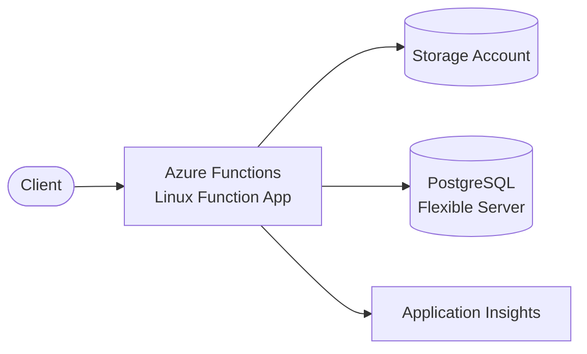

# Azure Functions + PostgreSQL

Serverless API with Azure Functions (Linux) and Azure PostgreSQL Flexible Server.

## Architecture



## Requirements

- Azure subscription with appropriate permissions
- Azure CLI installed and configured
- Terraform >= 1.0
- Node.js >= 18.x

## Deployment

```bash
cd environments/dev

# Configure Azure credentials
az login
az account set --subscription "your-subscription-id"

# Initialize Terraform
terraform init

# Review the plan
terraform plan

# Deploy
terraform apply
```

> PostgreSQL Flexible Server creation takes ~5-10 minutes.

## How it works

Azure Functions provides serverless compute for your API endpoints. The Function App connects to PostgreSQL Flexible Server for data persistence. Application Insights provides monitoring and logging.

Key benefits:
- **Serverless compute**: Pay only for execution time
- **Managed database**: PostgreSQL Flexible Server handles backups and patching
- **Integrated monitoring**: Application Insights for logs and metrics
- **Storage integration**: Storage Account for Function App requirements

## Testing

```bash
# Get the Function App URL
FUNCTION_URL=$(terraform output -raw function_app_url)

# Call the function
curl "$FUNCTION_URL/api/your-function-name?code=YOUR_FUNCTION_KEY"
```

## Configuration

| Variable | Default | Description |
|----------|---------|-------------|
| `project` | - | Project name (lowercase, alphanumeric) |
| `environment` | - | Environment: dev, staging, prod |
| `location` | Central US | Azure region |
| `postgresql_version` | 12 | PostgreSQL version |
| `postgresql_sku` | B_Standard_B1ms | PostgreSQL SKU |
| `app_service_plan_tier` | Standard | App Service Plan tier |
| `app_service_plan_size` | S1 | App Service Plan size |
| `node_version` | 18 | Node.js version |

## Estimated Costs

| Resource | Cost (monthly) |
|----------|----------------|
| Function App (Consumption) | ~$0 (pay per execution) |
| App Service Plan (Standard S1) | ~$70 |
| PostgreSQL Flexible Server (B_Standard_B1ms) | ~$25 |
| Storage Account | ~$0.02/GB |
| Application Insights | ~$2/GB data |

**Dev estimate: ~$100/month**

## Cleanup

```bash
terraform destroy
```

## Related Blueprints

| Blueprint | Relationship | Use Case |
|-----------|--------------|----------|
| `gcp-appengine-cloudsql-strapi` | GCP equivalent | Prefer GCP over Azure |
| `apigw-lambda-rds` | AWS equivalent | Prefer AWS over Azure |

## Origin

HM Impuls - WhatsApp-based pitch submission platform (ustwo, 2025)
