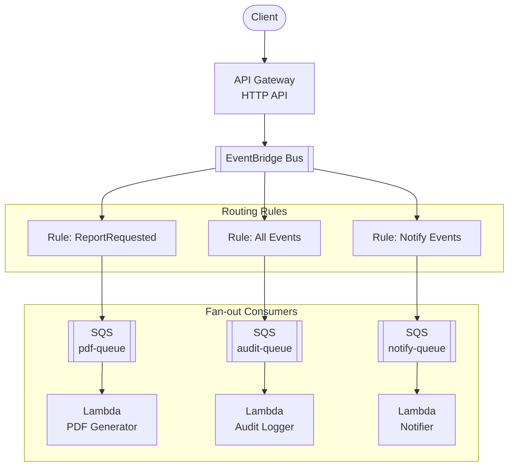

# API Gateway + EventBridge + Lambda

Event-driven API with Amazon EventBridge for event routing, filtering, and fan-out to multiple Lambda consumers.

## Architecture



## Requirements

- AWS Account with appropriate permissions
- AWS CLI installed and configured
- Terraform >= 1.9
- Node.js >= 18.x

## Deployment

```bash
cd environments/dev
cd ../../src/api && npm install && cd ../../environments/dev
terraform init
terraform apply
```

## How it works

API Gateway receives events and sends them to an EventBridge custom event bus. EventBridge rules route events based on patterns (event type, source, or content) to multiple SQS queues, which trigger independent Lambda consumers. This enables:

- **Content-based routing**: Route by event type or JSON content
- **Fan-out**: One event delivered to multiple consumers
- **Event archive**: Store events for replay/debugging
- **Decoupling**: Add/remove consumers without changing the publisher

## Testing

```bash
# Get the API endpoint
API_URL=$(terraform output -raw api_endpoint)

# Publish a ReportRequested event
curl -X POST "$API_URL/events" \
  -H "Content-Type: application/json" \
  -d '{
    "detail-type": "ReportRequested",
    "source": "reports.api",
    "detail": {"reportId": "123", "type": "monthly"}
  }'

# Publish a notification event
curl -X POST "$API_URL/events" \
  -H "Content-Type: application/json" \
  -d '{
    "detail-type": "UserNotification",
    "source": "notifications.api",
    "detail": {"userId": "456", "message": "Hello"}
  }'
```

## Configuration

| Variable | Default | Description |
|----------|---------|-------------|
| `project` | - | Project name (lowercase, alphanumeric) |
| `environment` | - | Environment: dev, staging, prod |
| `lambda_memory_size` | 256 | Lambda memory (MB) |
| `sqs_message_retention` | 86400 | Message retention (seconds) |
| `archive_retention_days` | 7 | Event archive retention |

## Estimated Costs

| Resource | Cost |
|----------|------|
| API Gateway | ~$1/million requests |
| EventBridge | $1/million events |
| SQS | ~$0.40/million requests |
| Lambda | Free tier / ~$0.20/million |

## Cleanup

```bash
terraform destroy
```

## Related Blueprints

| Blueprint | Relationship | Use Case |
|-----------|--------------|----------|
| `apigw-sns-lambda` | Simpler pub/sub | Don't need content-based routing |
| `apigw-sqs-lambda-dynamodb` | Queue worker | Single consumer, task processing |
| `apigw-lambda-dynamodb` | Synchronous | Don't need event-driven architecture |
