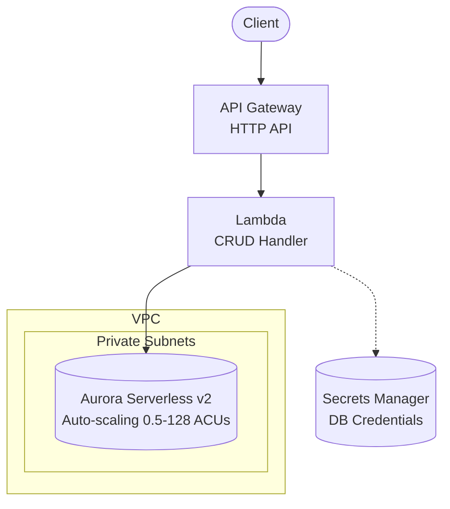

# API Gateway + Lambda + Aurora Serverless v2

Serverless REST API with Amazon API Gateway, AWS Lambda, and Aurora Serverless v2 with automatic scaling.

## Architecture



## Requirements

- AWS Account with appropriate permissions
- AWS CLI installed and configured
- Terraform >= 1.9
- Node.js >= 18.x

## Deployment

```bash
cd environments/dev
cd ../../src/api && npm install && cd ../../environments/dev
terraform init
terraform apply
```

> Deployment takes ~10-15 minutes.

## How it works

Aurora Serverless v2 provides automatic scaling that matches your workload. It scales in ACUs (Aurora Capacity Units) where 1 ACU ≈ 2 GB RAM. The database automatically scales from 0.5 ACU (minimum) up to 128 ACU based on demand, and scales back down when idle.

Key benefits over standard RDS:
- **Auto-scaling**: 0.5-128 ACUs based on demand
- **Cost when idle**: Near-zero at 0.5 ACU (~$0.06/hour)
- **Built-in connection handling**: No need for RDS Proxy

## Testing

```bash
# Get the API endpoint
API_URL=$(terraform output -raw api_endpoint)

# Create an item
curl -X POST "$API_URL/items" \
  -H "Content-Type: application/json" \
  -d '{"name": "Test Item", "description": "My first item"}'

# List items
curl "$API_URL/items"

# Get item by ID
curl "$API_URL/items/{id}"
```

## Configuration

| Variable | Default | Description |
|----------|---------|-------------|
| `project` | - | Project name (lowercase, alphanumeric) |
| `environment` | - | Environment: dev, staging, prod |
| `aurora_min_capacity` | 0.5 | Minimum ACUs (0.5-128) |
| `aurora_max_capacity` | 4 | Maximum ACUs (0.5-128) |
| `aurora_instance_count` | 1 | Number of Aurora instances |
| `lambda_memory_size` | 256 | Lambda memory (MB) |

## Estimated Costs

| Resource | Dev (estimate) | Prod (estimate) |
|----------|----------------|-----------------|
| Aurora (0.5 ACU idle) | ~$0.06/hour | - |
| Aurora (per ACU) | ~$0.12/hour | ~$0.12/hour |
| API Gateway | ~$1/month | ~$3.50/million |
| Lambda | Free tier | ~$0.20/million |
| VPC Endpoints | ~$7/month | ~$7/month |

**Cost advantage**: Scales to near-zero during idle periods.

## Cleanup

```bash
terraform destroy
```

## Related Blueprints

| Blueprint | Relationship | Use Case |
|-----------|--------------|----------|
| `apigw-lambda-rds` | Simpler | Fixed cost, predictable workload |
| `apigw-lambda-rds-proxy` | Connection pooling | High concurrency with standard RDS |
| `apigw-lambda-dynamodb` | NoSQL | Don't need relational data |
