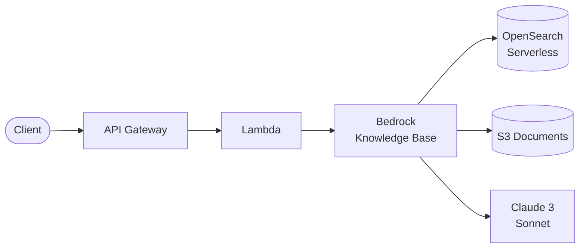

# API Gateway + Lambda + Bedrock RAG

RAG (Retrieval Augmented Generation) API using Amazon Bedrock Knowledge Bases with OpenSearch Serverless.

## Architecture



## Requirements

- AWS Account with appropriate permissions
- AWS CLI installed and configured
- Terraform >= 1.9
- Node.js >= 18.x
- **Bedrock models enabled** in AWS Console:
  - Claude 3 Sonnet (for generation)
  - Titan Text Embeddings V2 (for embeddings)

## Deployment

```bash
cd environments/dev
cd ../../src/api && npm install && cd ../../environments/dev
terraform init
terraform apply
```

> OpenSearch Serverless collection takes ~5 minutes to create.

## How it works

1. **Upload**: Documents uploaded to S3 via pre-signed URLs
2. **Index**: Knowledge Base chunks, embeds, and stores in OpenSearch
3. **Query**: User question is embedded, similar chunks retrieved
4. **Generate**: Retrieved context + question sent to Claude for grounded response

Responses include citations with source references.

## Testing

```bash
# Get the API endpoint
API_URL=$(terraform output -raw api_endpoint)

# Get upload URL for a document
UPLOAD_RESPONSE=$(curl -s -X POST "$API_URL/ingest" \
  -H "Content-Type: application/json" \
  -d '{"filename": "document.pdf", "contentType": "application/pdf"}')

UPLOAD_URL=$(echo $UPLOAD_RESPONSE | jq -r '.uploadUrl')

# Upload the document
curl -X PUT "$UPLOAD_URL" \
  -H "Content-Type: application/pdf" \
  --data-binary @document.pdf

# Trigger indexing
curl -X POST "$API_URL/sync"

# Query the knowledge base
curl -X POST "$API_URL/query" \
  -H "Content-Type: application/json" \
  -d '{"question": "What is the main topic of the document?"}'
```

## Configuration

| Variable | Default | Description |
|----------|---------|-------------|
| `project` | - | Project name (lowercase, alphanumeric) |
| `environment` | - | Environment: dev, staging, prod |
| `generation_model_id` | claude-3-sonnet | LLM for responses |
| `embedding_model_id` | titan-embed-v2 | Embedding model |
| `chunk_max_tokens` | 300 | Tokens per chunk |
| `opensearch_standby_replicas` | DISABLED | HA mode |

## Estimated Costs

| Resource | Cost |
|----------|------|
| OpenSearch Serverless | ~$175/month minimum (DISABLED replicas) |
| Bedrock Claude 3 Sonnet | $0.003/1K input, $0.015/1K output |
| Bedrock Titan Embeddings | $0.0001/1K tokens |
| S3, Lambda, API Gateway | Minimal |

**Minimum cost: ~$180/month** (mostly OpenSearch Serverless)

## Cleanup

```bash
# Empty S3 bucket first
aws s3 rm s3://$(terraform output -raw documents_bucket) --recursive

terraform destroy
```

## Related Blueprints

| Blueprint | Relationship | Use Case |
|-----------|--------------|----------|
| `apigw-lambda-dynamodb` | Simpler | Basic API without AI |
| `apigw-lambda-dynamodb-cognito` | Add auth | Secure RAG API with users |
| `amplify-cognito-apigw-lambda` | Frontend | Add chat UI for RAG |
