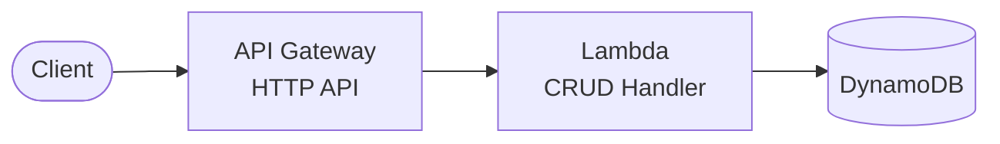

# API Gateway + Lambda + DynamoDB

Serverless REST API with Amazon API Gateway, AWS Lambda, and Amazon DynamoDB.

## Architecture



## Requirements

- AWS Account with appropriate permissions
- AWS CLI installed and configured
- Terraform >= 1.9
- Node.js >= 18.x

## Deployment

```bash
cd environments/dev
cd ../../src/api && npm install && cd ../../environments/dev
terraform init
terraform apply
```

## How it works

When an HTTP request is sent to the Amazon API Gateway endpoint, the AWS Lambda function is invoked and performs CRUD operations on the Amazon DynamoDB table. This is the simplest serverless pattern - no VPC required, fastest to deploy, lowest cost.

## Testing

```bash
# Get the API endpoint
API_URL=$(terraform output -raw api_endpoint)

# Create an item
curl -X POST "$API_URL/items" -H "Content-Type: application/json" -d '{"name": "Test"}'

# List items
curl "$API_URL/items"

# Get item by ID
curl "$API_URL/items/{id}"

# Update item
curl -X PUT "$API_URL/items/{id}" -H "Content-Type: application/json" -d '{"name": "Updated"}'

# Delete item
curl -X DELETE "$API_URL/items/{id}"
```

## Configuration

| Variable | Default | Description |
|----------|---------|-------------|
| `project` | - | Project name (lowercase, alphanumeric) |
| `environment` | - | Environment: dev, staging, prod |
| `lambda_memory_size` | 256 | Lambda memory (MB) |
| `lambda_timeout` | 30 | Lambda timeout (seconds) |
| `dynamodb_billing_mode` | PAY_PER_REQUEST | DynamoDB billing mode |

## Estimated Costs

| Resource | Cost |
|----------|------|
| API Gateway | ~$1/million requests |
| Lambda | Free tier / ~$0.20/million |
| DynamoDB | Free tier / pay-per-request |

**Total: Often free tier eligible**

## Cleanup

```bash
terraform destroy
```

## Related Blueprints

| Blueprint | Relationship | Use Case |
|-----------|--------------|----------|
| `apigw-lambda-dynamodb-cognito` | Add auth | User authentication needed |
| `apigw-lambda-rds` | Relational | Need SQL queries/joins |
| `apigw-sqs-lambda-dynamodb` | Async | Long-running background tasks |
| `apigw-sns-lambda` | Events | Notify multiple systems |
| `alb-ecs-fargate` | Containers | Need custom runtime |
