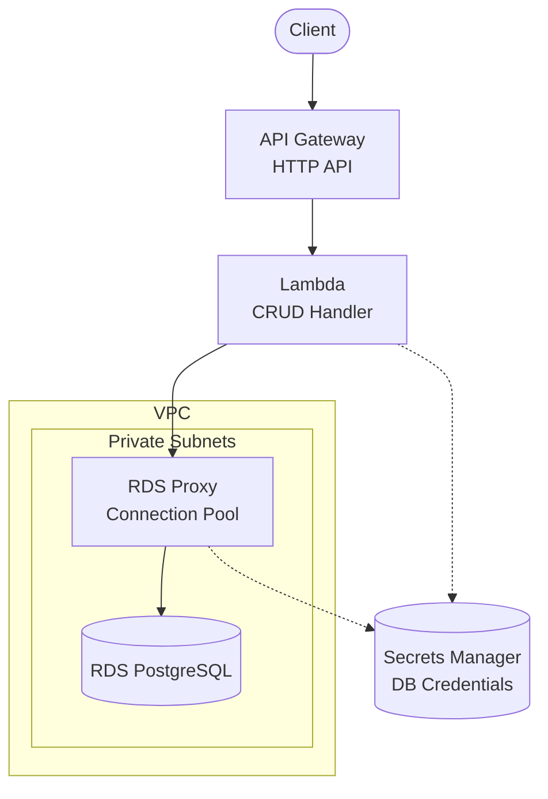

# API Gateway + Lambda + RDS Proxy + PostgreSQL

Serverless REST API with Amazon API Gateway, AWS Lambda, Amazon RDS Proxy, and RDS PostgreSQL for connection pooling.

## Architecture



## Requirements

- AWS Account with appropriate permissions
- AWS CLI installed and configured
- Terraform >= 1.9
- Node.js >= 18.x

## Deployment

```bash
cd environments/dev
cd ../../src/api && npm install && cd ../../environments/dev
terraform init
terraform apply
```

> Deployment takes ~15-20 minutes due to RDS + Proxy provisioning.

## How it works

RDS Proxy sits between Lambda and RDS, providing connection pooling. Instead of each Lambda invocation creating a new database connection, connections are reused from a pool. This solves common serverless database challenges:

- **Connection overhead**: Pooled connections reused instead of new connection per invocation
- **Cold start latency**: Near-instant from pool instead of 200-500ms connection setup
- **Connection limits**: Proxy manages pool instead of exhausting `max_connections`
- **Failover**: Automatic reconnection instead of connection drops

## Testing

```bash
# Get the API endpoint
API_URL=$(terraform output -raw api_endpoint)

# Create an item
curl -X POST "$API_URL/items" \
  -H "Content-Type: application/json" \
  -d '{"name": "Test Item", "description": "My first item"}'

# List items
curl "$API_URL/items"

# Get item by ID
curl "$API_URL/items/{id}"
```

## Configuration

| Variable | Default | Description |
|----------|---------|-------------|
| `project` | - | Project name (lowercase, alphanumeric) |
| `environment` | - | Environment: dev, staging, prod |
| `db_instance_class` | db.t3.micro | RDS instance size |
| `proxy_max_connections_percent` | 100 | Max connections to RDS |
| `proxy_idle_timeout` | 1800 | Idle connection timeout (seconds) |
| `lambda_memory_size` | 256 | Lambda memory (MB) |

## Estimated Costs

| Resource | Dev (estimate) | Prod (estimate) |
|----------|----------------|-----------------|
| RDS (db.t3.micro) | ~$15/month | ~$50/month |
| RDS Proxy | ~$20/month | ~$20/month |
| API Gateway | ~$1/month | ~$3.50/million |
| Lambda | Free tier | ~$0.20/million |
| VPC Endpoints | ~$7/month | ~$7/month |

**Total Dev: ~$43/month**

## Cleanup

```bash
terraform destroy
```

## Related Blueprints

| Blueprint | Relationship | Use Case |
|-----------|--------------|----------|
| `apigw-lambda-rds` | Simpler | Dev/learning, no proxy needed |
| `apigw-lambda-aurora` | Auto-scaling | Variable/unpredictable traffic |
| `apigw-lambda-dynamodb` | NoSQL | Don't need relational data |
