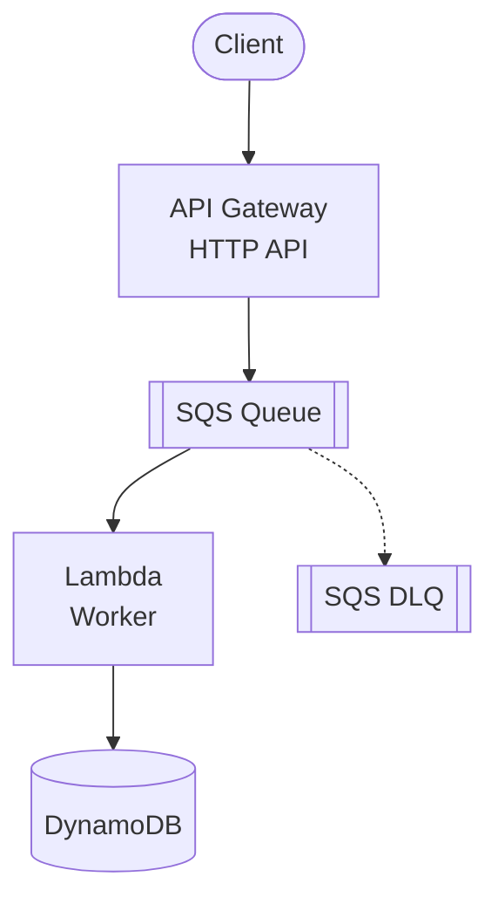

# API Gateway + SQS + Lambda + DynamoDB

Async API with Amazon SQS for queue-based processing and DynamoDB for storage.

## Architecture



## Requirements

- AWS Account with appropriate permissions
- AWS CLI installed and configured
- Terraform >= 1.9
- Node.js >= 18.x

## Deployment

```bash
cd environments/dev
cd ../../src/api && npm install && cd ../../environments/dev
terraform init
terraform apply
```

## How it works

API Gateway sends requests directly to SQS (no intermediate Lambda), providing lower latency (~10-20ms vs ~50-100ms) and lower cost. The client receives the SQS MessageId as confirmation. A Worker Lambda processes messages from the queue and stores results in DynamoDB.

Key benefits:
- **Async processing**: Client doesn't wait for processing to complete
- **Backpressure handling**: Queue absorbs traffic spikes
- **Retry with DLQ**: Failed messages go to Dead Letter Queue
- **Batch processing**: Worker can process up to 10 messages per invocation

## Testing

```bash
# Get the API endpoint
API_URL=$(terraform output -raw api_endpoint)

# Submit a job (returns SQS MessageId)
curl -X POST "$API_URL/jobs" \
  -H "Content-Type: application/json" \
  -d '{"type": "report", "data": {"reportId": "123"}}'

# Response:
# {"MD5OfMessageBody":"...","MessageId":"abc123-..."}

# Check worker logs
aws logs tail /aws/lambda/worker --follow

# Query processed items in DynamoDB
aws dynamodb scan --table-name jobs
```

## Configuration

| Variable | Default | Description |
|----------|---------|-------------|
| `project` | - | Project name (lowercase, alphanumeric) |
| `environment` | - | Environment: dev, staging, prod |
| `lambda_memory_size` | 256 | Lambda memory (MB) |
| `sqs_message_retention` | 86400 | Message retention (seconds) |
| `sqs_visibility_timeout` | 30 | Visibility timeout (seconds) |
| `sqs_batch_size` | 10 | Messages per Lambda invocation |

## Estimated Costs

| Resource | Cost |
|----------|------|
| API Gateway | ~$1/million requests |
| SQS | ~$0.40/million requests |
| Lambda | Free tier / ~$0.20/million |
| DynamoDB | Free tier / pay-per-request |

## Cleanup

```bash
terraform destroy
```

## Related Blueprints

| Blueprint | Relationship | Use Case |
|-----------|--------------|----------|
| `apigw-sns-lambda` | Fan-out | Multiple consumers for same event |
| `apigw-eventbridge-lambda` | Event routing | Content-based routing, event replay |
| `apigw-lambda-dynamodb` | Synchronous | Don't need async processing |
