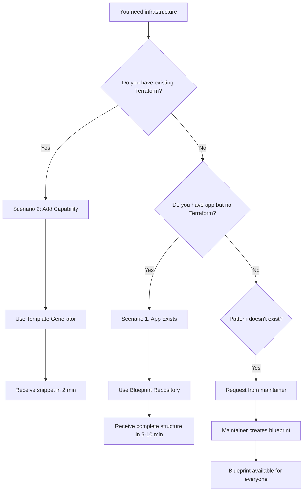
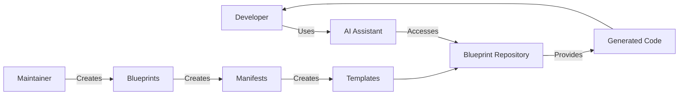

# Developer Workflow

Guide for developers working with Terraform Infrastructure Blueprints through AI Assistants.

> **Important**: Developers **do not access the blueprint repository directly**. They use AI Assistants that interact with MCP tools and Template Generator. Only **maintainers** create and maintain blueprints, manifests, and templates in the repository.

## Scenario 1: App Exists, Needs Infrastructure

**Situation**: You have an application (React, Node.js, Python, etc.) running locally and need complete Terraform infrastructure to deploy to AWS.

**Tool**: Blueprint Repository (MCP tools)  
**Time**: 5-10 minutes  
**Result**: Complete Terraform structure (environments/, modules/, etc.)

```mermaid
flowchart TD
    A[You: "I need to deploy to AWS"] --> B[AI analyzes app code]
    B --> C[AI identifies stack]
    C --> D[AI recommends blueprint]
    D --> E[AI shows complete structure]
    E --> F[You copy blueprint]
    F --> G[You adapt and apply]
```

**How it works**:

- AI automatically analyzes application code (package.json, requirements.txt, etc.)
- AI identifies stack (React, Node.js, Python, PostgreSQL, etc.)
- AI recommends appropriate blueprint
- AI shows complete structure

## Scenario 2: Existing Terraform, Add Capability

**Situation**: You already have Terraform configured and want to add a specific resource (RDS, SQS, Cognito, etc.).

**Tool**: Template Generator  
**Time**: 2 minutes  
**Result**: Generated and adapted Terraform snippet

```mermaid
flowchart TD
    A[You: "I need to add RDS PostgreSQL"] --> B[AI analyzes existing Terraform]
    B --> C[AI extracts naming conventions]
    C --> D[AI identifies blueprint]
    D --> E[Template Generator validates params]
    E --> F[Template Generator renders template]
    F --> G[You receive generated code]
    G --> H[You copy and apply]
```

**How it works**:

- AI automatically analyzes your existing Terraform code
- AI identifies existing resources (API Gateway, Lambda, VPC, etc.)
- AI extracts naming conventions from project
- AI generates code already adapted to your conventions

## Decision Flow



## Developer vs Maintainer



### Developers (End Users)

**What They Do**:

- ✅ Use existing blueprints through AI Assistants
- ✅ Receive code generated by Template Generator
- ✅ Copy code shown by AI Assistant
- ✅ Apply code to their projects

**What They DON'T Do**:

- ❌ Do NOT access the blueprint repository
- ❌ Do NOT create new blueprints
- ❌ Do NOT modify existing blueprints

### Maintainers (Repository)

**What They Do**:

- ✅ Create new blueprints in repository
- ✅ Maintain existing blueprints
- ✅ Create YAML manifests
- ✅ Create parameterized templates
- ✅ Access repository directly

## Time Savings

| Task        | Manual    | With System | Savings |
|-------------|-----------|-------------|---------|
| Add RDS     | 30 min    | 2 min       | 93%     |
| Create project | 3 hours | 10 min      | 94%     |
| Understand pattern | 1 hour | 5 min   | 92%     |

For validation and testing of Terraform (e.g. `terraform validate`, native tests, CI/CD), teams can use the **terraform-practices** skill.

## References

- [AI Assistant Guidelines](./ai-assistant-guidelines.md) - How AI Assistants help you
- [MCP Tools Reference](./mcp-tools-reference.md) - Technical reference
- [Blueprint Patterns](./blueprints/patterns.md) - Code patterns
