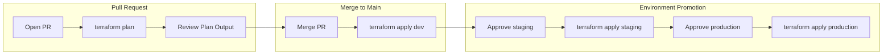

# CI/CD Pipeline Guide

This guide provides patterns and templates for setting up CI/CD pipelines for Terraform deployments. These workflows follow best practices for multi-environment deployments while maintaining flexibility for your specific needs.

## Core Principles

The recommended CI/CD pattern follows these principles:

1. **Plan before apply** - Always run `terraform plan` on pull requests to preview changes
2. **Apply on merge** - Automatically apply changes when merged to main branch
3. **Environment promotion** - Promote changes through dev → staging → production with approval gates
4. **Secure authentication** - Use OIDC (OpenID Connect) for passwordless AWS authentication
5. **Backend flexibility** - Support multiple backend types (S3, HCP Terraform, etc.)

## Workflow Pattern

The standard workflow pattern for multi-environment deployments:



## Using Workflow Files in Blueprints

Each blueprint includes ready-to-use GitHub Actions workflows in `.github/workflows/`. These workflows implement the multi-environment deployment pattern described above.

### Available Workflows

**`.github/workflows/terraform.yml`** - S3 backend with OIDC authentication

- Plan on pull requests for all environments
- Auto-apply to dev on merge
- Manual approval gates for staging/production
- Uses AWS OIDC for passwordless authentication

**`.github/workflows/terraform-hcp.yml.example`** - HCP Terraform backend

- Same promotion pattern
- Uses HCP Terraform workspaces for state management
- Copy to `terraform-hcp.yml` to use

### Quick Start

1. **Copy the blueprint** to your project
2. **Review the workflow** at `.github/workflows/terraform.yml`
3. **Configure prerequisites** (see below)
4. **Customize as needed** for your specific requirements

### Prerequisites for S3 Backend Workflow

- S3 bucket for Terraform state (with versioning and encryption)
- DynamoDB table for state locking
- AWS IAM OIDC provider configured in GitHub
- IAM role with permissions to assume via OIDC

See the complete workflow file in any blueprint: `aws/{blueprint-name}/.github/workflows/terraform.yml`

### Option 2: HCP Terraform (Terraform Cloud) Backend

This workflow uses HCP Terraform (formerly Terraform Cloud) for state management and runs.

**Prerequisites:**

- HCP Terraform organization and workspace
- HCP Terraform API token
- Workspaces configured for each environment (dev, staging, production)

**Workflow file:** `aws/{blueprint-name}/.github/workflows/terraform-hcp.yml.example` (copy to `terraform-hcp.yml` to use)

**Key differences from S3 workflow:**

- Uses `TF_TOKEN_app_terraform_io` secret instead of AWS credentials
- Initializes with HCP Terraform organization and workspace names
- No need for S3 bucket or DynamoDB table setup

## Setting Up GitHub Environments

Configure approval gates for staging and production:

1. Go to **Repository Settings → Environments**
2. Create environments: `staging` and `production`
3. Configure protection rules:

| Environment   | Required Reviewers | Wait Timer | Deployment Branches |
|---------------|--------------------|------------|---------------------|
| dev           | None               | None       | `main`              |
| staging       | 1 reviewer         | None       | `main`              |
| production    | 1-2 reviewers      | 10 minutes | `main`              |

The workflow will pause at the `apply-staging` and `apply-production` jobs until approvals are granted.

## Security: OIDC Authentication Setup

OIDC (OpenID Connect) provides passwordless authentication between GitHub Actions and AWS. This is more secure than static access keys.

### 1. Create IAM OIDC Provider

```bash
# Get GitHub's OIDC thumbprint
aws iam create-open-id-connect-provider \
  --url https://token.actions.githubusercontent.com \
  --client-id-list sts.amazonaws.com \
  --thumbprint-list 6938fd4d98bab03faadb97b34396831e3780aea1
```

### 2. Create IAM Role for GitHub Actions

```hcl
# iam-role-github-actions.tf
resource "aws_iam_role" "github_actions_terraform" {
  name = "github-actions-terraform"

  assume_role_policy = jsonencode({
    Version = "2012-10-17"
    Statement = [
      {
        Effect = "Allow"
        Principal = {
          Federated = "arn:aws:iam::ACCOUNT_ID:oidc-provider/token.actions.githubusercontent.com"
        }
        Action = "sts:AssumeRoleWithWebIdentity"
        Condition = {
          StringEquals = {
            "token.actions.githubusercontent.com:aud" = "sts.amazonaws.com"
          }
          StringLike = {
            "token.actions.githubusercontent.com:sub" = "repo:OWNER/REPO:*"
          }
        }
      }
    ]
  })
}

resource "aws_iam_role_policy_attachment" "github_actions_terraform" {
  role       = aws_iam_role.github_actions_terraform.name
  policy_arn = "arn:aws:iam::aws:policy/AdministratorAccess"  # Scope down as needed
}
```

### 3. Configure GitHub Secrets

Add these secrets to your GitHub repository:

- `AWS_ACCOUNT_ID`: Your AWS account ID
- `TF_STATE_BUCKET`: S3 bucket name for Terraform state
- `TF_LOCK_TABLE`: DynamoDB table name for state locking

The workflow will automatically assume the IAM role using OIDC - no access keys needed!

## Alternative CI Systems

The workflow pattern can be adapted to other CI systems. The key principles remain the same:

- **Plan on pull requests** - Preview changes before merging
- **Apply on merge** - Automatically deploy to dev
- **Manual approval gates** - Require approval for staging/production

### GitLab CI

GitLab CI supports similar patterns using `.gitlab-ci.yml`. Use `when: manual` for approval gates and `environment:` blocks for environment protection.

### CircleCI

CircleCI workflows can implement the same pattern using `workflows:` blocks and manual approval steps.

### Jenkins

Jenkins pipelines can use the `input` step for manual approvals and parallel stages for multi-environment planning.

## Additional Checks

You can enhance workflows with additional validation. Add these steps to the `plan` job in your workflow:

- **Security Scanning**: Add Checkov or Trivy steps to scan for security issues
- **Cost Estimation**: Add Infracost to estimate infrastructure costs
- **Linting**: Add tflint for additional Terraform linting beyond `terraform fmt`

See the workflow files in blueprints for examples, or add these checks based on your team's requirements.

## Adapting to Your Needs

These workflows are **templates** - adapt them to your specific requirements:

- **Single environment**: Remove staging/production jobs if you only need dev
- **Different backends**: Modify `terraform init` commands for your backend configuration
- **Custom approval flow**: Adjust GitHub Environment settings or add manual approval steps
- **Different CI system**: Adapt the pattern to GitLab CI, CircleCI, Jenkins, etc.
- **Additional checks**: Add security scanning, cost estimation, or custom validation

## Keeping Blueprints Up to Date

When a blueprint in this repository is updated, changes do not automatically apply to copies in client projects. To keep your infrastructure up to date:

1. **Watch for updates:** Monitor this repository for new releases, improvements, or security fixes.
2. **Compare changes:** When an update is published, compare your local blueprint folder with the updated version in this repo.
3. **Merge manually:** Manually merge relevant changes into your local copy, taking care to preserve any customizations.
4. **Test before applying:** Always test updates in a non-production environment before rolling out to production.
5. **Document customizations:** Keep notes on any changes you make to the blueprint so you can reapply them after future updates.

This manual update flow ensures you stay secure and benefit from improvements, while maintaining full control over your infrastructure code.
