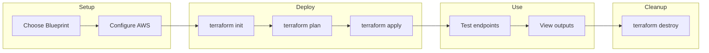

# Deployment Guide

This guide provides detailed step-by-step instructions for deploying blueprints.

## Step-by-Step Deployment

### 1. Choose a Blueprint

```bash
# List available blueprints
ls aws/

# Example output:
# alb-ecs-fargate/
# apigw-lambda-dynamodb/
# apigw-lambda-rds/
# eks-cluster/
# ...
```

### 2. Choose Your AWS Region

Edit `terraform.tfvars` to set your target region:

```hcl
aws_region = "eu-west-2"  # London - change to your preferred region
```

**How to choose a region:**

| Consider | Recommendation |
|----------|----------------|
| **User location** | Choose region closest to your users for lowest latency |
| **Compliance** | GDPR → EU regions, Data residency → specific country |
| **Cost** | Prices vary by region ([AWS pricing](https://aws.amazon.com/pricing/)) |
| **Service availability** | Some services aren't in all regions |

**Common regions:**

| Region | Location | Code |
|--------|----------|------|
| US East (N. Virginia) | USA | `us-east-1` |
| US West (Oregon) | USA | `us-west-2` |
| Europe (Ireland) | EU | `eu-west-1` |
| Europe (Frankfurt) | EU | `eu-central-1` |
| Europe (London) | UK | `eu-west-2` |
| Asia Pacific (Tokyo) | Japan | `ap-northeast-1` |
| Asia Pacific (Sydney) | Australia | `ap-southeast-2` |

### 3. Configure AWS Credentials

```bash
# Option A: AWS SSO (recommended)
aws sso login --profile your-profile
export AWS_PROFILE=your-profile

# Option B: Environment variables
export AWS_ACCESS_KEY_ID="your-key"
export AWS_SECRET_ACCESS_KEY="your-secret"
export AWS_REGION="eu-west-2"  # Match your terraform.tfvars

# Verify credentials
aws sts get-caller-identity
```

### 4. (Optional) Configure Remote State

For team collaboration, set up S3 backend:

```bash
cd aws/apigw-lambda-dynamodb/environments/dev
cp backend.tf.example backend.tf
# Edit backend.tf with your S3 bucket details
```

### 5. Review Configuration

```bash
# Check default values
cat terraform.tfvars

# Common settings to customize:
# - project     = "your-project-name"
# - environment = "dev"
# - aws_region  = "us-east-1"
```

### 6. Deploy

```bash
# Initialize providers and modules
terraform init

# Preview what will be created
terraform plan

# Create resources (type 'yes' to confirm)
terraform apply
```

### 7. Use the Outputs

```bash
# View all outputs
terraform output

# Get specific endpoint
terraform output -raw api_endpoint

# Most blueprints include helpful test commands
terraform output quick_start
```

### 8. Cleanup

```bash
# Destroy all resources when done
terraform destroy
```

## Blueprint Structure

Every blueprint follows this pattern:

```
aws/{blueprint-name}/
├── environments/
│   └── dev/
│       ├── main.tf           # Module composition
│       ├── variables.tf      # Input variables  
│       ├── outputs.tf        # Outputs
│       ├── versions.tf       # Provider versions
│       ├── terraform.tfvars  # Default values
│       └── backend.tf.example
├── modules/                  # Self-contained modules
├── src/                      # Application code (if any)
├── tests/
│   ├── unit/                 # Validation tests
│   └── integration/          # Full deployment tests
└── README.md                 # Blueprint-specific docs
```

## Deployment Flow


