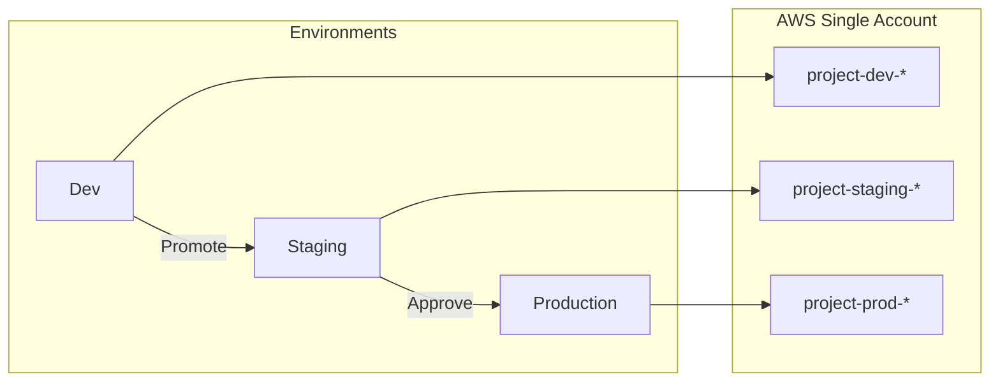

# Creating Additional Environments

Blueprints include only a `dev/` environment by default. Use the helper script to create staging or production environments when needed.

## Quick Create

```bash
# Create staging environment
./scripts/create-environment.sh aws/apigw-sqs-lambda-dynamodb staging

# Create production environment
./scripts/create-environment.sh aws/apigw-sqs-lambda-dynamodb prod
```

## What the Script Does

1. **Copies** the `dev/` directory to the new environment
2. **Updates** `terraform.tfvars` with environment-specific scaling
3. **Updates** `backend.tf.example` with new state key path
4. **Removes** any cached `.terraform` directories

## Environment Scaling Recommendations

| Setting | Dev | Staging | Prod |
|---------|-----|---------|------|
| **Memory (Lambda/Container)** | 256 MB | 512 MB | 1024 MB |
| **Log retention** | 7 days | 30 days | 90 days |
| **Message retention (SQS)** | 1 day | 7 days | 14 days |
| **Replicas/Concurrency** | 1-2 | 2-5 | 5-10 |
| **Database** | Single/Small | Multi-AZ/Medium | Multi-AZ/Large |

## Manual Environment Creation

If you prefer to create environments manually:

```bash
# 1. Copy dev environment
cp -r aws/apigw-sqs-lambda-dynamodb/environments/dev \
      aws/apigw-sqs-lambda-dynamodb/environments/staging

# 2. Update environment name in terraform.tfvars
sed -i '' 's/environment = "dev"/environment = "staging"/' \
    aws/apigw-sqs-lambda-dynamodb/environments/staging/terraform.tfvars

# 3. Adjust resource sizing as needed
# Edit terraform.tfvars with staging-appropriate values

# 4. Update backend state key (if using remote state)
# Edit backend.tf.example or backend.tf
```

## Multi-Environment Deployment Flow



## GitHub Environments for Approvals

Configure approval gates in GitHub:

1. Go to **Settings → Environments**
2. Create environments: `dev`, `staging`, `production`
3. Add protection rules:

| Environment | Required Reviewers | Wait Timer |
|-------------|-------------------|------------|
| dev | None | None |
| staging | 1 | None |
| production | 1-2 | 10 minutes |

Then use the deploy workflow to promote between environments with manual approval.
