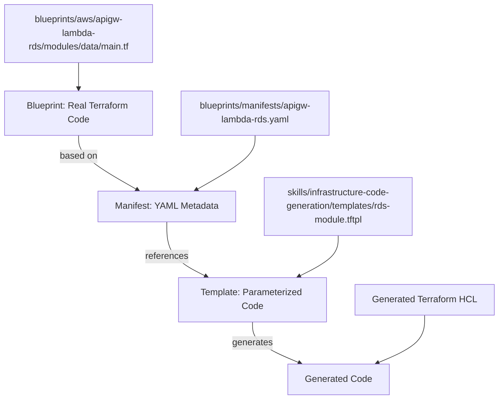
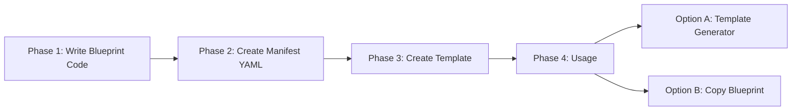
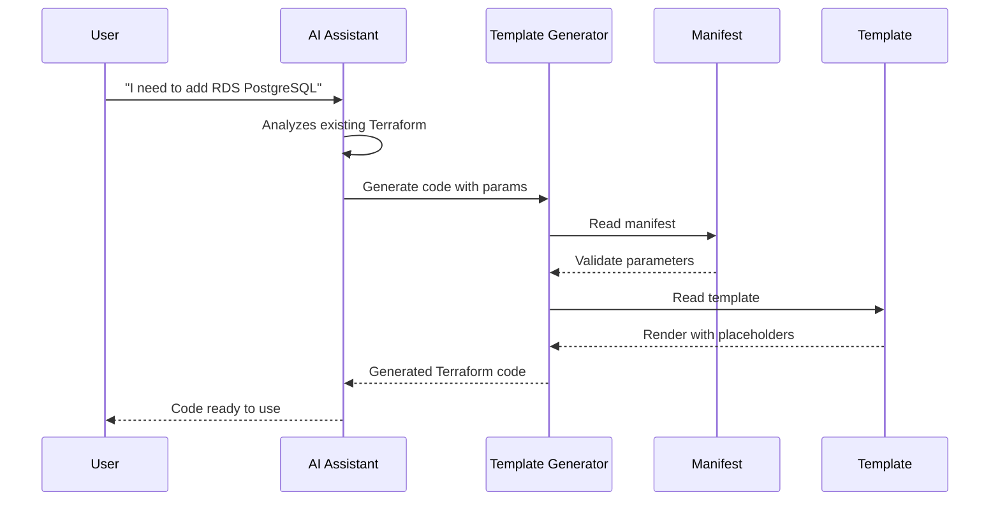

# Manifests and Templates

How blueprints, manifests, and templates work together in the Terraform Infrastructure Blueprints system.

## The Relationship

## Complete Flow

**Phase 1**: Write Terraform code in `blueprints/aws/{blueprint-name}/`  
**Phase 2**: Create manifest describing blueprint in YAML  
**Phase 3**: Create parameterized template with `${placeholders}` (`.tftpl` files; Terraform-style placeholders)  
**Phase 4**: Use Template Generator or copy blueprint directly

Design-time code generation uses Node.js and `${var}` substitution. For **runtime** file templating inside Terraform (e.g. `user_data`, IAM policies), HashiCorp recommends `templatefile()` and `.tftpl` files.

## Template Generator Workflow

## When You Write Terraform Code

### ✅ You write code when

1. **Creating a new blueprint**
   - Write all Terraform code in `blueprints/aws/{blueprint-name}/`
   - Create modules, environments, tests
   - This is production code

2. **Updating an existing blueprint**
   - Modify code in `blueprints/aws/{blueprint-name}/`
   - Add resources, improve patterns
   - Keep code updated

3. **Creating templates for snippets**
   - Based on real blueprint code
   - Use `.tftpl` extension and Terraform-style placeholders `${variable}` (simple identifiers only; Terraform literals like `"${var.x}"` stay intact)
   - Keep templates synchronized with real code

### ❌ You DON'T write code when

1. **Using Template Generator**
   - The generator creates code based on templates
   - You only provide parameters (JSON)
   - Code is generated automatically

2. **Using existing blueprints**
   - Copy the complete blueprint
   - Don't need to rewrite, just adapt

## Manifest location

The **canonical manifest location** is **`blueprints/manifests/`** at the repository root. The infrastructure-code-generation skill reads manifests from there when run from the repo (single source of truth).

## Fundamental Principle

> **The blueprint's Terraform code is always the source of truth.**
>
> Manifests and templates are **derived** from real code. If you change the blueprint code, you must update templates and manifests to maintain synchronization.

## References

- [Developer Workflow](./developer-workflow.md) - How developers use the system
- [AI Assistant Guidelines](./ai-assistant-guidelines.md) - How AI assistants work with manifests
- [Template Generator vs Repository](./blueprints/template-generator-vs-repo.md) - When to use which
