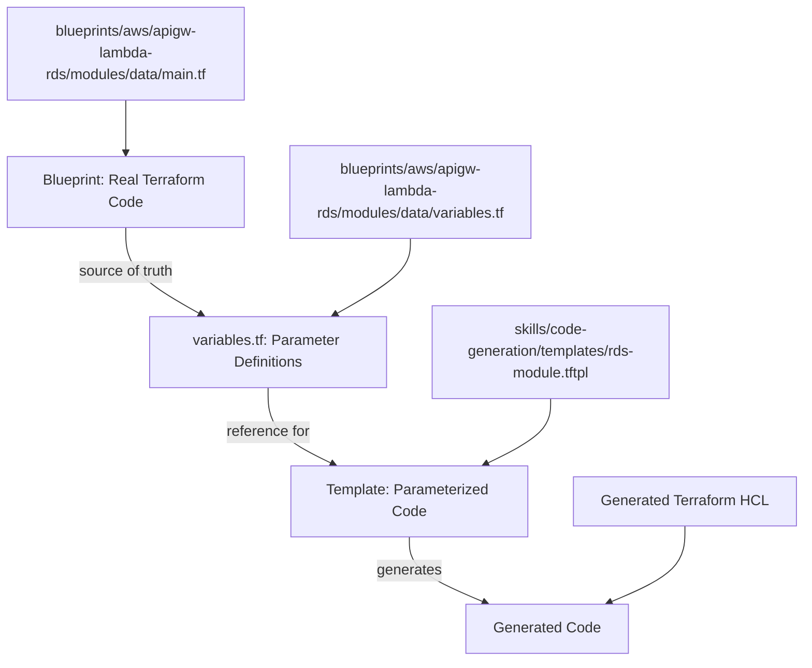
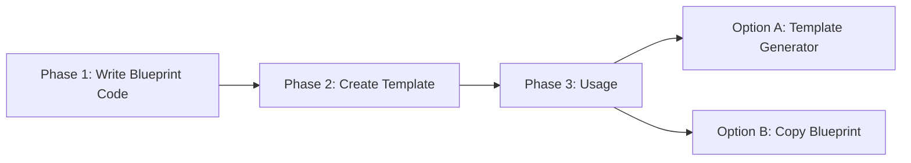
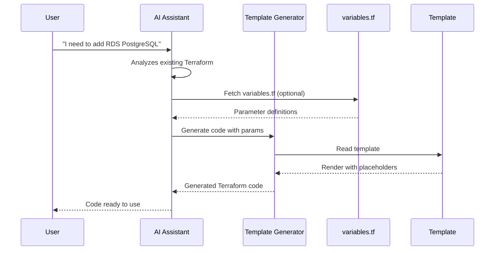

# Templates and Blueprints

How blueprints and templates work together in the Terraform Infrastructure Blueprints system.

## The Relationship

## Complete Flow

**Phase 1**: Write Terraform code in `blueprints/aws/{blueprint-name}/`  
**Phase 2**: Create parameterized template with `${placeholders}` (`.tftpl` files; Terraform-style placeholders)  
**Phase 3**: Use Template Generator or copy blueprint directly

Design-time code generation uses Node.js and `${var}` substitution. For **runtime** file templating inside Terraform (e.g. `user_data`, IAM policies), HashiCorp recommends `templatefile()` and `.tftpl` files.

## Template Generator Workflow

## When You Write Terraform Code

### ✅ You write code when

1. **Creating a new blueprint**
   - Write all Terraform code in `blueprints/aws/{blueprint-name}/`
   - Create modules, environments, tests
   - This is production code

2. **Updating an existing blueprint**
   - Modify code in `blueprints/aws/{blueprint-name}/`
   - Add resources, improve patterns
   - Keep code updated

3. **Creating templates for snippets**
   - Based on real blueprint code
   - Use `.tftpl` extension and Terraform-style placeholders `${variable}` (simple identifiers only; Terraform literals like `"${var.x}"` stay intact)
   - Keep templates synchronized with real code

### ❌ You DON'T write code when

1. **Using Template Generator**
   - The generator creates code based on templates
   - You only provide parameters (JSON)
   - Code is generated automatically

2. **Using existing blueprints**
   - Copy the complete blueprint
   - Don't need to rewrite, just adapt

## Single Source of Truth

The **blueprint's `variables.tf` file** is the single source of truth for parameter definitions:

- Parameter names, types, defaults, and descriptions are defined in `variables.tf`
- LLMs reference `variables.tf` using MCP `fetch_blueprint_file()` to understand what parameters are needed
- No duplication - one definition in `variables.tf`, not in separate manifest files
- Templates use the same parameter names as defined in `variables.tf`

## Fundamental Principle

> **The blueprint's Terraform code is always the source of truth.**
>
> Templates are **derived** from real code. If you change the blueprint code, you must update templates to maintain synchronization.

## Skill package layout

Skills live under [skills/](../skills/) and extend AI capabilities with domain knowledge. A Skill package has:

| Path | Required | Purpose |
|------|----------|---------|
| **SKILL.md** | Yes | Name, description, and Instructions (when to use, how to do it). |
| **scripts/** | No | Scripts used by the Skill (e.g. code-generation, validation). |
| **references/** | No | Domain references, glossaries, or pointers (e.g. to [Blueprint Catalog](blueprints/catalog.md)). |
| **templates/** or **assets/** | No | Output templates (e.g. `.tftpl`) or static assets. |

Example: `style-guide` has `SKILL.md` and `references/catalog-pointer.md`; `code-generation` has `SKILL.md`, `scripts/`, and `templates/`. See [Understanding MCP and Skills](understanding-mcp-and-skills.md).

## References

- [Developer Workflow](./developer-workflow.md) - How developers use the system
- [AI Assistant Guidelines](./ai-assistant-guidelines.md) - How AI assistants work with templates
- [Template Generator vs Repository](./blueprints/template-generator-vs-repo.md) - When to use which
