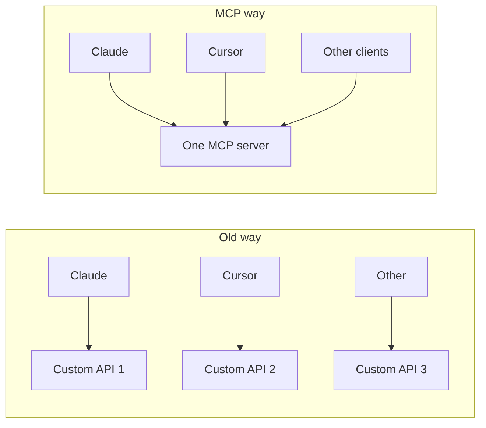
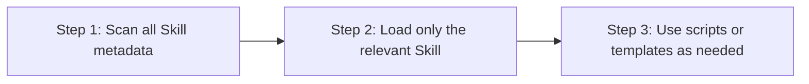
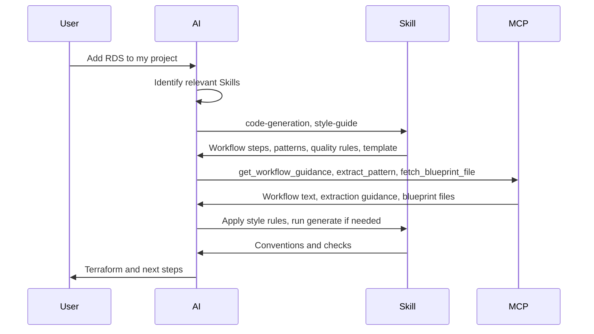

# Understanding MCP and Skills

A single guide to how this repository uses the Model Context Protocol (MCP) and Skills so that AI assistants can discover blueprints and apply methodology consistently.

## Transformation

**Isolated AI** can only use what’s in its training data or in the current chat. **Connected intelligence** uses live tools and reference knowledge so it can recommend the right blueprint, fetch real code, and follow your workflows.

This repo combines **MCP** (connectivity: tools, prompts, on-demand resources) with **Skills** (methodology and when/how to use data). Together they give AI: blueprint discovery, step-by-step workflows, and style/conventions—so consultants and clients get the right guidance every time.

## The Three-Layer Architecture

The workshop notes (2026-02) clarify three distinct layers:

1. **AGENTS.md / RULES** — "Who you are" (always present)
   - Project-specific rules and conventions
   - Consultancy model, naming conventions, cloud constraints
   - See: [AGENTS.md](../AGENTS.md) Decision Framework section

2. **Skills** — "What you can do" (on-demand workflows)
   - Procedural workflows for specific scenarios
   - Progressive disclosure (scan → load → execute)
   - See: [Skills](../skills/) in the repository

3. **MCP** — "What you can access" (external tools)
   - Dynamic blueprint discovery, file fetching
   - Connects to external knowledge/services
   - See: [MCP Tools Reference](mcp-tools-reference.md)

**Key insight:** These layers complement each other. AGENTS.md provides context, Skills provide methodology, MCP provides connectivity.

## What is MCP?

MCP is a standard way for AI tools to talk to servers. **Build once, any MCP client can connect.** Our server lives in [packages/mcp/](packages/mcp/) and exposes blueprints and workflows over the protocol.

## The Old Way vs The MCP Way

**Old way:** N×M custom integrations (each client × each backend). **MCP way:** One protocol, many clients, one (or more) MCP server. Our blueprint server is that single backend.

## The Three Building Blocks

MCP defines three building blocks. We use all three:

| Block | What it is | In this repo |
|-------|------------|--------------|
| **Resources** | Content identified by URI or template, read on demand | Blueprint file content fetched via the `fetch_blueprint_file` tool (dynamic). Static catalog moved to Skills per [ADR 0007](adr/0007-move-static-catalog-to-skills.md). |
| **Tools** | Callable operations with parameters and results | `get_workflow_guidance`, `recommend_blueprint`, `extract_pattern`, `search_blueprints`, `find_by_project`, `fetch_blueprint_file`. See [MCP Tools Reference](mcp-tools-reference.md). |
| **Prompts** | Pre-configured instructions the client can list and get | Workflow prompts: `new_project`, `add_capability`, `migrate_cloud`, `general`. Same content as the workflow tool; exposed via MCP Prompts API for slash commands or “insert workflow”. |

## What are Skills?

Skills are **modular expertise**: when to use what, and how to do it. They live in [skills/](skills/) and are referenced from [AGENTS.md](../AGENTS.md).

| Skill | Purpose |
|-------|--------|
| style-guide | Selecting blueprints, naming/tagging, writing/reviewing Terraform, catalog, decision tree, and priority rules |
| code-generation | Adding a capability; generating Terraform from parameterized templates |
| mcp-discovery | When to use each MCP tool (search, recommend, fetch, workflow, extract) |
| security | Secrets (passwords, Secrets Manager, IAM DB auth; never in state) and security groups (Lambda, RDS, API Gateway, ECS; least-privilege) |
| terraform-practices | Testing (native/Terratest, decision matrix), CI/CD (validate→test→plan→apply), code structure (block ordering, count/for_each); use with blueprint-generated or blueprint-style Terraform |

## How Skills Work

A Skill package has:

- **SKILL.md** (required): name, description, Instructions (when to use, how to do it).
- **scripts/** (optional): e.g. code-generation or validation scripts.
- **references/** (optional): domain references, glossaries, or pointers (e.g. to [Blueprint Catalog](blueprints/catalog.md)).
- **templates/** or **assets/** (optional): output templates (e.g. `.tftpl`). We use `templates/` in code-generation.

See [Templates and Blueprints](manifests-and-templates.md) for how blueprints and Skill templates fit together.

## Progressive Disclosure (3 Steps)

Skills are used in three steps so the AI only loads what it needs:

1. **Scan metadata** — See all Skills (name, description) to choose the right one.
2. **Load relevant Skill** — Read full SKILL.md and references only for the chosen Skill.
3. **Use scripts/templates** — Run scripts or fill templates when the Skill says to.

## The Real Power: MCP + Skills Together

End-to-end flow for a request like “Add RDS to my project”:

- **User request** → AI identifies relevant Skill(s) (e.g. code-generation, style-guide).
- **Skill provides** workflow steps, patterns, quality rules, and optionally a template (e.g. rds-module.tftpl).
- **MCP activates** recommend_blueprint / extract_pattern / fetch_blueprint_file (and Prompts when the client uses them).
- **Skill guides synthesis** (run script, apply style rules).
- **Output** is Terraform (and optionally an audit trail).

See [AI Assistant Guidelines](ai-assistant-guidelines.md) and [MCP Tools Reference](mcp-tools-reference.md).

## Implementation Roadmap

### Phase 1: Start with MCP

- **Critical data sources:** Blueprint catalog + file access. Catalog content lives in Skills; discovery and file content via MCP tools.
- **Current state:** Server and tools are in place. **Prompts** added so clients can list and get workflow prompts (new_project, add_capability, migrate_cloud, general).
- **Build or use:** Our server is [packages/mcp/](packages/mcp/).

### Phase 2: Develop Skills

- **Document key workflows:** New project, add capability, migrate cloud (in workflow tool/prompts and in [Blueprint Workflows](blueprints/workflows.md)).
- **Skill packages:** Each has clear Instructions and optional scripts/, references/, templates/ (or assets/). See [Templates and Blueprints](manifests-and-templates.md).

### Phase 3: Combine and Scale

- **Deploy end-to-end:** MCP for discovery and prompts; Skills for methodology and code generation. AI orchestrates both.
- **References:** [AI Assistant Guidelines](ai-assistant-guidelines.md), [MCP Tools Reference](mcp-tools-reference.md), [ADR 0005 – Skills vs MCP](adr/0005-skills-vs-mcp-decision.md).

## Key Takeaways

- **MCP** = connectivity: resources (on-demand fetch), tools, prompts. One server, any client.
- **Skills** = modular expertise: when to use what, patterns, and how to do it.
- **Together** = connected + knowledgeable: discover blueprints and apply methodology in one flow.
- **Progressive disclosure** = scan metadata → load relevant Skill → use scripts/templates as needed.
- **Roadmap** = Phase 1 MCP (tools + prompts), Phase 2 Skills (workflows + package layout), Phase 3 combine and scale.
