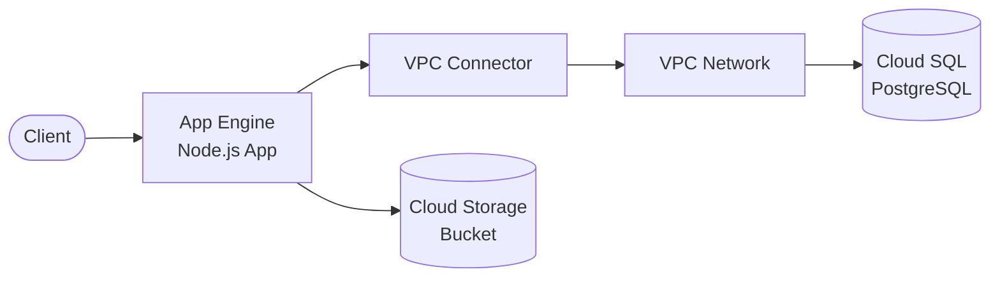

# App Engine + Cloud SQL + Cloud Storage

Containerized application on Google App Engine with Cloud SQL PostgreSQL (private IP) and Cloud Storage.

## Architecture



## Requirements

- GCP project with billing enabled
- gcloud CLI installed and configured
- Terraform >= 1.0
- Node.js >= 18.x

## Deployment

### 1. Enable Required APIs

```bash
gcloud services enable \
  appengine.googleapis.com \
  sqladmin.googleapis.com \
  vpcaccess.googleapis.com \
  secretmanager.googleapis.com \
  servicenetworking.googleapis.com \
  compute.googleapis.com
```

### 2. Deploy Infrastructure

```bash
cd environments/dev

# Set your GCP project ID
export TF_VAR_project_id="your-project-id"

# Initialize Terraform
terraform init

# Review the plan
terraform plan

# Deploy
terraform apply
```

> Cloud SQL creation takes ~5-10 minutes.

### 3. Deploy Application

```bash
# Get connection details
CONNECTION_NAME=$(terraform output -raw cloud_sql_connection_name)
BUCKET_NAME=$(terraform output -raw storage_bucket_name)

# Update app.yaml with connection details
cd ../../src/app
# Edit app.yaml with actual values

# Deploy to App Engine
gcloud app deploy
```

## How it works

App Engine runs your containerized application. The app connects to Cloud SQL via private IP through a VPC connector. Cloud Storage provides object storage for media files.

Key benefits:
- **Fully managed**: App Engine handles scaling and infrastructure
- **Private networking**: Cloud SQL accessible only via VPC
- **Serverless**: Pay only for what you use
- **Integrated storage**: Cloud Storage with signed URLs

## Testing

```bash
# Get the App Engine URL
APP_URL=$(terraform output -raw app_engine_url)

# Test health endpoint
curl "$APP_URL/health"

# Test database connection
curl "$APP_URL/db"
```

## Configuration

| Variable | Default | Description |
|----------|---------|-------------|
| `project` | - | Project name (lowercase, alphanumeric) |
| `project_id` | - | GCP project ID |
| `environment` | - | Environment: dev, staging, prod |
| `region` | us-central1 | GCP region |
| `database_tier` | db-f1-micro | Cloud SQL instance tier |
| `database_disk_size` | 10 | Disk size in GB |
| `storage_bucket_name` | - | Base name for storage bucket |

## Estimated Costs

| Resource | Cost (monthly) |
|----------|----------------|
| App Engine (F1 instances) | ~$0.05/hour per instance |
| Cloud SQL (db-f1-micro) | ~$7.50 |
| Cloud Storage | ~$0.02/GB |
| VPC Connector | ~$0.10/hour |
| Network egress | ~$0.12/GB |

**Dev estimate: ~$20-50/month**

## Cleanup

```bash
terraform destroy
```

## Related Blueprints

| Blueprint | Relationship | Use Case |
|-----------|--------------|----------|
| `functions-postgresql` | Azure equivalent | Prefer Azure over GCP |
| `alb-ecs-fargate-rds` | AWS equivalent | Prefer AWS over GCP |

## Origin

Mavie iOS - Mobile app backend with Strapi CMS (ustwo, 2025)
