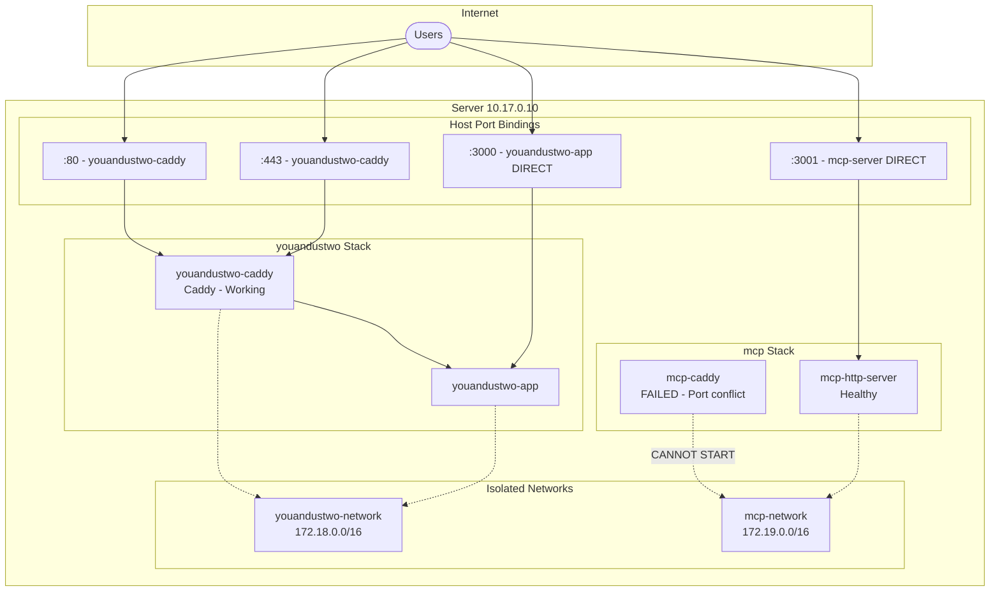
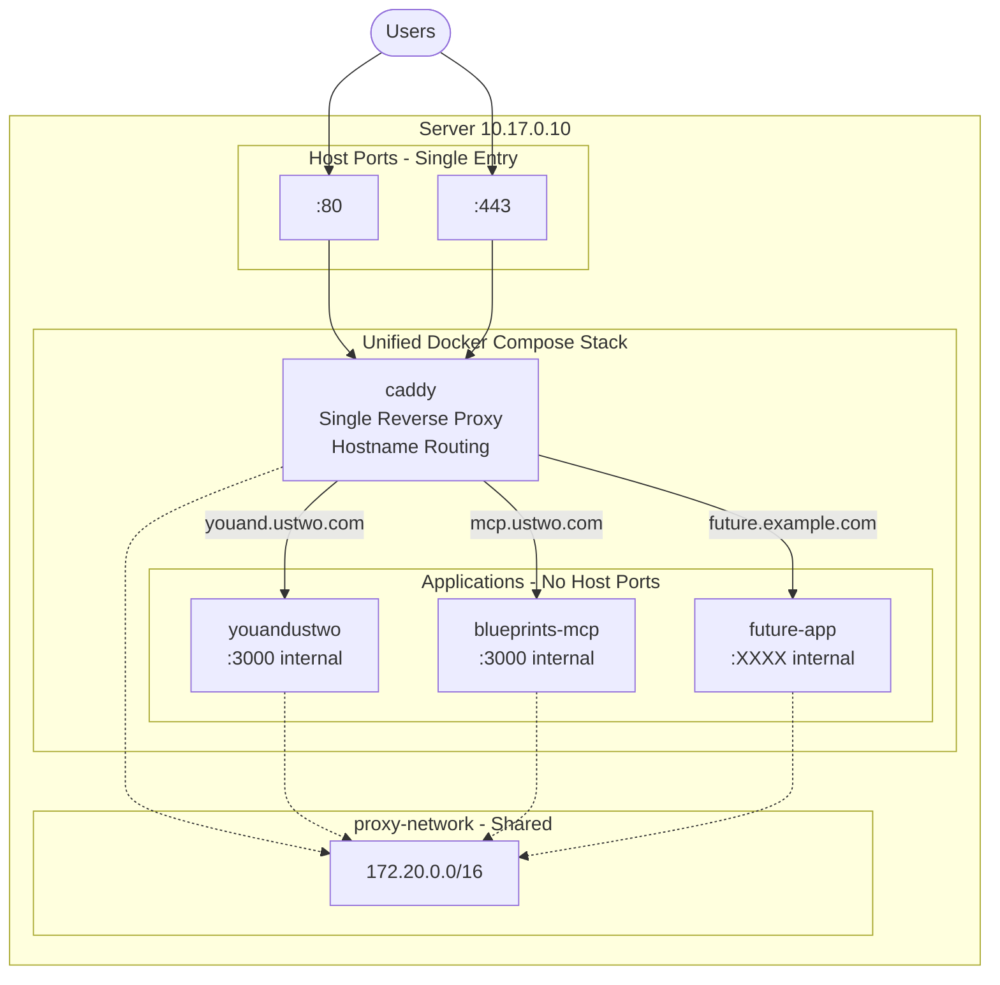
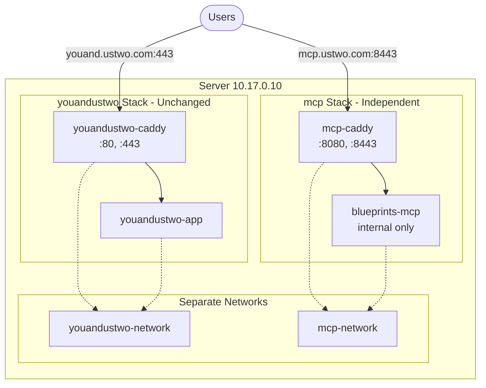

# MCP Server Infrastructure Guide

This document covers the infrastructure architecture and deployment strategies for the MCP server on the shared host (10.17.0.10).

## Table of Contents

- [Current State Analysis](#current-state-analysis)
- [Deployment Options](#deployment-options)
  - [Option A: Shared Infrastructure](#option-a-shared-infrastructure-recommended-long-term)
  - [Option B: Independent Deployment](#option-b-independent-deployment-no-dependencies)
- [Google OAuth Configuration](#google-oauth-configuration)
- [Migration Steps](#migration-steps)
- [Troubleshooting](#troubleshooting)

---

## Current State Analysis

### Server: 10.17.0.10

The server runs **two separate Docker Compose stacks** that were deployed independently, causing conflicts.

#### Stack 1: youandustwo (Nick's)

- **Location**: `/home/youand/youandustwo/`
- **Containers**:
  - `youandustwo-caddy` - Reverse proxy (owns ports 80/443)
  - `youandustwo-app` - Main application
- **Network**: `youandustwo_youandustwo-network` (172.18.0.0/16)

#### Stack 2: MCP (Terraform Blueprints)

- **Location**: `/home/mcp-terraform-blueprints/terraform-infrastructure-blueprints/packages/mcp/`
- **Containers**:
  - `mcp-caddy` - Reverse proxy (**FAILED** - port 80 conflict)
  - `mcp-http-server` - MCP server (healthy, exposed on port 3001)
- **Network**: `mcp_mcp-network` (172.19.0.0/16)

### Current Architecture (Broken)



### Key Problems

| Problem | Impact | Root Cause |
|---------|--------|------------|
| **Port 80/443 conflict** | MCP has no HTTPS | Each stack has its own Caddy competing for same ports |
| **Isolated networks** | Apps cannot share proxy | Separate `docker-compose.yml` files create separate networks |
| **Direct port exposure** | Security risk, no TLS for MCP | Workaround for failed Caddy |
| **No centralized management** | Hard to add new apps | Each app needs its own proxy configuration |

---

## Deployment Options

### Option A: Shared Infrastructure (Recommended Long-term)

A unified setup where one Caddy handles routing for all apps based on hostname.

**Requirements**: Coordination with Nick (youandustwo owner)

#### Target Architecture



**Benefits**:

- No port conflicts
- All apps get HTTPS via single Caddy
- Easy to add more apps
- Internal networking (apps not exposed directly)
- Centralized configuration

**What You Need from Nick**:

| Item | Why Needed |
|------|------------|
| Agreement to migrate | His app moves to shared stack |
| Environment variables | `.env` values (OAuth secrets, JWT, etc.) |
| Permission to stop his stack | Need to free ports 80/443 |
| Data volume mapping | Confirm paths for data persistence |
| Maintenance window | ~10-15 min downtime |

---

### Option B: Independent Deployment (No Dependencies)

Deploy MCP on **different ports** (8443/8080) to avoid conflicts with youandustwo.

**Requirements**: None - can deploy immediately

#### Target Architecture



**Benefits**:

- No dependency on Nick
- MCP gets HTTPS via its own Caddy
- Can deploy immediately
- Completely isolated from youandustwo

**Trade-off**:

- Non-standard port (users access `https://mcp.ustwo.com:8443`)

#### Configuration Files for Option B

**docker-compose.yml**:

```yaml
services:
  mcp-server:
    image: ghcr.io/bertrindade/infra-mcp:latest
    container_name: mcp-http-server
    restart: unless-stopped
    # NO ports exposed to host - only accessible via Caddy
    environment:
      - NODE_ENV=production
      - PORT=3000
      - MCP_TRANSPORT=http
      - MCP_BASE_URL=${MCP_BASE_URL:-https://mcp.ustwo.com:8443}
      - AUTH_BASE_URL=${AUTH_BASE_URL:-https://mcp.ustwo.com:8443}
      - COMPANY_DOMAIN=${COMPANY_DOMAIN:-ustwo.com}
      - GOOGLE_CLIENT_ID=${GOOGLE_CLIENT_ID}
      - GOOGLE_CLIENT_SECRET=${GOOGLE_CLIENT_SECRET}
      - JWT_SECRET=${JWT_SECRET}
      - LOG_LEVEL=${LOG_LEVEL:-info}
    networks:
      - mcp-network
    healthcheck:
      test: ["CMD", "wget", "-q", "--spider", "http://localhost:3000/health"]
      interval: 30s
      timeout: 10s
      retries: 3
      start_period: 40s

  caddy:
    image: caddy:2-alpine
    container_name: mcp-caddy
    restart: unless-stopped
    ports:
      - "8080:80"       # HTTP on non-standard port
      - "8443:443"      # HTTPS on non-standard port
      - "8443:443/udp"  # HTTP/3
    volumes:
      - ./Caddyfile:/etc/caddy/Caddyfile:ro
      - caddy_data:/data
      - caddy_config:/config
    depends_on:
      mcp-server:
        condition: service_healthy
    networks:
      - mcp-network
    environment:
      - ACME_AGREE=true

networks:
  mcp-network:
    driver: bridge

volumes:
  caddy_data:
  caddy_config:
```

**Caddyfile**:

```
# MCP Server - Independent deployment on port 8443
# Users access via: https://mcp.ustwo.com:8443

mcp.ustwo.com {
    log {
        output stdout
        format console
    }

    # Security headers
    header {
        Strict-Transport-Security "max-age=63072000; includeSubDomains; preload"
        -Server
    }

    # Reverse proxy to MCP server
    reverse_proxy mcp-server:3000 {
        health_path /health
        health_interval 30s
        health_timeout 5s
    }
}
```

**.env**:

```bash
# MCP Server Configuration
NODE_ENV=production
MCP_TRANSPORT=http

# URLs - Note the :8443 port
MCP_BASE_URL=https://mcp.ustwo.com:8443
AUTH_BASE_URL=https://mcp.ustwo.com:8443

# Domain for OAuth
COMPANY_DOMAIN=ustwo.com

# Google OAuth
GOOGLE_CLIENT_ID=<your-client-id>
GOOGLE_CLIENT_SECRET=<your-client-secret>

# JWT Secret (min 32 chars)
JWT_SECRET=<your-jwt-secret>

# Logging
LOG_LEVEL=info
```

---

## Google OAuth Configuration

For Option B (port 8443), configure Google OAuth in [Google Cloud Console](https://console.cloud.google.com/apis/credentials):

### Authorised JavaScript Origins

| URI | Purpose |
|-----|---------|
| `http://localhost:3000` | Local development |
| `https://mcp.ustwo.com` | Standard port (future) |
| `https://mcp.ustwo.com:8443` | **Required for Option B** |

### Authorised Redirect URIs

| URI | Purpose |
|-----|---------|
| `http://localhost:3000/oauth/callback` | Local development |
| `https://mcp.ustwo.com:8443/oauth/callback` | **Required for Option B** |

**Important**: Both the JavaScript origin AND redirect URI with `:8443` must be configured for OAuth to work.

---

## Migration Steps

### Option B: Independent Deployment

#### Step 1: Update Google OAuth

Add to Google Cloud Console:

- **JavaScript Origin**: `https://mcp.ustwo.com:8443`
- **Redirect URI**: `https://mcp.ustwo.com:8443/oauth/callback`

#### Step 2: Stop Current MCP Stack

```bash
ssh -i ~/.ssh/id_ed25519_ustwo epadmin@10.17.0.10

cd /home/mcp-terraform-blueprints/terraform-infrastructure-blueprints/packages/mcp
docker compose down
```

#### Step 3: Update Configuration Files

Update on the server:

- `docker-compose.yml` - New port mappings (8080, 8443)
- `.env` - Update URLs to include `:8443`

#### Step 4: Open Firewall Ports

```bash
# If using ufw
sudo ufw allow 8443/tcp
sudo ufw allow 8443/udp  # For HTTP/3
sudo ufw allow 8080/tcp
```

#### Step 5: Deploy Updated Stack

```bash
cd /home/mcp-terraform-blueprints/terraform-infrastructure-blueprints/packages/mcp
docker compose up -d
```

#### Step 6: Verify Deployment

```bash
# Check containers
docker compose ps

# Check Caddy logs (should show no port conflict)
docker logs mcp-caddy

# Test HTTPS endpoint
curl -I https://mcp.ustwo.com:8443/health

# Test OAuth metadata
curl https://mcp.ustwo.com:8443/.well-known/oauth-authorization-server
```

#### Step 7: Update Client Configurations

Update MCP client configurations to use the new URL:

**Cursor MCP Settings** (`~/.cursor/mcp.json`):

```json
{
  "mcpServers": {
    "ustwo-infra": {
      "url": "https://mcp.ustwo.com:8443/sse"
    }
  }
}
```

---

## Troubleshooting

| Issue | Solution |
|-------|----------|
| Port conflict on 80/443 | Use Option B with ports 8080/8443 |
| OAuth redirect fails | Ensure `https://mcp.ustwo.com:8443` is in both JavaScript origins AND redirect URIs |
| Caddy won't start | Check `docker logs mcp-caddy` for errors |
| Health check failing | Verify `mcp-server` is healthy: `docker compose ps` |
| SSL certificate issues | Caddy auto-provisions Let's Encrypt; ensure DNS resolves and ports are open |
| Firewall blocking | Open ports 8443/tcp, 8443/udp, 8080/tcp |

### Rollback Plan

If issues occur, revert to direct port exposure:

```bash
# Edit docker-compose.yml to restore direct port mapping:
# mcp-server:
#   ports:
#     - "3001:3000"

docker compose down
docker compose up -d
```

---

## Future: Migrate to Shared Infrastructure

Option B can later migrate to shared infrastructure when coordinating with Nick:

1. Move MCP service to shared `docker-compose.yml`
2. Join shared `proxy-network`
3. Remove independent Caddy
4. Add MCP hostname to shared Caddyfile
5. Update URLs to use standard port 443

No application code changes needed - only infrastructure configuration.
